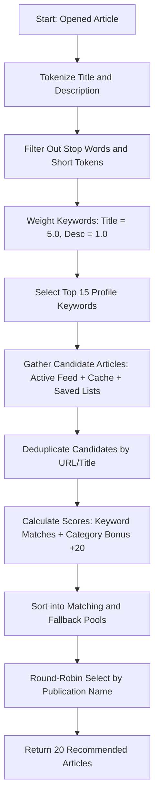

# Feature: News Reader (RSS Feed & Article Reader)

The News Reader is a core feature that provides users with a distraction-free, fast, and personalized news consumption experience. It aggregates articles from multiple RSS/WordPress JSON sources, sanitizes and reformats them for readability, syncs user-saved items (Read Later and Favorites) cross-platform, and presents intelligent, localized recommendations.

---

## 1. Functional Specification

### 1.1 Feed Subscription & Source Management
- **News Settings & Feeds Panel**: News settings are centralized in a standalone settings section, exposing toggles for auto-refresh on startup and cover images display, alongside a dedicated **News Feeds** panel.
- **Feed Discovery & Search**: Users can discover feeds by typing keyword queries (which queries Feedly's public search API) or entering a website domain/URL directly. The app fetches the page and sniffs alternate `<link>` tags (`application/rss+xml`, `application/atom+xml`, or JSON feeds), resolving relative paths or falling back to checking common sub-paths (like `/feed`, `/rss`, or `/wp-json/wp/v2/posts`).
- **Inline Editing & Management**: Subscribed feeds can be edited inline, allowing real-time changes to their Name, URL, and Category (Local, Markets, World, Tech, Coding, Space, Other).
- **Flexible Reordering**: Subscribed feeds can be reordered using explicit **Move Up** / **Move Down** buttons or by dragging and dropping items directly in the list, updating the custom `DisplayOrder` database column.
- **Custom RSS/WP-JSON Subscriptions**: Users can subscribe to custom sources by providing a feed URL and a display name. The app automatically fetches the website favicon (using the Google Favicon API fallback) and auto-detects whether the source uses a traditional XML RSS format or a WordPress JSON API (`wp-json`).
- **Atomic Loading & Cycles**: Users can swap between active feeds, pull to refresh, or cycle through publications sequentially using cycle controls.

### 1.2 Interactive Reader View (Distraction-Free Mode)
- **Fast-Path Extraction (SmartReader)**: By default, the app uses a backend scraping and parsing algorithm (`SmartReader`) to download and parse the raw webpage content. It extracts the core article text, author, and main image, stripping away headers, sidebars, scripts, and advertisements.
- **Featured Image Deduplication**: To avoid double-rendering, the engine compares the webpage's extracted featured image with the inline body images. It aggressively cleans up and removes any duplicate inline image tags and their empty parent containers.
- **Author Sanitization**: Standardizes author credits by cleaning up web junk (like "Social Links" or "See all articles") and automatically separates multiple concatenated titles (e.g., converting "Jane DoeSenior Editor" to "Jane Doe, Senior Editor").
- **WebView2 Web Scraping Fallback**: If the fast-path parser fails to find readable content (due to JS-dependent pages or heavy dynamic rendering), the app falls back to a hidden browser automation step:
  - It loads the article URL in a web view instance.
  - Automatically runs an injected JavaScript cleanup script to strip away cookie walls, GDPR consents, newsletter popups, paywall frames, and modal overlays.
  - Polls the DOM until JS-rendered content is present, extracts the full HTML, and parses it again.
  - If parsing still fails, it renders the raw webpage in the view.

### 1.3 Saved Lists (Offline / Sync Ready)
- **Read Later**: A bookmarking stack allowing users to save articles for future reading.
- **Favorites**: A starred article collection for keeping track of long-term references.
- Both lists support toggling items from inside the reader view toolbar or from the main list.

### 1.4 Smart Recommendations
- Suggests up to 20 related articles while the user is reading.
- Uses term-frequency heuristics, category matching, and a round-robin fairness strategy to build the recommendation set (see Technical Architecture).

### 1.5 Global Aggregation ("All News")
- **Unified Feed View**: Users can select "All News" from the feed menu to view a consolidated list of articles aggregated from all active feed subscriptions.
- **Fairness Distribution**: The "All News" view takes the top 2 articles from each subscribed feed (ordered by the subscription feed list) to present a balanced initial briefing.

### 1.6 Inline Article Search
- **Instant Search**: An interactive search box allows users to filter articles in real-time by typing keywords that match article titles or descriptions.
- **Context-Aware Scoping**: The search dynamically adjusts its scope: when viewing a specific RSS feed, it filters items within that feed; when in the "All News" view, it runs a global search across all cached articles from all feeds.

---

## 2. Technical Architecture & Data Model

### 2.1 Dependency Injection & Services
- `IRssFeedService` / `RssFeedService`: Handles listing available feeds, downloading XML/JSON feeds, background pre-fetching, and full-article text scraping.
- `IRssArticleService` / `RssArticleService`: Manages saved articles (Read Later and Favorites) in the local database and coordinates sync events.
- `IDatabaseService` / `DatabaseService`: Coordinates local SQLite database connections and table initializations.
- `IRenderedHtmlService` / `MauiWebViewRenderedHtmlService`: (Platform-specific) Extracts fully rendered JS content on mobile web view runtimes.

### 2.2 Data Models & Schema
The database stores user subscriptions and saved articles, which are synchronized with Supabase:

#### Local Database Schema (SQLite / Mobile Sync)
- **`LocalRssSubscription`**:
  - `Id` (Guid String)
  - `UserId` (String)
  - `Name` (String)
  - `Url` (String)
  - `Category` (String)
  - `IconUrl` (String)
  - `CreatedAt` (DateTime)
  - `IsDeleted` (Boolean)
- **`LocalSavedArticle`**:
  - `Id` (Guid String)
  - `UserId` (String)
  - `Title` (String)
  - `ArticleUrl` (String) (Primary key for uniqueness)
  - `ArticleDate` (DateTime)
  - `ImageUrl` (String)
  - `Description` (String)
  - `Author` (String)
  - `Type` (Integer: Favorite = 1, ReadLater = 2)
  - `PublicationName` (String)
  - `PublicationIconUrl` (String)
  - `CreatedAt` (DateTime)

### 2.3 Smart Recommendation Algorithm Flow
When a user opens an article, the recommendation engine (`GetSmartRecommendations(RssItem currentItem)`) executes:

- **Fairness Guarantee**: The Round-Robin selection rotates through distinct publication names (e.g. taking one TechCrunch article, then one Wired article, then one VentureBeat article) to prevent a single source from filling the entire list.
- **Background Pre-fetching**: On startup, a background task (`PreFetchAllFeedsInBackground`) loops through all inactive feeds and downloads their feed items, caching them in `_allFeedsCache` so recommendation candidates are available instantly.

### 2.4 "All News" Parallel Fetching & Caching
- **Parallel Loading**: When the "All News" view is selected, the application fetches articles from all subscribed feeds in parallel using `Task.WhenAll`.
- **In-Memory Caching (`_allFeedsCache`)**:
  - To prevent excessive network requests, fetched feed items are cached in a thread-safe dictionary `Dictionary<string, List<RssItem>> _allFeedsCache`.
  - Reads and writes to `_allFeedsCache` are protected by a `lock` statement.
  - When loading "All News" (without a force refresh), cached items are preferred. If cache misses occur, the feeds are fetched and cached.
  - Selecting "Refresh" clears the cache and refetches all feeds from the source.

### 2.5 Article Search & Filtering Logic
- **Real-Time Filtering**: The UI binds to the search box's text change events (`ArticleSearchBox_TextChanged` and `ArticleSearchBox_QuerySubmitted`), running a case-insensitive filtering lookup.
- **Search Execution**:
  - Filters articles matching `lowerQuery = query.ToLowerInvariant()` against `item.Title` or `item.Description` using `Contains(..., StringComparison.OrdinalIgnoreCase)`.
  - In "All News" mode, it aggregates and searches across all lists inside `_allFeedsCache.Values`, returning matching articles sorted in descending order of their `PublishDate`.

---

## 3. UI/UX & Styling

### 3.1 Custom Title Bar & Metadata Sync
- The reader view features a toolbar containing a back button, publication name, publication icon, and quick action buttons (Favorite/Read Later).
- In WinUI, the custom `AppTitleBar` coordinates authentication profile photos and light/dark theme toggles.

### 3.2 Dynamic Scroll Fade (WinUI)
- The smart recommendations list is a horizontally scrollable container.
- An event listener (`RecommendationsScrollViewer_ViewChanged`) calculates the position of each item relative to the scroll viewport bounds using `container.TransformToVisual(RecommendationsScrollViewer)`.
- It dynamically applies a linear opacity fade-out to items entering the left and right edges (fade zone = 36px), creating a smooth, premium glass-like visual edge transition.

### 3.3 Search Bar Styling & Responsiveness
- **Glassmorphic Design**: The `ArticleSearchBox` utilizes standard app theme brushes (`AppGlassColorBrush` and `AppGlassBorderColorBrush`) with a 1px border and custom corner radius (`CornerRadius="18"`) for a modern, rounded pill design.
- **Responsive Viewport Collapse**: In the page size change handler (`RssFeedDetailPage_SizeChanged`), the `ArticleSearchBox` is set to `Visibility.Collapsed` when the viewport width is less than 880px to prevent layout collision with the feed headers and cycle controls.
- **All News Visual Treatment**: When "All News" is selected, the custom favicon image border (`SelectedFeedIconBorder`) is collapsed, and a standard Segoe Fluent Icon glyph (`&#xE909;`) is displayed within `SelectedFeedFontIcon` to represent the global feed context.
- **Feed Selector Adaptive MaxWidth (WinUI)**: To prevent visual collision with the Pivot category headers in narrow layouts, the selected feed title (`SelectedFeedText`) in the right header has a default `MaxWidth` of 55px (with `CharacterEllipsis` trimming). On widget resize, `UpdateAdaptiveLayout` calculates the available space (`ActualWidth - 280` safety margin) and dynamically adjusts the text's `MaxWidth` between `55px` and `120px` to maximize readability on wider viewports.

---

## 4. Platform Implementation Differences (WinUI vs. MAUI / Blazor Hybrid)

| Characteristic | WinUI Implementation | MAUI / Blazor Hybrid Implementation |
| :--- | :--- | :--- |
| **Reader View Tech** | Native XAML `WebView2` Control | Blazor Hybrid DOM / Razor Markup |
| **HTML Display** | `ReaderWebView.NavigateToString(html)` with embedded styling template | `@((MarkupString)selectedItem.Content)` injected inside a `<MudPaper>` container |
| **Styles & Theme** | Dynamic XAML properties and `UpdateWebViewBackground()` which overrides default HTML bg color | Cascading MudBlazor styling themes and custom CSS variables |
| **Fallback Scraping** | Uses the desktop WebView2 browser engine, injecting Javascript scripts directly into chromium | Utilizes `IRenderedHtmlService` to orchestrate platform-native WebView elements on iOS/Android |
| **Recommendations UI** | Horizontal `ScrollViewer` + `ItemsControl` with manual scroll fade-out calculations | Standard MudBlazor list layout wrapped in a `<MudSwipeArea>` |
| **Navigation Flows** | Multi-level frame navigation inside `MainWindow.xaml` | Detail navigation service mapping URLs to Blazor components (`NavService`) |
| **Gestures** | Mouse-hover and scroll-wheel drag behaviors | Touch gestures: Swiping left-to-right on a MudSwipeArea closes the reader |
| **Article Search** | Native `AutoSuggestBox` filtering items locally or from cache | Not implemented / uses standard list |
| **All News Feed** | Consolidates all feeds in parallel with thread-safe dictionary caching (`_allFeedsCache`) | Not implemented |

---

## 5. Desktop WebView2 Packaged MSIX & Lifecycle Requirements (WinUI)

When running the application in a packaged MSIX context (or under unpackaged distribution mode), the native XAML `WebView2` control is subject to strict security, lifecycle, and threading requirements:

### 5.1 Outbound Network Access (Internet Capability)
Because the application runs in a sandboxed container, WebView2's sandboxed Chromium processes cannot access external websites unless the manifest explicitly enables network access.
- **Requirement**: [Package.appxmanifest](file:///c:/Users/mihai/source/repos/Daily/WinUI/Daily.WinUI/Package.appxmanifest) must contain `<Capability Name="internetClient" />` to allow outbound HTTP requests and webpage rendering.

### 5.2 Single-Threaded Apartment (STA) COM Model
WebView2 and WinUI components require the calling UI thread to run in Single-Threaded Apartment (STA) mode. 
- **Gotcha**: If `[System.STAThreadAttribute]` is placed on the same line as an XML documentation comment closing tag (e.g. `/// 
    [System.STAThreadAttribute]`), the compiler parses it as comment text and ignores it. This starts the app's main thread in MTA mode, causing all subsequent `EnsureCoreWebView2Async` calls to fail with `System.InvalidOperationException: Cannot change thread mode after it is set` (`RPC_E_CHANGED_MODE`).
- **Requirement**: Always place the `[System.STAThreadAttribute]` attribute on its own line immediately above the `Main` entry point in [App.xaml.cs](file:///c:/Users/mihai/source/repos/Daily/WinUI/Daily.WinUI/App.xaml.cs).

### 5.3 Visual Tree / Visibility Constraint
WinUI 3's WebView2 control will refuse to initialize its underlying browser engine if the control's `Visibility` property is `Collapsed`, or if its parent container is collapsed.
- **Requirement**: Set `ReaderWebView.Visibility = Visibility.Visible;` and `ReaderWebView.Opacity = 0.0;` to place the control into the active visual tree before calling `EnsureCoreWebView2Async()`. Once initialized and loaded, transition `Opacity` to `1.0`. Avoid pre-initializing WebView2 controls during page load if they are collapsed by default.

### 5.4 Concurrent Initialization Shielding
Calling `EnsureCoreWebView2Async()` concurrently on the same WebView2 instance before the first call completes causes deadlocks, crashes, or runtime hangs.
- **Requirement**: Shield WebView2 initialization using a shared, stateful `Task` reference (`_webViewInitTask`) to ensure multiple navigations or loaded event triggers safely await the exact same task. If the initialization task enters a faulted or canceled state, reset the task reference to `null` to allow automatic retry recovery.

### 5.5 Null Core Guard & Native UI Fallback
If the client machine lacks the Evergreen WebView2 Runtime or if initialization fails, calling `NavigateToString()` on a null `CoreWebView2` will crash the application process.
- **Requirement**: Always verify `ReaderWebView.CoreWebView2 != null` before invoking `NavigateToString`. If the core is null, use a native XAML fallback (e.g., stop the progress ring and update a status `TextBlock` natively) to show a friendly error instead of crashing.

### 5.6 Parallel Recommendations Retrieval Protection
When retrieving recommendation feed items concurrently in the briefing engine or page UI, individual feed loading tasks must be wrapped in local try-catch blocks. This prevents a single network or feed-parse exception from aborting the entire parallel `Task.WhenAll` batch operations, ensuring that the remaining feeds load successfully.

---

## 6. Recent Improvements (June 2026)

### 6.1 Glassmorphic Visual Theme Integration
- **Rss Widget Item Transparency**: Updated the article card templates in [RssFeedWidgetControl.xaml](file:///c:/Users/mihai/source/repos/Daily/WinUI/Daily.WinUI/Controls/RssFeedWidgetControl.xaml) to use `{ThemeResource AppGlassSubColorBrush}` and `{ThemeResource AppGlassBorderColorBrush}` instead of opaque default card brushes, providing consistent transparency across both Light and Dark modes.
- **Pivot Item Margin Override**: Added a local resource override (`PivotItemMargin = 0`) to `RssFeedDetailPage.xaml` to eliminate the default system margin on pivot items, aligning the RSS lists perfectly with the header area and search bar.

### 6.2 Pivot Count Badges with Visual Theme Colors (June 2026)
- **Exposed Public Item Collections**: Refactored the private backing collections for feed items (`_articles`), read later items (`_readLaterArticles`), and favorite items (`_favoriteArticles`) in [RssFeedDetailPage.xaml.cs](file:///c:/Users/mihai/source/repos/Daily/WinUI/Daily.WinUI/Views/RssFeedDetailPage.xaml.cs) to be exposed via public properties (`Articles`, `ReadLaterArticles`, `FavoriteArticles`).
- **Interactive Pivot Header Badges**: Replaced the plain text headers for the three tabs ("Live Feed", "Read Later", "Favorites") in [RssFeedDetailPage.xaml](file:///c:/Users/mihai/source/repos/Daily/WinUI/Daily.WinUI/Views/RssFeedDetailPage.xaml) with custom `PivotItem.Header` layouts containing count badges that automatically update in real-time using `{x:Bind}`:
  - **Live Feed Badge**: Styled with a blue background (`{ThemeResource AccentFillColorDefaultBrush}`) and standard foreground text (`{ThemeResource TextOnAccentFillColorPrimaryBrush}`).
  - **Read Later Badge**: Styled with a red background (`{ThemeResource AppErrorBrush}`) and white text.
  - **Favorites Badge**: Styled with a yellow/gold background (`{ThemeResource AppWarningBrush}`) and high-contrast text (`{ThemeResource AppWarningForegroundBrush}`) that adapts automatically between light and dark modes to guarantee readability.
- **Custom Warning Brushes**: Registered `AppWarningBrush` and `AppWarningForegroundBrush` in both `Default` (Dark) and `Light` theme dictionaries inside [App.xaml](file:///c:/Users/mihai/source/repos/Daily/WinUI/Daily.WinUI/App.xaml), defining appropriate high-contrast gold and white/gray colors respectively.
 
### 6.3 Medium Integration & Paywall-Compliant Scraping (June 2026)
- **Persistence Settings**: Added `MediumUsername` and `MediumReadingListUrl` properties to `AppSettings` in [SettingsService.cs](file:///c:/Users/mihai/source/repos/Daily/WinUI/Daily.WinUI/Services/SettingsService.cs#L64-L67).
- **Setup & Authentication Flow**:
  - Added a "Medium Setup" subsection card in [FeaturesPage.xaml](file:///c:/Users/mihai/source/repos/Daily/WinUI/Daily.WinUI/Views/FeaturesPage.xaml#L547-L581) to manage link states (Not Configured vs. Linked accounts), display the active username, allow URL customization, and support account disconnection.
  - Added `MediumLoginBtn_Click` in [FeaturesPage.xaml.cs](file:///c:/Users/mihai/source/repos/Daily/WinUI/Daily.WinUI/Views/FeaturesPage.xaml.cs#L1396-L1492) that launches a native, resizable `MediumLoginWindow` Window containing an embedded `WebView2` browser pointing to Medium's login page.
  - **Native Window Titlebar Theme Adaptation**: Configured P/Invoke calls to Windows DWM API (`DwmSetWindowAttribute`) inside the programmatic `MediumLoginWindow` to dynamically apply `DWMWA_USE_IMMERSIVE_DARK_MODE` (attribute `20`/`19`) so the native title bar matches the light/dark mode. Registered the login window in `App.Current.RegisterSecondaryWindow` and updated `PropagateThemeToSubWindows` in `MainPage.xaml.cs` to dynamically propagate theme updates (Grid theme, WebView2 default background color, and DWM title bar colors) in real time.
  - Listens to the `CoreWebView2.SourceChanged` event. When the user successfully signs in and is redirected to their profile (`medium.com/@username`), the username is automatically extracted, settings are saved, the window closes, and the UI transitions to the active link state.
  - Automatically redirects a landing on the root page `/` or `/me` to the profile page to ensure username extraction occurs.
  - Deletes session cookies for `https://medium.com` programmatically on disconnect.
- **Compliant Background Scraper**:
  - Added a hidden `BackgroundWebView` in [RssFeedDetailPage.xaml](file:///c:/Users/mihai/source/repos/Daily/WinUI/Daily.WinUI/Views/RssFeedDetailPage.xaml#L476) sharing the same Edge User Data Folder (`%LocalAppData%\Daily.WinUI\WebView2`) as the main reader and login browser.
  - Navigates to the reading list, waits for navigation completion using a `TypedEventHandler` task delay, and evaluates a DOM-scraping script using `ExecuteScriptAsync` to map `<article>` cards into `RssItem` ViewModels.
  - **Paywall Compliance**: No bypasses or hacks are used. WebView2 shares the active authenticated login profile. If the logged-in user is a paid member, stories load in full. Otherwise, they see standard previews and Medium's paywall, matching edge/chrome behavior exactly.
- **Author RSS Subscription Action**:
  - Added a custom "+" button inside [RssFeedDetailPage.xaml](file:///c:/Users/mihai/source/repos/Daily/WinUI/Daily.WinUI/Views/RssFeedDetailPage.xaml#L205-L220) for Medium items.
  - Clicking it invokes `SubscribeAuthorButton_Click` in [RssFeedDetailPage.xaml.cs](file:///c:/Users/mihai/source/repos/Daily/WinUI/Daily.WinUI/Views/RssFeedDetailPage.xaml.cs#L848-L906) which parses the author's handle and subscribes to their official RSS feed (`https://medium.com/feed/@username`) under the "Coding" category.
