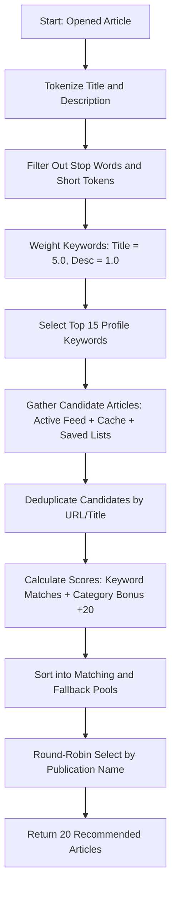

# Feature: News Reader (RSS Feed & Article Reader)

The News Reader is a core feature that provides users with a distraction-free, fast, and personalized news consumption experience. It aggregates articles from multiple RSS/WordPress JSON sources, sanitizes and reformats them for readability, syncs user-saved items (Read Later and Favorites) cross-platform, and presents intelligent, localized recommendations.

---

## 1. Functional Specification

### 1.1 Feed Subscription & Source Management
- **Categorized News Picker**: Feeds are organized into predefined categories (e.g., Tech, Markets, World, Local) to help users browse their topics of interest.
- **Custom RSS/WP-JSON Subscriptions**: Users can subscribe to custom sources by providing a feed URL and a display name. The app automatically fetches the website favicon (using the Google Favicon API fallback) and auto-detects whether the source uses a traditional XML RSS format or a WordPress JSON API (`wp-json`).
- **Atomic Loading & Cycles**: Users can swap between active feeds, pull to refresh, or cycle through publications sequentially using cycle controls.

### 1.2 Interactive Reader View (Distraction-Free Mode)
- **Fast-Path Extraction (SmartReader)**: By default, the app uses a backend scraping and parsing algorithm (`SmartReader`) to download and parse the raw webpage content. It extracts the core article text, author, and main image, stripping away headers, sidebars, scripts, and advertisements.
- **Featured Image Deduplication**: To avoid double-rendering, the engine compares the webpage's extracted featured image with the inline body images. It aggressively cleans up and removes any duplicate inline image tags and their empty parent containers.
- **Author Sanitization**: Standardizes author credits by cleaning up web junk (like "Social Links" or "See all articles") and automatically separates multiple concatenated titles (e.g., converting "Jane DoeSenior Editor" to "Jane Doe, Senior Editor").
- **WebView2 Web Scraping Fallback**: If the fast-path parser fails to find readable content (due to JS-dependent pages or heavy dynamic rendering), the app falls back to a hidden browser automation step:
  - It loads the article URL in a web view instance.
  - Automatically runs an injected JavaScript cleanup script to strip away cookie walls, GDPR consents, newsletter popups, paywall frames, and modal overlays.
  - Polls the DOM until JS-rendered content is present, extracts the full HTML, and parses it again.
  - If parsing still fails, it renders the raw webpage in the view.

### 1.3 Saved Lists (Offline / Sync Ready)
- **Read Later**: A bookmarking stack allowing users to save articles for future reading.
- **Favorites**: A starred article collection for keeping track of long-term references.
- Both lists support toggling items from inside the reader view toolbar or from the main list.

### 1.4 Smart Recommendations
- Suggests up to 20 related articles while the user is reading.
- Uses term-frequency heuristics, category matching, and a round-robin fairness strategy to build the recommendation set (see Technical Architecture).

---

## 2. Technical Architecture & Data Model

### 2.1 Dependency Injection & Services
- `IRssFeedService` / `RssFeedService`: Handles listing available feeds, downloading XML/JSON feeds, background pre-fetching, and full-article text scraping.
- `IRssArticleService` / `RssArticleService`: Manages saved articles (Read Later and Favorites) in the local database and coordinates sync events.
- `IDatabaseService` / `DatabaseService`: Coordinates local SQLite database connections and table initializations.
- `IRenderedHtmlService` / `MauiWebViewRenderedHtmlService`: (Platform-specific) Extracts fully rendered JS content on mobile web view runtimes.

### 2.2 Data Models & Schema
The database stores user subscriptions and saved articles, which are synchronized with Supabase:

#### Local Database Schema (SQLite / Mobile Sync)
- **`LocalRssSubscription`**:
  - `Id` (Guid String)
  - `UserId` (String)
  - `Name` (String)
  - `Url` (String)
  - `Category` (String)
  - `IconUrl` (String)
  - `CreatedAt` (DateTime)
  - `IsDeleted` (Boolean)
- **`LocalSavedArticle`**:
  - `Id` (Guid String)
  - `UserId` (String)
  - `Title` (String)
  - `ArticleUrl` (String) (Primary key for uniqueness)
  - `ArticleDate` (DateTime)
  - `ImageUrl` (String)
  - `Description` (String)
  - `Author` (String)
  - `Type` (Integer: Favorite = 1, ReadLater = 2)
  - `PublicationName` (String)
  - `PublicationIconUrl` (String)
  - `CreatedAt` (DateTime)

### 2.3 Smart Recommendation Algorithm Flow
When a user opens an article, the recommendation engine (`GetSmartRecommendations(RssItem currentItem)`) executes:

- **Fairness Guarantee**: The Round-Robin selection rotates through distinct publication names (e.g. taking one TechCrunch article, then one Wired article, then one VentureBeat article) to prevent a single source from filling the entire list.
- **Background Pre-fetching**: On startup, a background task (`PreFetchAllFeedsInBackground`) loops through all inactive feeds and downloads their feed items, caching them in `_allFeedsCache` so recommendation candidates are available instantly.

---

## 3. UI/UX & Styling

### 3.1 Custom Title Bar & Metadata Sync
- The reader view features a toolbar containing a back button, publication name, publication icon, and quick action buttons (Favorite/Read Later).
- In WinUI, the custom `AppTitleBar` coordinates authentication profile photos and light/dark theme toggles.

### 3.2 Dynamic Scroll Fade (WinUI)
- The smart recommendations list is a horizontally scrollable container.
- An event listener (`RecommendationsScrollViewer_ViewChanged`) calculates the position of each item relative to the scroll viewport bounds using `container.TransformToVisual(RecommendationsScrollViewer)`.
- It dynamically applies a linear opacity fade-out to items entering the left and right edges (fade zone = 36px), creating a smooth, premium glass-like visual edge transition.

---

## 4. Platform Implementation Differences (WinUI vs. MAUI / Blazor Hybrid)

| Characteristic | WinUI Implementation | MAUI / Blazor Hybrid Implementation |
| :--- | :--- | :--- |
| **Reader View Tech** | Native XAML `WebView2` Control | Blazor Hybrid DOM / Razor Markup |
| **HTML Display** | `ReaderWebView.NavigateToString(html)` with embedded styling template | `@((MarkupString)selectedItem.Content)` injected inside a `<MudPaper>` container |
| **Styles & Theme** | Dynamic XAML properties and `UpdateWebViewBackground()` which overrides default HTML bg color | Cascading MudBlazor styling themes and custom CSS variables |
| **Fallback Scraping** | Uses the desktop WebView2 browser engine, injecting Javascript scripts directly into chromium | Utilizes `IRenderedHtmlService` to orchestrate platform-native WebView elements on iOS/Android |
| **Recommendations UI** | Horizontal `ScrollViewer` + `ItemsControl` with manual scroll fade-out calculations | Standard MudBlazor list layout wrapped in a `<MudSwipeArea>` |
| **Navigation Flows** | Multi-level frame navigation inside `MainWindow.xaml` | Detail navigation service mapping URLs to Blazor components (`NavService`) |
| **Gestures** | Mouse-hover and scroll-wheel drag behaviors | Touch gestures: Swiping left-to-right on a MudSwipeArea closes the reader |
