# Feature: Smart Behavior Tracking & Analytics

The **Smart Behavior** engine provides a privacy-first, context-aware user profile tracking system. Guided by local on-device Artificial Intelligence (SLMs), it logs user interactions across all core features (Weather, News, Habits, Health, and Finances) to build a semantic interest profile. This profile is used to power personalized recommendations and adapt smart narratives, maintaining strict compliance with local-first privacy principles.

---

## 1. Functional Specification

### 1.1 Local Profile Analytics
The engine traces user behaviors locally on the device using specific event schemas:
- **News**: Logs `ReadArticle` events inside `RssFeedDetailPage.xaml.cs` when the article reader is opened. Tracks `title` and `source` metadata.
- **Weather**: Logs `ViewWeather` events in `WeatherDetailPage.xaml.cs` when forecasts are loaded/refreshed. Tracks `location` names along with `latitude` and `longitude` coordinates.
- **Habits**: Logs completions in `HabitsDetailPage.xaml.cs` under two action types: `LogWater` (metadata tracks drink name e.g., Water, Coffee, Tea, Juice, Beer, Wine, and volume in ml) and `LogSmoke` (metadata tracks tobacco type e.g., Cigarette, Heated Tobacco, Rolled, Cigarillo, and unit count).
- **Health**: Logs `ViewVitals` events in `HealthDetailPage.xaml.cs` when metrics are fetched. Tracks daily summary data including `steps`, `heartRate`, and `sleepHours`.
- **Finances**: Logs `ViewPortfolio` events when financial overviews are loaded (capturing `netWorth`, `cash`, and `investments` totals) and `FilterMarket` events when selecting stock/crypto/forex markets in `FinancesDetailPage.xaml.cs`.

### 1.2 Privacy-First Design
- **On-Device by Default**: All raw timeline events are stored in a local, encrypted SQLite database.
- **Toggleable Cloud Sync**: A settings toggle enables synchronization of behavior metrics to Supabase to support cross-device profiles. If disabled, all behavior events remain strictly local.
- **Data Erasure**: Users can completely purge their local and remote behavioral history at any time with a single click.

---

## 2. Technical Architecture & Data Model

### 2.1 Egress & Network Optimization
To avoid flooding Supabase with direct HTTP requests on every single user interaction, the engine implements a local buffer-and-flush queue:
1. Behavior events are written to the local SQLite database.
2. If cloud sync is enabled, a background thread is spawned to batch upsert new events to Supabase.
3. Failed updates fail silently and are retried during the next sync event.

```mermaid
sequenceDiagram
    participant User as User Interaction
    participant LocalDB as SQLite (Local)
    participant SyncService as Behavior Service Sync
    participant RemoteDB as Supabase (Cloud)

    User->>LocalDB: Log event (IsSynced = false)
    Note over LocalDB: Local buffer updated
    rect rgb(30, 41, 59)
    Note over SyncService: Trigger Batch Sync
    SyncService->>LocalDB: Fetch unsynced events
    LocalDB-->>SyncService: Return event list
    SyncService->>RemoteDB: Batch Upsert (Single API request)
    RemoteDB-->>SyncService: Upsert Acknowledged
    SyncService->>LocalDB: Update events (IsSynced = true)
    end
```



### 2.2 Database Schemas

#### 2.2.1 Local SQLite Model
```csharp
[Table("smart_behavior_events")]
public class SmartBehaviorEvent
{
    [PrimaryKey]
    public string Id { get; set; } = null!;
    public string UserId { get; set; } = null!;
    public string Feature { get; set; } = null!;      // e.g., "News", "Weather", "Health"
    public string ActionType { get; set; } = null!;   // e.g., "ReadArticle", "GoalMet", "SearchLocation"
    public string Metadata { get; set; } = null!;     // JSON payload containing context details
    public DateTime Timestamp { get; set; }
    public bool IsSynced { get; set; }
}
```

#### 2.2.2 Supabase Postgrest Model
```csharp
[Table("smart_behavior_events")]
public class SmartBehaviorEventRemote : BaseModel
{
    [PrimaryKey]
    [Column("id")]
    public string Id { get; set; } = null!;

    [Column("user_id")]
    public string UserId { get; set; } = null!;

    [Column("feature")]
    public string Feature { get; set; } = null!;

    [Column("action_type")]
    public string ActionType { get; set; } = null!;

    [Column("metadata")]
    public string Metadata { get; set; } = null!;

    [Column("created_at")]
    public DateTime Timestamp { get; set; }
}
```

### 2.3 Context Window Optimization (SLM Recommendations)
Feeding thousands of raw behavior events into a local Small Language Model (SLM) like Llama 3.2 1B or Phi Silica is impractical due to context-window token limits (typically 2,048 tokens).

To resolve this, `BehaviorService` aggregates the raw timeline logs into a compact **7-Day Semantic Summary** prior to generating recommendations:

```text
User Behavior Insights (Last 7 Days):
- Feature: News
  * ReadArticle: 14 times
  * SearchTopic: 3 times
- Feature: Habits
  * LogHydration: 6 times
  * CompleteHabit: 8 times
- Feature: Health
  * SyncVitals: 7 times
```

This aggregated summary uses less than 150 tokens, fitting comfortably within prompt limitations and reserving maximum context space for the SLM's narrative planning.

---

## 3. UI/UX & Layout Settings

The user controls for the behavior engine are situated in the **Features Settings** panel under the "Smart Behavior Analytics" card:
1. **Smart Behavior Engine Toggle**: Enable or disable the local tracking engine entirely.
2. **Sync Behavior to Cloud Toggle**: Toggle cloud backups to Supabase.
3. **Clear History Button**: Instantly erases all behavior logs locally and prompts a notification upon successful deletion.

These settings are serialized immediately into `%LocalAppData%\Daily.WinUI\settings.json`.
