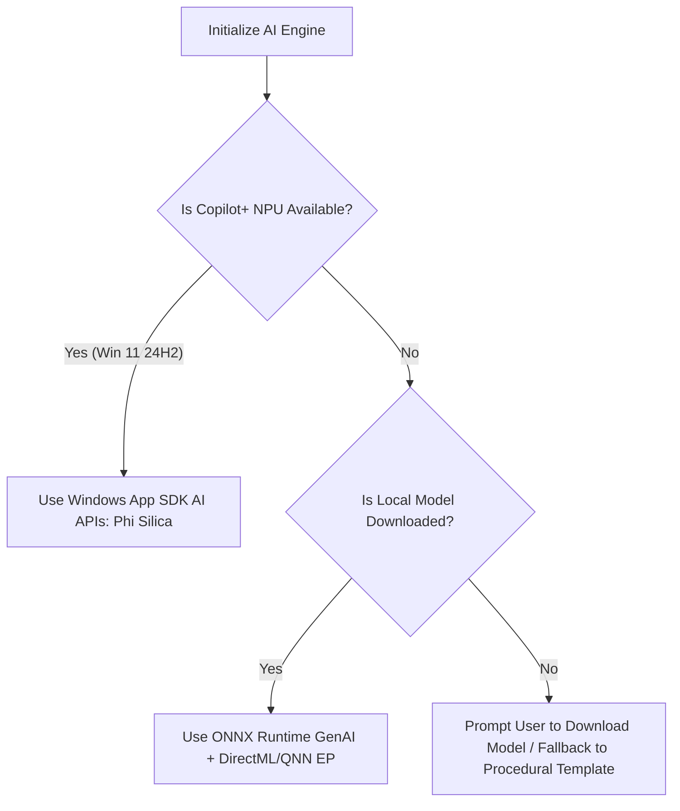

# Feature: Local Smart Intelligence (On-Device NPU/GPU AI)

The Local Smart Intelligence feature integrates lightweight, privacy-first, on-device Small Language Models (SLMs) into the Daily application. It utilizes hardware-accelerated NPUs (Neural Processing Units) and GPUs to power local content summarization, vitals trend analysis, budget recommendations, and daily schedule narrative briefings, all without transmitting personal user data to third-party cloud servers.

---

## 1. Functional Specification

### 1.1 Local Intelligence Engine
- **Hardware-Aware Execution**: The app detects the host machine's hardware capabilities at launch to determine execution strategies:
  - **Copilot+ NPU Acceleration**: On Copilot+ PCs (e.g., ARM64 Snapdragon X Elite, or Intel Lunar Lake / AMD Strix Point devices with 40+ TOPS NPUs), the app runs workloads on the dedicated NPU.
  - **GPU Acceleration**: On devices with dedicated GPUs (NVIDIA/AMD/Intel) or capable integrated graphics, the app falls back to GPU execution via DirectML.
  - **CPU Fallback**: For older hardware, workloads run on the CPU (using optimized INT4 quantized weights). If no local model is ready or download is cancelled, the system falls back immediately to a structured C# template to guarantee absolute app stability.
- **Zero-Installer Bloat (Download-on-Demand)**: To keep the initial application installer small (~80MB), the local AI model is not pre-packaged. Instead, users are prompted in the Settings screen to download a **Local Intelligence Pack** (~670MB) containing optimized INT4 weights for Llama 3.2 1B Instruct. The pack is saved locally in `%LocalAppData%\Daily.WinUI\models\llama1b`.

### 1.2 Smart Features Suite

#### 1.2.1 News Smart Summarizer
- **Distraction-Free Summary**: Extracts bullet points of the key facts, estimated reading time, and sentiment analysis for subscribed RSS/WordPress articles.
- **Interactive Reader Q&A**: Lets users ask questions about the article context (e.g., "What was the company's Q3 revenue mentioned in the text?").

#### 1.2.2 Vitals & Health Coach
- **7-Day Trend Analysis**: Synthesizes Step, Sleep, Heart Rate, Calories, Weight, and HRV trends to provide actionable suggestions.
- **Correlative Insights**: Identifies relationships between distinct metrics (e.g., "Your HRV dropped by 18% on the 2 days you logged less than 1.5L of water. Focus on reaching your water goal today to improve your recovery.").

#### 1.2.3 Financial & Budget Advisory
- **Portfolio Health Commentary**: Generates textual summaries of stock watchlists and asset performance.
- **Weekly Budget Optimizer**: Analyzes transaction categories to recommend adjustments (e.g., "Dining Out expenses are up 15% this week. We suggest reallocating $20 to your emergency savings goal.").

#### 1.2.4 Habits Companion
- **Streak & Consistency Insights**: Analyzes habit history to identify behavioral triggers.
- **Proactive Prompts**: Generates context-aware notifications (e.g., "You typically complete your 'Evening Walk' habit on days you finish your tasks before 5 PM. You have 1 task left—finish it now to keep your walk streak alive!").

#### 1.2.5 Weather & Daily Narrative Briefing
- **Dynamic Morning Narrative**: Merges weather forecast, calendar events, high-priority tasks, and habits into a cohesive "Daily Briefing".
- **Example output**: *"Good morning, Mihai! It's going to be rainy (18°C) today, so we recommend doing your daily cardio habit indoors. You have 3 high-priority tasks due today, and a meeting at 2 PM. Let's make it a great day!"*

#### 1.2.6 Smart Behavior Personalization
- **Behavior-Aware Narrative**: Integrates aggregated 7-day semantic behavior profile statistics (e.g., hydration trends, preferred news topics) to personalize the daily narrative.
- **Dynamic Recommendations**: Tailors news feed suggestions and habit streak warnings based on user pattern history. For full details on database schemas and sync mechanisms, refer to the [Smart Behavior Guide](Behavior.md).

---

## 2. Technical Architecture & Data Model

### 2.1 Native Windows AI vs. Bring-Your-Own-Model (BYOM)
The app implements a **Hybrid AI Provider** model to bridge the gap between platform capabilities:



1. **Windows Copilot Runtime (Built-in Phi Silica)**
   - Utilizes Windows 11's built-in **Phi Silica** (3.3B parameter SLM) via native Windows App SDK APIs.
   - **Advantage**: Requires zero additional downloads, uses the NPU directly with high energy efficiency, and lifecycle management is handled by the OS.
2. **ONNX Runtime GenAI (BYOM fallback)**
   - Executes custom quantized models (specifically Llama-3.2-1B-Instruct-INT4) using `Microsoft.ML.OnnxRuntimeGenAI.DirectML` or the `QNN` Execution Provider.
   - **Advantage**: Works across all Windows hardware (GPU, Intel/AMD/Qualcomm NPUs, and CPUs).

### 2.2 API Blueprint & Implementation

#### 2.2.1 Service Interface
```csharp
public interface ISmartIntelligenceService
{
    Task<bool> IsModelReadyAsync();
    Task<string> GenerateResponseAsync(string systemPrompt, string userPrompt, CancellationToken ct = default);
}
```

#### 2.2.2 Windows App SDK (Phi Silica) Integration
```csharp
using Microsoft.Windows.AI;
using Microsoft.Windows.AI.Text;

public class PhiSilicaSmartService : ISmartIntelligenceService
{
    private LanguageModel? _model;

    public async Task<bool> IsModelReadyAsync()
    {
        try
        {
            var state = LanguageModel.GetReadyState();
            return state == AIFeatureReadyState.Ready;
        }
        catch
        {
            return false;
        }
    }

    public async Task<string> GenerateResponseAsync(string systemPrompt, string userPrompt, CancellationToken ct = default)
    {
        if (_model == null)
        {
            _model = await LanguageModel.CreateAsync();
        }
        
        string prompt = $"<|system|>\n{systemPrompt}<|end|>\n<|user|>\n{userPrompt}<|end|>\n<|assistant|>\n";
        var result = await _model.GenerateResponseAsync(prompt).AsTask(ct);
        
        if (result.Status == LanguageModelResponseStatus.Complete)
        {
            return result.Text;
        }
        throw new Exception($"Phi Silica generation failed: {result.Status}");
    }
}
```

#### 2.2.3 ONNX Runtime GenAI (DirectML/QNN) Integration
Requires the `Microsoft.ML.OnnxRuntimeGenAI.DirectML` NuGet package.

```csharp
using Microsoft.ML.OnnxRuntimeGenAI;

public class OnnxGenAiSmartService : ISmartIntelligenceService
{
    private Model? _model;
    private Tokenizer? _tokenizer;
    private readonly string _modelPath = Path.Combine(Environment.GetFolderPath(Environment.SpecialFolder.LocalApplicationData), "Daily.WinUI", "models", "llama1b");

    public Task<bool> IsModelReadyAsync()
    {
        string filePath = Path.Combine(_modelPath, "model.onnx");
        return Task.FromResult(Directory.Exists(_modelPath) && File.Exists(filePath));
    }

    public async Task<string> GenerateResponseAsync(string systemPrompt, string userPrompt, CancellationToken ct = default)
    {
        if (_model == null)
        {
            await Task.Run(() =>
            {
                _model = new Model(_modelPath);
                _tokenizer = new Tokenizer(_model);
            });
        }

        // Llama 3 Chat Format
        string formattedPrompt = $"<|begin_of_text|><|start_header_id|>system<|end_header_id|>\n\n{systemPrompt}<|eot_id|><|start_header_id|>user<|end_header_id|>\n\n{userPrompt}<|eot_id|><|start_header_id|>assistant<|end_header_id|>\n\n";
        StringBuilder responseText = new StringBuilder();

        await Task.Run(() =>
        {
            using var tokens = _tokenizer.Encode(formattedPrompt);
            using var generatorParams = new GeneratorParams(_model);
            generatorParams.SetSearchOption("max_length", 2048);

            using var generator = new Generator(_model, generatorParams);
            generator.AppendTokenSequences(tokens);
            using var tokenizerStream = _tokenizer.CreateStream();

            while (!generator.IsDone() && !ct.IsCancellationRequested)
            {
                generator.GenerateNextToken();
                var sequence = generator.GetSequence(0);
                var newToken = sequence[^1];
                string chunk = tokenizerStream.Decode(newToken);
                responseText.Append(chunk);
            }
        }, ct);

        return responseText.ToString();
    }
}
```

### 2.3 Local Manifest Data Model (`settings.json` entry)
```json
{
  "StartupSmartBriefing": true,
  "SelectedAiAccelerator": "Auto",
  "AiModelPath": "%LocalAppData%/Daily.WinUI/models/llama1b"
}
```

---

## 3. UI/UX & Layout

### 3.1 Integrated Views & Interacting Panels
- **Smart Briefing Overlay**: A premium welcome screen that overlays the main dashboard (frosted glassmorphism, adapting to light/dark themes).
  - *Dynamic Typing Narrative*: A Samsung Bixby/Assistant-style text typing block displaying time-adapted greetings and summarized daily highlights.
  - *Typewriter Animation Milestones*: Visual cards slide up and fade into view sequentially as typing progress metrics are reached:
    - **20% Progress**: Fades in the *Weather Forecast card* (max temp, 3-day preview).
    - **40% Progress**: Fades in the *Health & Vitals card* (steps progress, sleep duration, resting heart rate).
    - **60% Progress**: Fades in the *Finances & Watchlist card* (net worth, ticker changes).
    - **80% Progress**: Fades in the *Habits Tracker card* (completion ratio, circular progress).
    - **92% Progress**: Fades in the *AI News Recommendations card* (embedded `NewsRecommendationsWidgetControl` showing custom feed topics).
  - *Responsive Layout & Docking*: Listens to window resizing to toggle layouts. Wide window widths display narrative and cards side-by-side (24px margins). When docked or resized under 850px width, panels stack vertically with narrow margins (6px margins) to optimize layout density.
  - *Start My Day Centering*: The primary action button and "Show at startup" checkbox are vertically and horizontally centered in the actions panel.
- **Settings Panel (AI & Accelerator Preferences)**:
  - Toggle switch for "Startup Smart Briefing" which saves state immediately.
  - Local AI Accelerator combo box to select the hardware device (`Auto`, `NPU`, `GPU (DirectML)`, `CPU`).
  - NPU/Hardware engine detection displaying dynamic recommendations ("Recommended for your system") based on CPU/NPU hardware capabilities.
  - "Download AI Pack" button executing a real sequential download from Hugging Face for the ~670MB model weights, displaying real-time speed (MB/s), completion percentage, and estimated time remaining (ETA) with cancellation support.


---

## 4. Platform Implementation Differences (WinUI vs. MAUI / Blazor Hybrid)

| Characteristic | WinUI Implementation | MAUI / Blazor Hybrid Implementation |
| :--- | :--- | :--- |
| **Model Runtime** | Direct access to `ONNX Runtime GenAI` and Windows Copilot Runtime APIs | Integrates via native platform-specific OS runtime bindings |
| **NPU Interface** | DirectML / QNN Execution Provider (`QnnHtp.dll` for Snapdragon) | iOS: Apple Intelligence / CoreML (Apple Neural Engine). Android: Gemini Nano / Google AICore APIs |
| **Model Size / Options** | Custom 1.5B–3.8B parameters models (INT4 quantized) | System-managed models (Gemini Nano on Android, Apple intelligence models on iOS) |
| **User Settings UI** | Custom WinUI Settings panel with download-on-demand progress bars | Platform system settings or Blazor settings configurations |
