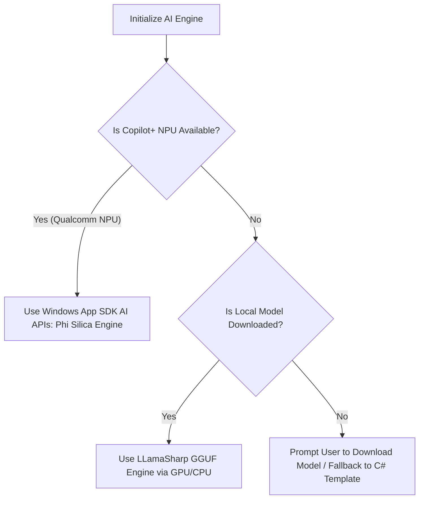

# Feature: Local Smart Briefing (On-Device NPU/GPU AI)

The Local Smart Briefing feature integrates lightweight, privacy-first, on-device Small Language Models (SLMs) into the Daily application. It utilizes hardware-accelerated NPUs (Neural Processing Units) and GPUs to power local content summarization, vitals trend analysis, budget recommendations, and daily schedule narrative briefings, all without transmitting personal user data to third-party cloud servers.

---

## 1. Functional Specification

### 1.1 Local Intelligence Engine
- **Hardware-Aware Execution**: The app detects the host machine's hardware capabilities at launch to determine execution strategies:
  - **Copilot+ NPU Acceleration**: On Copilot+ PCs (e.g., ARM64 Snapdragon X Elite devices with Qualcomm Hexagon NPUs), the app runs workloads on the dedicated NPU.
  - **GPU Acceleration**: On devices with dedicated GPUs (NVIDIA/AMD) or capable integrated graphics, the app falls back to GPU execution via LLamaSharp (using Vulkan/CUDA).
  - **CPU Fallback**: For older hardware, workloads run on the CPU (using optimized INT4 quantized weights). If no local model is ready or download is cancelled, the system falls back immediately to a structured C# template to guarantee absolute app stability.
- **Zero-Installer Bloat (Download-on-Demand)**: To keep the initial application installer small (~80MB), the local AI model is not pre-packaged. Instead, users are prompted in the Settings screen to download a **Local Intelligence Pack** (~600MB) containing optimized INT4 GGUF weights. The pack is saved locally in `%LocalAppData%\Daily.WinUI\models\<model_folder>\model.gguf`.

### 1.2 Smart Features Suite

#### 1.2.1 News Smart Summarizer
- **Distraction-Free Summary**: Extracts bullet points of the key facts, estimated reading time, and sentiment analysis for subscribed RSS/WordPress articles.
- **Interactive Reader Q&A**: Lets users ask questions about the article context (e.g., "What was the company's Q3 revenue mentioned in the text?").

#### 1.2.2 Vitals & Health Coach
- **7-Day Trend Analysis**: Synthesizes Step, Sleep, Heart Rate, Calories, Weight, and HRV trends to provide actionable suggestions.
- **Correlative Insights**: Identifies relationships between distinct metrics (e.g., "Your HRV dropped by 18% on the 2 days you logged less than 1.5L of water. Focus on reaching your water goal today to improve your recovery.").

#### 1.2.3 Financial & Budget Advisory
- **Portfolio Health Commentary**: Generates textual summaries of stock watchlists and asset performance.
- **Weekly Budget Optimizer**: Analyzes transaction categories to recommend adjustments (e.g., "Dining Out expenses are up 15% this week. We suggest reallocating $20 to your emergency savings goal.").

#### 1.2.4 Habits Companion
- **Streak & Consistency Insights**: Analyzes habit history to identify behavioral triggers.
- **Proactive Prompts**: Generates context-aware notifications (e.g., "You typically complete your 'Evening Walk' habit on days you finish your tasks before 5 PM. You have 1 task left—finish it now to keep your walk streak alive!").

#### 1.2.5 Weather & Daily Narrative Briefing
- **Dynamic Morning Narrative**: Merges weather forecast, calendar events, high-priority tasks, and habits into a cohesive "Daily Briefing".
- **Example output**: *"Good morning, Mihai! It's going to be rainy (18°C) today, so we recommend doing your daily cardio habit indoors. You have 3 high-priority tasks due today, and a meeting at 2 PM. Let's make it a great day!"*

#### 1.2.6 Smart Behavior Personalization
- **Behavior-Aware Narrative**: Integrates aggregated 7-day semantic behavior profile statistics (e.g., hydration trends, preferred news topics) to personalize the daily narrative.
- **Dynamic Recommendations**: Tailors news feed suggestions and habit streak warnings based on user pattern history. For full details on database schemas and sync mechanisms, refer to the [Smart Behavior Guide](Behavior.md).

---

## 2. Technical Architecture & Data Model

### 2.1 Native Windows AI vs. Bring-Your-Own-Model (BYOM)
The app implements a **Hybrid AI Provider** model to bridge the gap between platform capabilities:



1. **Windows Copilot Runtime (Built-in Phi Silica)**
   - Utilizes Windows 11's built-in **Phi Silica** (3.3B parameter SLM) via native Windows App SDK APIs.
   - **Advantage**: Requires zero additional downloads, uses the NPU directly with high energy efficiency, and lifecycle management is handled by the OS.
2. **LLamaSharp GGUF Engine (BYOM fallback)**
   - Executes custom quantized models (specifically Llama-3.2-1B, Qwen-2.5-1.5B, Gemma-3-1B, and Phi-3.5-Mini) in GGUF format using Vulkan/CUDA GPU runtimes or CPU instructions.
   - **Advantage**: Works across all Windows hardware (NVIDIA, AMD, Intel GPU, and CPUs).

### 2.2 API Blueprint & Implementation

#### 2.2.1 Service Interface
```csharp
public interface ISmartIntelligenceService
{
    Task<bool> IsModelReadyAsync();
    Task<string> GenerateResponseAsync(string systemPrompt, string userPrompt, CancellationToken ct = default);
}
```

#### 2.2.2 Windows App SDK (Phi Silica) Integration
```csharp
using Microsoft.Windows.AI;
using Microsoft.Windows.AI.Text;

public class PhiSilicaNpuEngine : ISmartBriefingEngine
{
    private LanguageModel? _model;
    private bool _initialized;

    public async Task<bool> IsSupportedAsync()
    {
        try
        {
            // Unlocks Microsoft Limited Access Feature (LAF) prior to query
            var access = Windows.ApplicationModel.LimitedAccessFeatures.TryUnlockFeature(
                "com.microsoft.windows.ai.languagemodel",
                "bm83TtgNO2HbnbBAf79aIQ==",
                "1z32rh13vfry6 has registered their use of com.microsoft.windows.ai.languagemodel with Microsoft and agrees to the terms of use.");

            if (access.Status != Windows.ApplicationModel.LimitedAccessFeatureStatus.Available &&
                access.Status != Windows.ApplicationModel.LimitedAccessFeatureStatus.AvailableWithoutToken)
            {
                return false;
            }

            var state = LanguageModel.GetReadyState();
            return state == AIFeatureReadyState.Ready || state == AIFeatureReadyState.NotReady;
        }
        catch
        {
            return false;
        }
    }

    public async Task InitializeAsync()
    {
        if (_initialized) return;
        _model = await LanguageModel.CreateAsync();
        _initialized = true;
    }

    public async Task<string> GenerateBriefingAsync(string prompt)
    {
        var result = await _model.GenerateResponseAsync(prompt);
        if (result.Status == LanguageModelResponseStatus.Complete)
        {
            return result.Text;
        }
        throw new Exception($"Phi Silica generation failed: {result.Status}");
    }
}
```

#### 2.2.3 LLamaSharp GGUF Integration
```csharp
using LLama;
using LLama.Common;

public class LLamaUniversalEngine : ISmartBriefingEngine, IDisposable
{
    private readonly bool _allowGpuOffload;
    private LLamaWeights? _weights;
    private string? _loadedModelPath;
    private bool _initialized;

    public async Task InitializeAsync()
    {
        var settings = SettingsService.Load();
        string selectedModelId = settings.SelectedLocalAiModel ?? "llama32_1b";
        string modelPath = Path.Combine(SettingsService.GetModelDirectory(selectedModelId), "model.gguf");

        if (_initialized && _loadedModelPath == modelPath && _weights != null) return;

        // Clean up previous weights before loading new ones
        _weights?.Dispose();
        _weights = null;
        _initialized = false;

        var parameters = new ModelParams(modelPath)
        {
            ContextSize = 4096,
            GpuLayerCount = _allowGpuOffload ? 99 : 0
        };

        _weights = await Task.Run(() => LLamaWeights.LoadFromFile(parameters));
        _loadedModelPath = modelPath;
        _initialized = true;
    }

    public async Task<string> GenerateBriefingAsync(string prompt)
    {
        var parameters = new ModelParams(_loadedModelPath)
        {
            ContextSize = 4096,
            GpuLayerCount = _allowGpuOffload ? 99 : 0
        };

        using var context = _weights.CreateContext(parameters);
        var executor = new StatelessExecutor(_weights, parameters);
        // Execute token generation loop...
    }
    
    public void Dispose()
    {
        _weights?.Dispose();
    }
}
```

### 2.3 Local Manifest Data Model (`settings.json` entry)
```json
{
  "EnableSmartBriefing": true,
  "SelectedAiAccelerator": "GPU",
  "SelectedLocalAiModel": "gemma3_1b",
  "UseWindowsInternalAi": false
}
```

### 2.4 Packaging & Isolated Backend Copying
When packaging a WinUI 3 application, multiple `LLamaSharp.Backend.*` packages (e.g. Vulkan and CUDA) conflict by copying their custom compile outputs to the same target DLL name (`llama.dll`).

To resolve this conflict, the project targets copy backend runtimes into isolated subfolders and registers them inside the MSIX package layout:
1. **Isolated Copy Target**: Copies backend DLLs from NuGet packages into `runtimes\win-x64\native\<backend_name>` directories.
2. **AppX Packaging Target**: Inserts these runtimes into the app payload:
   ```xml
   <Target Name="AddLLamaBackendsToPayload" BeforeTargets="_ComputeAppxPackagePayload">
     <ItemGroup>
       <BackendFiles Include="$(OutputPath)runtimes\**\*.*" />
       <PackagingOutputs Include="@(BackendFiles)">
         <TargetPath>runtimes\%(RecursiveDir)%(Filename)%(Extension)</TargetPath>
         <ProjectName>$(MSBuildProjectName)</ProjectName>
         <OutputGroup>LLamaBackendsGroup</OutputGroup>
       </PackagingOutputs>
     </ItemGroup>
   </Target>
   ```
3. **Dynamic DLL Search Preloading**: At runtime, `AIManager` calls `SetDllDirectory()` pointing to the isolated subdirectory (`cuda12` or `vulkan`) before `LLamaUniversalEngine` loads, ensuring the correct vendor DLL is resolved.

---

## 3. UI/UX & Layout

### 3.1 Integrated Views & Interacting Panels
- **Smart Briefing Overlay**: A premium welcome screen that overlays the main dashboard (frosted glassmorphism, adapting to light/dark themes).
  - *Dynamic Typing Narrative*: A Bixby/Assistant-style text typing block displaying time-adapted greetings and summarized daily highlights.
  - *Typewriter Animation Milestones*: Visual cards slide up and fade into view sequentially as typing progress metrics are reached:
    - **20% Progress**: Fades in the *Weather Forecast card* (max temp, 3-day preview).
    - **40% Progress**: Fades in the *Health & Vitals card* (steps progress, sleep duration, resting heart rate).
    - **60% Progress**: Fades in the *Finances & Watchlist card* (net worth, ticker changes).
    - **80% Progress**: Fades in the *Habits Tracker card* (completion ratio, circular progress).
    - **92% Progress**: Fades in the *AI News Recommendations card* (embedded `NewsRecommendationsWidgetControl` showing custom feed topics).
  - *Responsive Layout & Docking*: Listens to window resizing to toggle layouts. Wide window widths display narrative and cards side-by-side. When docked or resized under 850px width, panels stack vertically with narrow margins to optimize layout density.
  - *Start My Day Centering*: The primary action button and "Show at startup" checkbox are vertically and horizontally centered in the actions panel.
- **Settings Panel (AI & Accelerator Preferences)**:
  - Toggle switch for "Startup Smart Briefing" which saves state immediately.
  - Local AI Accelerator combo box to select the hardware device (`Auto`, `NPU`, `GPU`, `CPU`, `Fallback`).
  - NPU/Hardware engine detection displaying dynamic recommendations ("Recommended for your system") based on CPU/NPU hardware capabilities.
  - "Download AI Pack" button executing a download from Hugging Face for the optimized model weights, displaying real-time speed (MB/s), completion percentage, and estimated time remaining (ETA).

---

## 4. Platform Implementation Differences (WinUI vs. MAUI / Blazor Hybrid)

| Characteristic | WinUI Implementation | MAUI / Blazor Hybrid Implementation |
| :--- | :--- | :--- |
| **Model Runtime** | Direct access to `LLamaSharp` GGUF engine and Windows Copilot Runtime | Integrates via native platform-specific OS runtime bindings |
| **NPU Interface** | Windows App SDK LanguageModel API (`PhiSilicaNpuEngine`) | iOS: Apple Intelligence / CoreML. Android: Gemini Nano / Google AICore APIs |
| **Model Size / Options** | Custom 1.0B–3.8B parameters GGUF models | System-managed models (Gemini Nano on Android, Apple intelligence models on iOS) |
| **User Settings UI** | Custom WinUI Settings panel with download-on-demand progress bars | Platform system settings or Blazor settings configurations |
