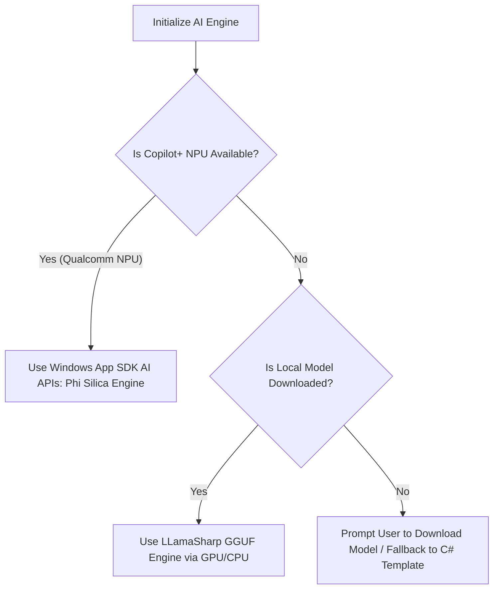
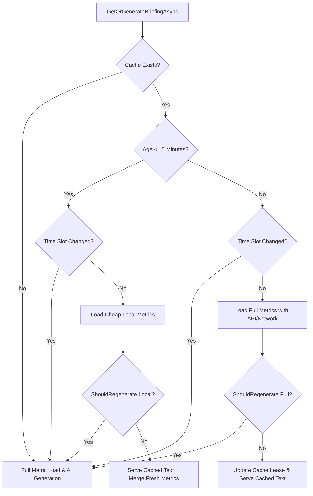

# Feature: Local Smart Briefing (On-Device NPU/GPU AI)

The Local Smart Briefing feature integrates lightweight, privacy-first, on-device Small Language Models (SLMs) into the Daily application. It utilizes hardware-accelerated NPUs (Neural Processing Units) and GPUs to power local content summarization, vitals trend analysis, budget recommendations, and daily schedule narrative briefings, all without transmitting personal user data to third-party cloud servers.

---

## 1. Functional Specification

### 1.1 Local Intelligence Engine
- **Hardware-Aware Execution**: The app detects the host machine's hardware capabilities at launch to determine execution strategies:
  - **Copilot+ NPU Acceleration**: On Copilot+ PCs (e.g., ARM64 Snapdragon X Elite devices with Qualcomm Hexagon NPUs), the app runs workloads on the dedicated NPU. Intel AI Boost and AMD Ryzen AI NPUs are currently unsupported directly for custom GGUF models and will fall back to CPU or GPU execution.
  - **GPU Acceleration**: On devices with dedicated GPUs (NVIDIA/AMD) or capable integrated graphics, the app falls back to GPU execution via LLamaSharp (using Vulkan/CUDA).
  - **CPU Fallback**: For unsupported NPUs or older hardware, workloads run on the CPU (using optimized INT4 quantized weights). If no local model is ready or download is cancelled, the system falls back immediately to a structured C# template to guarantee absolute app stability.
- **Zero-Installer Bloat (Download-on-Demand)**: To keep the initial application installer small (~80MB), the local AI model is not pre-packaged. Instead, users are prompted in the Settings screen to download a **Local Intelligence Pack** (~600MB) containing optimized INT4 GGUF weights. The pack is saved locally in `%LocalAppData%\Daily.WinUI\models\<model_folder>\model.gguf`.

### 1.2 Smart Features Suite

#### 1.2.1 News Smart Summarizer
- **Distraction-Free Summary**: Extracts bullet points of the key facts, estimated reading time, and sentiment analysis for subscribed RSS/WordPress articles.
- **Interactive Reader Q&A**: Lets users ask questions about the article context (e.g., "What was the company's Q3 revenue mentioned in the text?").

#### 1.2.2 Vitals & Health Coach
- **7-Day Trend Analysis**: Synthesizes Step, Sleep, Heart Rate, Calories, Weight, and HRV trends to provide actionable suggestions.
- **Correlative Insights**: Identifies relationships between distinct metrics (e.g., "Your HRV dropped by 18% on the 2 days you logged less than 1.5L of water. Focus on reaching your water goal today to improve your recovery.").

#### 1.2.3 Financial & Budget Advisory
- **Portfolio Health Commentary**: Generates textual summaries of stock watchlists and asset performance.
- **Weekly Budget Optimizer**: Analyzes transaction categories to recommend adjustments (e.g., "Dining Out expenses are up 15% this week. We suggest reallocating $20 to your emergency savings goal.").

#### 1.2.4 Habits Companion
- **Streak & Consistency Insights**: Analyzes habit history to identify behavioral triggers.
- **Proactive Prompts**: Generates context-aware notifications (e.g., "You typically complete your 'Evening Walk' habit on days you finish your tasks before 5 PM. You have 1 task left—finish it now to keep your walk streak alive!").

#### 1.2.5 Weather & Daily Narrative Briefing
- **Dynamic Morning Narrative**: Merges weather forecast, calendar events, high-priority tasks, and habits into a cohesive "Daily Briefing".
- **Example output**: *"It's going to be rainy (18°C) today, so we recommend doing your daily cardio habit indoors. You have 3 high-priority tasks due today, and a meeting at 2 PM. Let's make it a productive day!"*

#### 1.2.6 Smart Behavior Personalization
- **Behavior-Aware Narrative**: Integrates aggregated 7-day semantic behavior profile statistics (e.g., hydration trends, preferred news topics) to personalize the daily narrative.
- **Dynamic Recommendations**: Tailors news feed suggestions and habit streak warnings based on user pattern history. For full details on database schemas and sync mechanisms, refer to the [Smart Behavior Guide](Behavior.md).

---

## 2. Technical Architecture & Data Model

### 2.1 Native Windows AI vs. Bring-Your-Own-Model (BYOM)
The app implements a **Hybrid AI Provider** model to bridge the gap between platform capabilities:



1. **Windows Copilot Runtime (Built-in Phi Silica)**
   - Utilizes Windows 11's built-in **Phi Silica** (3.3B parameter SLM) via native Windows App SDK APIs.
   - **Advantage**: Requires zero additional downloads, uses the NPU directly with high energy efficiency, and lifecycle management is handled by the OS.
2. **LLamaSharp GGUF Engine (BYOM fallback)**
   - Executes custom quantized models (specifically Llama-3.2-1B, Qwen-2.5-1.5B, Gemma-3-1B, and Phi-3.5-Mini) in GGUF format using Vulkan/CUDA GPU runtimes or CPU instructions.
   - **Advantage**: Works across all Windows hardware (NVIDIA, AMD, Intel GPU, and CPUs).

### 2.2 API Blueprint & Implementation

#### 2.2.1 Service Interface
```csharp
public interface ISmartIntelligenceService
{
    Task<bool> IsModelReadyAsync();
    Task<string> GenerateResponseAsync(string systemPrompt, string userPrompt, CancellationToken ct = default);
}
```

#### 2.2.2 Windows App SDK (Phi Silica) Integration
```csharp
using Microsoft.Windows.AI;
using Microsoft.Windows.AI.Text;

public class PhiSilicaNpuEngine : ISmartBriefingEngine
{
    private LanguageModel? _model;
    private bool _initialized;

    public async Task<bool> IsSupportedAsync()
    {
        try
        {
            // Unlocks Microsoft Limited Access Feature (LAF) prior to query
            var access = Windows.ApplicationModel.LimitedAccessFeatures.TryUnlockFeature(
                "com.microsoft.windows.ai.languagemodel",
                "bm83TtgNO2HbnbBAf79aIQ==",
                "1z32rh13vfry6 has registered their use of com.microsoft.windows.ai.languagemodel with Microsoft and agrees to the terms of use.");

            if (access.Status != Windows.ApplicationModel.LimitedAccessFeatureStatus.Available &&
                access.Status != Windows.ApplicationModel.LimitedAccessFeatureStatus.AvailableWithoutToken)
            {
                return false;
            }

            var state = LanguageModel.GetReadyState();
            return state == AIFeatureReadyState.Ready || state == AIFeatureReadyState.NotReady;
        }
        catch
        {
            return false;
        }
    }

    public async Task InitializeAsync()
    {
        if (_initialized) return;
        _model = await LanguageModel.CreateAsync();
        _initialized = true;
    }

    public async Task<string> GenerateBriefingAsync(string prompt)
    {
        var result = await _model.GenerateResponseAsync(prompt);
        if (result.Status == LanguageModelResponseStatus.Complete)
        {
            return result.Text;
        }
        throw new Exception($"Phi Silica generation failed: {result.Status}");
    }
}
```

#### 2.2.3 LLamaSharp GGUF Integration
```csharp
using LLama;
using LLama.Common;

public class LLamaUniversalEngine : ISmartBriefingEngine, IDisposable
{
    private readonly bool _allowGpuOffload;
    private LLamaWeights? _weights;
    private string? _loadedModelPath;
    private bool _initialized;

    public async Task InitializeAsync()
    {
        var settings = SettingsService.Load();
        string selectedModelId = settings.SelectedLocalAiModel ?? "llama32_1b";
        string modelPath = Path.Combine(SettingsService.GetModelDirectory(selectedModelId), "model.gguf");

        if (_initialized && _loadedModelPath == modelPath && _weights != null) return;

        // Clean up previous weights before loading new ones
        _weights?.Dispose();
        _weights = null;
        _initialized = false;

        var parameters = new ModelParams(modelPath)
        {
            ContextSize = 4096,
            GpuLayerCount = _allowGpuOffload ? 99 : 0
        };

        _weights = await Task.Run(() => LLamaWeights.LoadFromFile(parameters));
        _loadedModelPath = modelPath;
        _initialized = true;
    }

    public async Task<string> GenerateBriefingAsync(string prompt)
    {
        var parameters = new ModelParams(_loadedModelPath)
        {
            ContextSize = 4096,
            GpuLayerCount = _allowGpuOffload ? 99 : 0
        };

        using var context = _weights.CreateContext(parameters);
        var executor = new StatelessExecutor(_weights, parameters);
        // Execute token generation loop...
    }
    
    public void Dispose()
    {
        _weights?.Dispose();
    }
}
```

### 2.3 Local Manifest Data Model (`settings.json` entry)
```json
{
  "EnableSmartBriefing": true,
  "SelectedAiAccelerator": "GPU",
  "SelectedLocalAiModel": "gemma3_1b",
  "UseWindowsInternalAi": false
}
```

### 2.4 Packaging & Isolated Backend Copying
When packaging a WinUI 3 application, multiple `LLamaSharp.Backend.*` packages (e.g. Vulkan and CUDA) conflict by copying their custom compile outputs to the same target DLL name (`llama.dll`).

To resolve this conflict, the project targets copy backend runtimes into isolated subfolders and registers them inside the MSIX package layout:
1. **Isolated Copy Target**: Copies backend DLLs from NuGet packages into `runtimes\win-x64\native\<backend_name>` directories.
2. **AppX Packaging Target**: Inserts these runtimes into the app payload:
   ```xml
   <Target Name="AddLLamaBackendsToPayload" BeforeTargets="_ComputeAppxPackagePayload">
     <ItemGroup>
       <BackendFiles Include="$(OutputPath)runtimes\**\*.*" />
       <PackagingOutputs Include="@(BackendFiles)">
         <TargetPath>runtimes\%(RecursiveDir)%(Filename)%(Extension)</TargetPath>
         <ProjectName>$(MSBuildProjectName)</ProjectName>
         <OutputGroup>LLamaBackendsGroup</OutputGroup>
       </PackagingOutputs>
     </ItemGroup>
   </Target>
   ```
3. **Dynamic DLL Search Preloading**: At runtime, `AIManager` calls `SetDllDirectory()` pointing to the isolated subdirectory (`cuda12` or `vulkan`) before `LLamaUniversalEngine` loads, ensuring the correct vendor DLL is resolved.

### 2.5 Briefing Cache & Prefetching Engine
To reduce unnecessary local hardware power consumption (NPU/GPU/CPU) and optimize remote Supabase database egress, the daily briefing narrative utilizes a robust caching and prefetching manager (`SmartBriefingCacheManager`):
1. **Local & Cloud Storage**: Briefing payloads are saved as serialized JSON in the local SQLite table `smart_briefing_cache` and in `AppSettings` (for fast memory access). The cache is automatically synced to the remote `smart_briefings` table in Supabase.
2. **15-Minute Age Gate & Fast-Path Telemetry Merging**: If a briefing is requested within 15 minutes of creation, the UI launches with a cheap local-only query (`onlyLocal: true`) for instant responsiveness (~10ms). The cached narrative is served, and the fresh telemetry metrics are merged into the display cards.
3. **Telemetry Delta Evaluation (Time-Slot Aware)**: When evaluating the cache, the system compares fresh metrics against the cached data. To prevent false positive invalidations when using local-only metrics, the manager bypasses weather and news comparisons in fast-path mode. If variations are beneath specific thresholds:
   - Weather Temperature change $\leq$ 1.5°C (ignored in local-only check)
   - Steps progress delta $\leq$ 1000 steps
   - Habit totals and completions remain identical
   - Habit progress increases (water intake and smoked tobacco count) remain below 10% of their respective goals relative to the previous cached value
   - Top news recommendation titles are unchanged (ignored in local-only check)
   The engine re-uses the existing AI narrative text but updates the numeric widgets with fresh metrics, avoiding costly SLM model generation.
4. **Contextual Time-Slot Cache Validation**: The cache is divided into four local time slots:
   - **Morning** (5:00 AM - 11:59 AM)
   - **Mid-Day** (12:00 PM - 4:59 PM)
   - **Evening** (5:00 PM - 9:59 PM)
   - **Night** (10:00 PM - 4:59 AM)
   If the user transitions into a different time slot compared to when the cache was generated (e.g. logging in at 1:00 PM when the cache was built at 10:00 AM), the cache is automatically bypassed and a fresh contextual narrative is generated to ensure appropriate greetings and time-sensitive recommendations.
5. **Smart Automatic Presentation Schedule**: The briefing overlay only automatically pops up on boot/startup if:
   - The user opens the app during a key contextual slot (**Morning**, **Mid-Day**, or **Evening**).
   - And a fresh briefing was actually generated during the startup load (telemetry changed significantly or the time slot changed).
   If the briefing is served from the cache, the overlay remains collapsed to minimize disruption. The user can manually open the overlay at any time via the TitleBar icon to view the cached briefing.
6. **Silent Prefetching**: Triggered in the background during app startup or window restoration from system tray to ensure the briefing is ready when the user opens the overlay.

---

## 3. UI/UX & Layout

### 3.1 Integrated Views & Interacting Panels
- **Smart Briefing Overlay**: A premium welcome screen that overlays the main dashboard (frosted glassmorphism, adapting to light/dark themes).
  - *Dynamic Typing Narrative*: A Bixby/Assistant-style text typing block displaying time-adapted greetings and summarized daily highlights.
  - *Premium Glowing Halo*: A large `120x120px` ambient pulsing glow behind the AI icon utilizing a radial gradient blending Deep Violet (`#FF7C4DFF`), translucent Magenta (`#50FF00E5`), and transparency.
  - *Typewriter Animation Milestones*: Visual cards slide up and fade into view sequentially as typing progress metrics are reached:
    - **20% Progress**: Fades in the *Weather Forecast card* (max temp, 3-day preview with icon codes mapped to Segoe Fluent Icons).
    - **40% Progress**: Fades in the *Health & Vitals card* (steps progress, sleep duration, resting heart rate).
    - **60% Progress**: Fades in the *Finances & Watchlist card* (net worth, ticker changes).
    - **80% Progress**: Fades in the *Habits Tracker card* (completion ratio, circular progress ring with `IsIndeterminate="False"`).
    - **92% Progress**: Fades in the *AI News Recommendations card* (embedded `NewsRecommendationsWidgetControl` showing custom feed topics from up to 4 recommendations). Cards are interactive; tapping them navigates directly to the reader view (`RssFeedDetailPage`).
  - *Responsive Layout & Docking*: Listens to window resizing to toggle layouts. Wide window widths display narrative and cards side-by-side. When docked or resized under 850px width, panels stack vertically with narrow margins to optimize layout density.
  - *Dismiss Button*: An early-dismiss action button allows bypassing the loading state immediately.
- **Settings Panel (AI & Accelerator Preferences)**:
  - Toggle switch for "Smart Briefing Summary" (replaces the legacy Startup checkbox inside the overlay) which saves state immediately.
  - Local AI Accelerator combo box to select the hardware device (`Auto`, `NPU`, `GPU`, `CPU`, `Fallback`).
  - NPU/Hardware engine detection displaying dynamic recommendations ("Recommended for your system") based on CPU/NPU hardware capabilities.
  - "Download AI Pack" button executing a download from Hugging Face for the optimized model weights, displaying real-time speed (MB/s), completion percentage, and estimated time remaining (ETA).

---

## 4. Platform Implementation Differences (WinUI vs. MAUI / Blazor Hybrid)

| Characteristic | WinUI Implementation | MAUI / Blazor Hybrid Implementation |
| :--- | :--- | :--- |
| **Model Runtime** | Direct access to `LLamaSharp` GGUF engine and Windows Copilot Runtime | Integrates via native platform-specific OS runtime bindings |
| **NPU Interface** | Windows App SDK LanguageModel API (`PhiSilicaNpuEngine`) | iOS: Apple Intelligence / CoreML. Android: Gemini Nano / Google AICore APIs |
| **Model Size / Options** | Custom 1.0B–3.8B parameters GGUF models | System-managed models (Gemini Nano on Android, Apple intelligence models on iOS) |
| **User Settings UI** | Custom WinUI Settings panel with download-on-demand progress bars | Platform system settings or Blazor settings configurations |

---

## 5. Detailed Overall Functionality as of June 2nd, 2026

### 5.1 Presentation Gating & Trigger Points
The presentation of the Smart Briefing is governed by a combination of startup states, time-slot configurations, age gates, and telemetry variance thresholds.

#### 5.1.1 Automatic Startup Presentation
During the application boot process, [MainPage.xaml.cs](file:///c:/Users/Mihai/source/Repos/Daily/WinUI/Daily.WinUI/MainPage.xaml.cs) launches two parallel pipelines:
1. It asynchronously queries Supabase to pull down the user's remote briefing cache via `PullRemoteCacheAsync()`.
2. It initiates background pre-generation of the briefing task (`_pregeneratedBriefingTask`) by calling `cacheMgr.GetOrGenerateBriefingAsync(currentUserName)` to avoid blocking the thread when the UI transitions.

At the very end of startup, the app checks if it should display the briefing overlay:
```csharp
// MainPage.xaml.cs
var settings = SettingsService.Load();
if (settings.EnableSmartBriefing && isInitialBoot)
{
    ShowSmartBriefing(isAutomatic: true);
}
```

When `ShowSmartBriefing(isAutomatic: true)` is called, it evaluates the following gating conditions:
1. **Contextual Time-Slot Filter**: The app reads local time and checks if the user is launching the app during an active productivity slot:
   - **Morning**: 5:00 AM - 11:59 AM
   - **Mid-Day**: 12:00 PM - 2:59 PM
   - **Evening**: 5:00 PM - 9:59 PM
   If the local hour is outside these windows (e.g. 4:00 PM), the automatic pop-up is **skipped** to avoid disruption.
2. **The `WasRegenerated` Egress/UX Gate**: To prevent annoying the user with the same narrative pop-up repeatedly on every app open, the manager uses this gate:
   ```csharp
   if (data == null || !data.WasRegenerated)
   {
       System.Diagnostics.Debug.WriteLine("[MainPage] Skipping automatic smart briefing: Cached narrative is unchanged.");
       return;
   }
   ```
   If the briefing data is returned from the cache because the time slot has not changed and telemetry variation is below the threshold, `WasRegenerated` is `false`, and the automatic pop-up is **skipped**. It only shows automatically if a new AI narrative is generated.

#### 5.1.2 Manual Presentation
When a user clicks the **Briefing icon in the TitleBar** of the [MainWindow.xaml.cs](file:///c:/Users/Mihai/source/Repos/Daily/WinUI/Daily.WinUI/MainWindow.xaml.cs) (handled by `TitleBarBriefing_Click` calling `ShowSmartBriefing(isAutomatic: false)`), **all automatic gates (Time-Slot and `WasRegenerated` cache check) are bypassed**. The overlay will always fade in and display either the cached narrative or trigger a forced refresh.

---

### 5.2 Caching & Sync Manager (`SmartBriefingCacheManager`)
The briefing uses [SmartBriefingCacheManager.cs](file:///c:/Users/Mihai/source/Repos/Daily/WinUI/Daily.WinUI/Services/SmartBriefingCacheManager.cs) to manage caching, SQLite persistence, and Supabase synchronization:



1. **Under 15-Minute "Fast Path"**:
   - **Behavior**: Minimizes network overhead by querying only local SQLite metrics (Steps and Habits).
   - **Check**: Calls `ShouldRegenerate(..., onlyLocal: true)`:
     - If Steps changed by $> 1000$, or habits completed count changed, or either water progress or smokes progress increased by $\ge 10\%$ of their respective goal/baseline relative to the last cached value, it forces an AI refresh.
     - Otherwise, it merges the fresh step/habit progress into the cached narrative structure and displays it immediately (returns with `WasRegenerated = false`).
2. **Stale (> 15-Minute) Path**:
   - **Behavior**: Triggers full queries including Weather APIs, Stock Quotes, and News recommendations.
   - **Check**: Calls `ShouldRegenerate(..., onlyLocal: false)`:
     - If Weather Temp changed by $> 1.5^\circ\text{C}$, Steps changed by $> 1000$, Habits completions changed, either water progress or smokes progress increased by $\ge 10\%$ of their respective goal/baseline relative to the last cached value, or the News recommendation titles changed, it invalidates the cache and generates a new AI narrative.
     - If they are beneath these limits, it preserves the narrative, updates the cached numbers on the widgets, pushes a renewed lease timestamp to SQLite and Supabase, and returns `WasRegenerated = false`.

---

### 5.3 Prompting Structures & Constraints
If the system decides to regenerate the briefing and the AI engine is ready, the system compiles data from multiple services and prompts the model inside [SmartBriefingService.cs](file:///c:/Users/Mihai/source/Repos/Daily/WinUI/Daily.WinUI/Services/SmartBriefingService.cs).

#### 5.3.1 System Prompt
```text
You are DayOne, a helpful personal assistant AI running locally on the user's device. 
Generate a concise, natural, and friendly daily briefing narrative based on the user's data. 
Analyze their weather, habits, finances, health, and 7-day behavior logs to provide cohesive insights and encouraging advice.

Rules:
- Do NOT write any greeting (like 'Good morning', 'Good evening', 'Hello', etc.) or introductory filler (like 'Here is your briefing' or 'Based on your data'). Start directly with the weather analysis.
- Keep the briefing structured in 2-3 short, focused paragraphs of conversational flowing text. Keep descriptions extremely concise and direct to stay on point and avoid hallucinating details. Do not use markdown headers or lists.
- Format your paragraphs clearly, using double newlines (\n\n) to separate them.
- If finance data is marked as UNINITIALIZED, do not congratulate the user on net worth or mention a $0 net worth. Suggest setting up their ledger or adding an account instead.
- If smoking habit data is present, treat it as a negative target (reduction/cessation). Do NOT congratulate the user for smoking or logging smokes; instead, encourage reduction or praise staying under limit.
- Evaluate the weather forecast over the next hours and next 5 days, highlighting key transitions (e.g. if it will rain later, recommend taking an umbrella or exercising indoors).

At the very end of your response, you MUST append a JSON block enclosed in <insights> and </insights> tags. The JSON must contain short advice strings (1 sentence each) for the widgets: 
{
  "weatherAdvice": "short advice based on weather forecast",
  "healthAdvice": "short advice based on vitals/sleep",
  "financeAdvice": "short advice based on ledger/watchlist",
  "habitsAdvice": "short advice based on water/smoking"
}
Do not write any introductory or transition text before or after the JSON block. Go directly from the end of your narrative text to the <insights> tag. Do not write any text after the </insights> tag.
```

#### 5.3.2 User Prompt Structure
The user prompt aggregates the data payload dynamically:
```text
User Name: [Name]
Current Time: [Local Time]

--- WEATHER DATA ---
Condition: [Condition] (Temp: [Temp]°C)
Hourly Forecast (next 8 hours): [List of hourly labels, temp, feels like, precipitation %]
5-Day Forecast: [List of days, max/min temps, conditions]

--- HEALTH DATA ---
Steps Today: [Count]
Sleep Last Night: [Hours]
Average Heart Rate: [BPM]
[Optional: Weight, Active Energy Burned, HRV, Blood Pressure, SpO2]

--- FINANCE DATA ---
[If HasLedgerData]: Net Worth: [Amount] | Watchlist Stocks: [Ticker: Price (Change)]
[If Uninitialized]: Ledger status: UNINITIALIZED (No accounts or transactions logged yet...)

--- HABITS DATA ---
Water target: [Goal] ml, Drank today: [Progress] ml
[Optional]: Cigarettes limit/baseline: [Goal] today, Smoked today: [Progress]

--- RECENT USER BEHAVIOR TELEMETRY (Last 7 Days) ---
[Aggregated event frequency strings from BehaviorService, e.g., "Feature: News * ReadArticle: 5 times"]
```

#### 5.3.3 Parsing & Extraction
The response is parsed by finding the index of `<insights>` and `</insights>` tags. The text prior to the tags is cleaned of trailing metadata filler and used for the main briefing text, while the block inside is parsed via `JsonDocument.Parse` (or falls back to a robust line-based key-value regex-like parser if JSON syntax is broken) to populate the widget advice properties.

---

### 5.4 Code Map: Production & UI Animation
1. **AI Engine Resolution**: `SmartIntelligenceService` coordinates the dynamic loading. If NPU is enabled, it uses `PhiSilicaNpuEngine` (handling the Microsoft Limited Access Features token registration). Otherwise, it delegates to `LLamaUniversalEngine` using local GGUF models.
2. **C# Template Fallback**: If `IsModelReadyAsync()` is false or generation throws an exception, `SmartBriefingService` constructs a rich, rule-based text template merging the coordinates, weather metrics, vitals, ledger balance, and habit checklists.
3. **UI Sequencing (Typewriter Milestones)**: Inside [MainPage.xaml.cs](file:///c:/Users/Mihai/source/Repos/Daily/WinUI/Daily.WinUI/MainPage.xaml.cs), a `DispatcherTimer` runs at a rapid 20ms interval, outputting the narrative word-by-word. As specific milestones are reached, the corresponding UI cards fade and slide up:
   - **20% Progress**: Weather card fades in.
   - **40% Progress**: Health Vitals card fades in.
   - **60% Progress**: Finances & Stock Watchlist card fades in.
   - **80% Progress**: Habits completion list card fades in.
   - **92% Progress**: News Recommendations widget fades in.

---

### 5.5 Common Failure Points & Debugging Guidance
- **Automatic Pop-up Skip**: If testing automatic presentation, ensure `WasRegenerated = true` or use manual TitleBar click to bypass the gating logic.
- **Model Truncation**: Under-sized models might fail to output the closing `</insights>` tags. The custom C# parser performs robust line-based regex-like key-value extractions to recover the advice strings, but a complete cutoff of the response will trigger fallback templates.
- **Slow Warm Startup**: API delays (e.g., weather coordinates or RSS feed loading timeouts) can prolong the briefing pre-generation loader panel.

