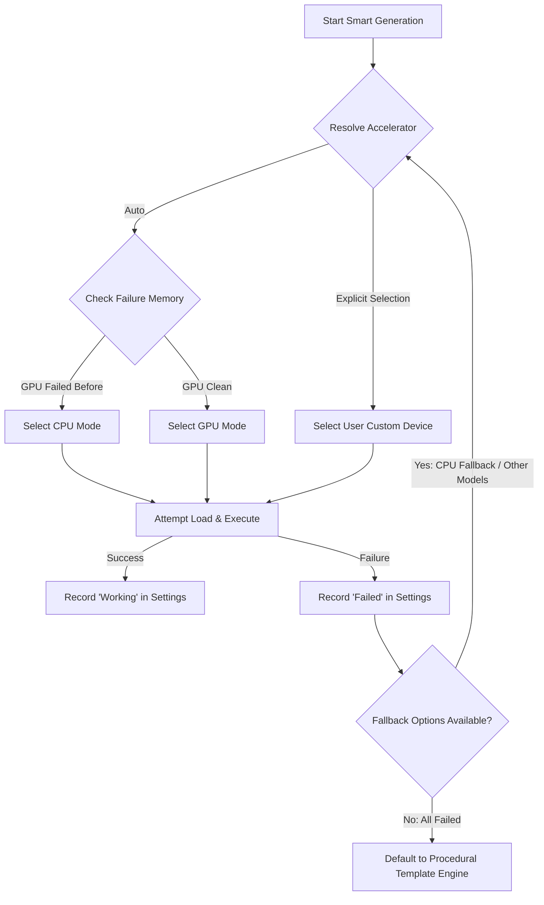

# Local AI Architecture & Tech Stack

This document details the architecture, configuration, weight management, prompt styling, and execution recovery systems that power the local smart features (such as **Smart Briefing** and **Smart Behavior**) in the Daily application.

---

## 1. Local AI Tech Stack Overview
Daily supports two parallel local AI executing backends depending on the host machine's hardware capability:

### A. Windows Copilot Runtime (Native NPU)
* **Underlying Model**: Phi Silica (3.3B parameters, quantized INT4).
* **Hardware Target**: Qualcomm Hexagon NPU (45 TOPS) on Snapdragon X Elite/Plus processors (Copilot+ PCs).
* **Integration**: Utilizes the native Windows `LanguageModel` WinRT API.
* **Benefits**: Extremely fast generation speeds and zero-download configuration (the weights are pre-provisioned by Windows Update and kept warm in memory by the OS).
* **Toggles & Fallbacks**: The UI includes a "Use Windows built-in AI engine (Phi Silica)" checkbox for Snapdragon devices. When checked, the app prioritizes Phi Silica. When unchecked, it bypasses the built-in runtime and utilizes DirectML custom downloaded models (e.g., Llama 3.2 1B), allowing full developer customization and offline model usage even on NPU-equipped machines.

### B. ONNX Runtime Generative AI (DirectML Backend)
* **Underlying Models**: Downloadable custom models (Llama 3.2 1B, Qwen 2.5 1.5B, Gemma 3 1B, Phi 3.5 Mini 3.8B).
* **Hardware Target**: Graphics Cards (GPUs) and Processors (CPUs) via Microsoft **DirectML**.
* **Integration**: Utilizes `Microsoft.ML.OnnxRuntimeGenAI` for model loading, tokenization, and auto-regressive generation.
* **Benefits**: Runs on any Windows 11 hardware setup (Intel, AMD, NVIDIA) with fallback capability.

---

## 2. Dynamic Model Downloads & Configuration Patching
For the DirectML backend, the application dynamically downloads model weights from Hugging Face and applies local patches:

### Download Targets
* **Llama 3.2 1B Instruct (INT4)**: `onnx-community/Llama-3.2-1B-Instruct-GENAI-ONNX` inside `cpu_and_mobile/cpu-int4-rtn-block-32-acc-level-4/`.
* **Qwen 2.5 1.5B Instruct (INT4)**: `onnx-community/Qwen2.5-1.5B-Instruct` inside `onnx/`.
* **Gemma 3 1B Instruct (INT4)**: `onnx-community/gemma-3-1b-it-ONNX` inside `onnx/`.
* **Phi 3.5 Mini Instruct (INT4)**: `microsoft/Phi-3.5-mini-instruct-onnx` inside `cpu_and_mobile/cpu-int4-rtn-block-32-acc-level-4/`.

### Post-Download Patching
Custom ONNX web-conversions lack standard GenAI metadata files. The `ModelDownloadManager` applies the following patching steps on download completion:
1. **ONNX Filename Normalization**: Renames the quantized model file (e.g., `model_q4.onnx` or `phi-3.5...onnx`) to `model.onnx`.
2. **GenAI Configuration Generation**: Programmatically writes a default `genai_config.json` that sets parameters missing from web-bound configurations:
   * **Context Length**: Enforces `"context_length": 2048` to avoid runtime memory limits.
   * **Vocabulary Size**: Supplies `"vocab_size": 151936` (Qwen) or `"vocab_size": 262144` (Gemma) to prevent initialization failures.
   * **Buffer Sharing**: Configures `"past_present_share_buffer": true` inside `"search"` block. This allows **DirectML Graph Capture** (which speed ups GPU dispatch) and prevents KV cache shape mismatch exceptions during execution.

---

## 3. Model Prompt Formatting Templates
To extract clean narrative summaries and structured JSON widgets, input prompts are dynamically wrapped in chat template formats depending on the active model:

* **Llama 3.2**:
  ```text
  <|begin_of_text|><|start_header_id|>system<|end_header_id|>

  {SystemPrompt}<|eot_id|><|start_header_id|>user<|end_header_id|>

  {UserPrompt}<|eot_id|><|start_header_id|>assistant<|end_header_id|>
  ```
* **Qwen 2.5**:
  ```text
  <|im_start|>system
  {SystemPrompt}<|im_end|>
  <|im_start|>user
  {UserPrompt}<|im_end|>
  <|im_start|>assistant
  ```
* **Gemma 3**:
  ```text
  <start_of_turn>system
  {SystemPrompt}<end_of_turn>
  <start_of_turn>user
  {UserPrompt}<end_of_turn>
  <start_of_turn>assistant
  ```
* **Phi 3.5**:
  ```text
  <|system|>
  {SystemPrompt}<|end|>
  <|user|>
  {UserPrompt}<|end|>
  <|assistant|>
  ```

---

## 4. Calibration Memory & Cascading Fallbacks
To provide maximum stability across diverse hardware setups, the `OnnxGenAiSmartService` implements a self-calibrating execution memory.



### Key Elements

#### A. Calibration Memory (`ModelExecutionHistory`)
We store the execution history for each `(ModelId, Accelerator)` pair inside `settings.json`. If a model fails to initialize or execute (e.g. driver parameter crashes), it is marked as `Failed` along with a user-friendly error description. Successful executions are marked as `Working`.

#### B. The Execution Fallback Cascade
When a generation is requested, the system attempts the following chain:
1. **User's Choice**: Try to run the selected model on the selected hardware.
2. **CPU Safe Fallback**: If it was running on GPU/NPU and fails, it immediately attempts to load the same model on CPU.
3. **Cross-Model Fallback**: If the model fails entirely, the service scans other downloaded models on disk, prioritizing models with a recorded `Working` status (e.g. defaulting back to a verified Llama 3.2 configuration).
4. **Basic Engine Fallback**: If all local models fail, it falls back to the rule-based procedural template engine.

#### C. Smart `Auto` Resolution
The `Auto` accelerator setting dynamically reads the calibration history. If DirectML GPU is recommended but has a recorded `Failed` history on this machine, `Auto` bypasses GPU and maps execution straight to the CPU, avoiding application stalls.

#### D. Calibration Warning Panel
The Settings Page reads `LastExecutionExplanation` from settings to display a system status warning in the UI:
* Displays a detailed step-by-step description of any fallbacks or redirections that occurred during the last briefing run.
* Keeps the user informed in natural, non-technical language (or detailed exception descriptions when debugging runtime features) about why the app chose the active backend.

#### E. Windows Copilot Runtime (Phi Silica) Diagnostics & Fallback
Because Phi Silica is restricted to packaged (MSIX) applications and requires Microsoft's Limited Access Feature (LAF) authorization, it can fail to load (throwing `System.UnauthorizedAccessException` with Status `3` / `Unknown` if the developer unlock token is missing or if OS builds are mismatched). 
To handle and debug this:
* **Resilient Fallback**: If Phi Silica fails to initialize or run, the system catches the exception and immediately attempts to redirect execution to the custom ONNX model (e.g. Llama 3.2) if downloaded and verified on disk.
* **Detailed Diagnostic Logging**: The specific exception and error status are saved to `settings.LastExecutionExplanation`. This propagates directly to the **System Calibration Memory** panel in Settings, showing the exact error (such as `Access Denied. Limited access feature is not available. com.microsoft.windows.ai.languagemodel. Status: 3`) to help developers and users diagnose licensing or OS configuration issues.

---

## 5. Desktop vs. Mobile Performance Benchmarks
From our initial research, desktop NPUs (Intel AI Boost / AMD Ryzen AI) experience initial performance bottlenecks due to differences in software frameworks compared to mobile systems:

1. **System Service Architectures**: Mobile OS flagships (e.g., Android AICore) load model weights once during device boot and keep them warm. Desktop applications load models into RAM/VRAM on-demand, causing a 2-5 second delay during first run. (We bypass this in Daily by pre-loading and pre-generating the briefing asynchronously at application launch).
2. **DirectML Driver Mapping**: While DirectML is highly optimized for GPUs, it lacks vendor-optimized pipelines for NPUs. Targeting Intel/AMD NPUs directly requires compiler-specific runtimes (Intel OpenVINO / AMD Vitis AI). Phi Silica bypasses this on Qualcomm NPUs by communicating directly via native QNN drivers.
