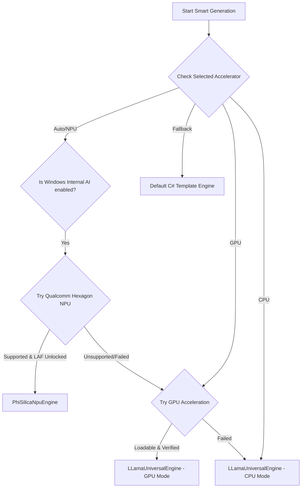

# Local AI Architecture & Tech Stack

This document details the architecture, configuration, weight management, prompt styling, and execution recovery systems that power the local smart features (such as **Smart Briefing** and **Smart Behavior**) in the Daily application.

---

## 1. Local AI Tech Stack Overview
Daily supports two parallel local AI executing backends depending on the host machine's hardware capability:

### A. Windows Copilot Runtime (Native NPU)
* **Underlying Model**: Phi Silica (3.3B parameters, quantized INT4).
* **Hardware Target**: Qualcomm Hexagon NPU (45 TOPS) on Snapdragon X Elite/Plus processors (Copilot+ PCs).
* **Integration**: Utilizes the native Windows `LanguageModel` WinRT API.
* **Benefits**: Extremely fast generation speeds and zero-download configuration (the weights are pre-provisioned by Windows Update and kept warm in memory by the OS).
* **LAF Token Access**: Requires Microsoft Limited Access Feature (LAF) unlock token to instantiate the engine.

### B. LLamaSharp GGUF Engine (GPU/CPU Backend)
* **Underlying Models**: Downloadable custom GGUF models (Llama 3.2 1B, Qwen 2.5 1.5B, Gemma 3 1B, Phi 3.5 Mini 3.8B).
* **Hardware Target**: Dedicated Graphics Cards (GPUs) and Central Processors (CPUs) via **LLamaSharp** utilizing Cuda12 or Vulkan backends.
* **Integration**: Utilizes runtime-loaded `llama.dll` backends to support dynamic GPU layer offloading (`GpuLayerCount = 99`).
* **Benefits**: Broad cross-compatibility with fallback capability on non-NPU hardware.

---

## 2. Dynamic Model Downloads & Weights Management
For the LLamaSharp backend, the application dynamically downloads GGUF model weights from Hugging Face:

### Download Targets
* **Llama 3.2 1B Instruct (GGUF)**: Saved to `%LocalAppData%\Daily.WinUI\models\llama1b\model.gguf`.
* **Qwen 2.5 1.5B Instruct (GGUF)**: Saved to `%LocalAppData%\Daily.WinUI\models\qwen15b\model.gguf`.
* **Gemma 3 1B Instruct (GGUF)**: Saved to `%LocalAppData%\Daily.WinUI\models\gemma1b\model.gguf`.
* **Phi 3.5 Mini Instruct (GGUF)**: Saved to `%LocalAppData%\Daily.WinUI\models\phi35\model.gguf`.

### Memory Cleanup & Re-initialization
To support dynamic settings switches without application memory bloat or driver crashes:
1. **Dynamic Model Reloading**: The `LLamaUniversalEngine` tracks the path of the loaded weights (`_loadedModelPath`). If a user changes models in Settings, the previous weights are disposed (`_weights?.Dispose()`) and the new GGUF file is loaded on the next execution.
2. **Accelerator Switching**: When the active accelerator changes, the `AIManager` calls `SetActiveEngine()`, which disposes the previously selected engine to cleanly release system memory and VRAM before initializing the new target backend.

---

## 3. Model Prompt Formatting Templates
To extract clean narrative summaries and structured JSON widgets, input prompts are dynamically wrapped in chat template formats depending on the active model:

* **Llama 3.2**:
  ```text
  <|begin_of_text|><|start_header_id|>system<|end_header_id|>

  {SystemPrompt}<|eot_id|><|start_header_id|>user<|end_header_id|>

  {UserPrompt}<|eot_id|><|start_header_id|>assistant<|end_header_id|>
  ```
* **Qwen 2.5**:
  ```text
  <|im_start|>system
  {SystemPrompt}<|im_end|>
  <|im_start|>user
  {UserPrompt}<|im_end|>
  <|im_start|>assistant
  ```
* **Gemma 3**:
  ```text
  <start_of_turn>system
  {SystemPrompt}<end_of_turn>
  <start_of_turn>user
  {UserPrompt}<end_of_turn>
  <start_of_turn>assistant
  ```
* **Phi 3.5**:
  ```text
  <|system|>
  {SystemPrompt}<|end|>
  <|user|>
  {UserPrompt}<|end|>
  <|assistant|>
  ```

---

## 4. Hardware Routing Strategy & Cascading Fallbacks
To provide maximum stability across diverse hardware setups, the `AIManager` implements the Strategy Pattern to orchestrate cascading fallbacks.



### Key Components

#### A. WMI Device Detection & In-Process Load Checks
Rather than executing a separate child process for dry-running DLLs, `AIManager` performs an in-process verification check. It detects GPU hardware vendor properties via WMI queries and uses safe `LoadLibraryEx` Win32 API calls to verify if the native `llama.dll` and its backend runtime dependencies (such as CUDA or Vulkan) are loadable before attempting initialization.

#### B. The Strategy Router (`AIManager.cs`)
1. **Qualcomm NPU Check**: If `UseWindowsInternalAi` is checked and the device features Qualcomm NPU architecture, the engine attempts to boot `PhiSilicaNpuEngine`.
2. **GPU Acceleration**: Attempts to load the GPU version of `llama.dll` (utilizing `cuda12` for NVIDIA and `vulkan` for AMD).
3. **CPU Mode**: If GPU loading checks fail, it falls back to the CPU engine using optimized `ggml-cpu.dll` libraries (auto-detecting `avx2`, `avx`, or `noavx` CPU instruction support).
4. **Basic Template Fallback**: If no engines are loadable or the user selects "Fallback Template Engine" in settings, the briefing defaults immediately to C# procedural narrative generation.

---

## 5. Windows Copilot Runtime (Phi Silica) Limited Access Feature (LAF) Unlock
To utilize the native on-device Snapdragon NPU LanguageModel API, the application must register and unlock Microsoft's Limited Access Feature (LAF) at process startup.

### Unlock Details
- **Feature Name**: `com.microsoft.windows.ai.languagemodel`
- **LAF Token Value**: `bm83TtgNO2HbnbBAf79aIQ==`
- **Registration Attribution**: `"1z32rh13vfry6 has registered their use of com.microsoft.windows.ai.languagemodel with Microsoft and agrees to the terms of use."`

### C# Implementation
In `App.xaml.cs` (application constructor), the feature is unlocked:
```csharp
try
{
    var access = Windows.ApplicationModel.LimitedAccessFeatures.TryUnlockFeature(
        "com.microsoft.windows.ai.languagemodel",
        "bm83TtgNO2HbnbBAf79aIQ==",
        "1z32rh13vfry6 has registered their use of com.microsoft.windows.ai.languagemodel with Microsoft and agrees to the terms of use.");
    Console.WriteLine($"[App] Phi Silica LAF unlock status: {access.Status}");
}
catch (Exception ex)
{
    Console.WriteLine($"[App] Phi Silica LAF unlock exception: {ex.Message}");
}
```

This token ensures that when running on Snapdragon processors, the Windows App SDK generative APIs are authorized and ready.
