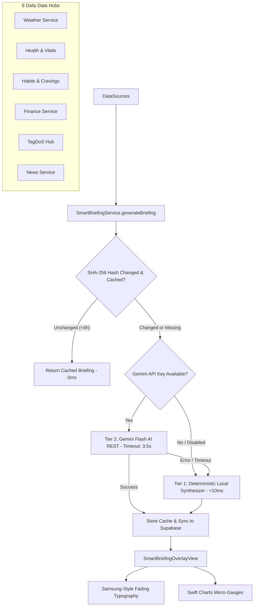

# Smart Periodic Briefing & AI Summary System (Next-Gen)

## 1. Executive Summary & Overview
The **Smart Periodic Briefing & Summary System** introduces an intelligent cross-platform briefing experience into the Daily ecosystem. It analyzes all 6 primary data hubs (**Weather**, **Health & Vitals**, **Habits & Cravings**, **Finances & Money**, **TagDoS & Notes**, and **World News**) and presents an executive contextual snapshot tailored to the user's current diurnal phase.

Key visual highlights include:
- **Samsung Galaxy AI-Style Fading Typography**: A progressive word-by-word reveal with progressive opacity ramps, subtle Gaussian blur fades, and an ambient glowing lead cursor (`✨`), without jarring character clacks. Includes tap-to-skip functionality.
- **Diurnal Phase Adaptation**: Distinct intelligence narratives across 4 slots: Morning Awakening (05:00–11:59), Intra-Day Momentum (12:00–17:59), Evening Wind-Down (18:00–21:59), and Nightly Restoration (22:00–04:59).
- **Dual-Tier Hybrid Synthesis Engine**:
  - **Tier 1 (Instant Local Deterministic)**: Runs on-device in $<10$ms with zero network overhead, zero latency, and strict data consistency.
  - **Tier 2 (Cloud Generative via Google Gemini Flash)**: Optional upgrade using Gemini 2.5/1.5 Flash structured JSON generation with a hard 3.5-second timeout and graceful fallback to Tier 1.
- **Micro-Visuals**: Mini-charts embedded in the briefing sheet (Sleep/Recovery gauge, Hydration vs Goal, Smokes vs Baseline gauge, Financial monthly flow snapshot, and TagDoS active stream chips).
- **Zero Regression Isolation**: Cloud records persist to `public.daily_smart_summaries`, guaranteeing 100% isolation from WinUI's legacy `smart_briefings` table.

---

## 2. Architecture & Data Flow



---

## 3. Diurnal Time Slots

| Slot | Time Window | Context & Tone | Focus |
| :--- | :--- | :--- | :--- |
| **Morning Awakening** | 05:00 – 11:59 | Optimistic, motivating, crisp | Sleep score, daily weather forecast, hydration kickoff, primary TagDoS focus |
| **Intra-Day Momentum** | 12:00 – 17:59 | Action-oriented, pace-checking | Hydration pacing, smoke reduction vs baseline, active work streams, midday financial checks |
| **Evening Wind-Down** | 18:00 – 21:59 | Reflective, relaxing | Total daily steps, daily net cashflow, smoke count vs target, TagDoS achievements |
| **Nightly Restoration** | 22:00 – 04:59 | Calming, serene, restorative | Winding down, sleep debt preparation, quiet reflections, tomorrow readiness |

---

## 4. Dual-Tier Hybrid Synthesis Engine

### Tier 1: Deterministic Local Synthesizer (`<10ms`)
- Evaluates metrics from all 6 hubs deterministically using empathetic domain rules.
- **Empathetic Smoking Reduction Coaching**: Recognizes tobacco/heaters as an active habit to conquer. When daily smoke count is below baseline, praises restraint; when elevated, gently encourages hydration and mindful pacing without clinical guilt.
- Generates structured narrative blocks:
  - `greeting`
  - `weatherSummary`
  - `healthSummary`
  - `habitsSummary`
  - `financesSummary`
  - `tagdosSummary`
  - `newsSummary`
  - `actionableSuggestion`
- Prepares numeric telemetry snapshot backing Swift Charts (`SmartBriefingMetrics`).

### Tier 2: Google Gemini Cloud AI (`gemini-2.5-flash` / `gemini-1.5-flash`)
- Activated when user provides an API key in **Settings > Smart Briefing & AI**.
- Structured `responseSchema` forces type-safe JSON directly matching `SmartBriefingNarrative`.
- Strict **3.5-second timeout** ensures instant fallback to Tier 1 local synthesis with zero app freezing or delayed presentation.

---

## 5. UI Presentation & Streamlined Card Architecture

### Pre-arranged Samsung Galaxy AI-Style Fading Cards (`SmartBriefingOverlayView.swift`)
- **Zero Layout Jitter**: All card frames, headers, icons, and metric badges are rendered and geometrically locked from millisecond 0 using transparent typography placeholders.
- **Word-by-Word Progressive Reveal**: Words stream smoothly across the cards with an opacity ramp, subtle Gaussian blur, and a glowing `✨` lead cursor.
- **Active Card Aura**: The active card being written displays an ambient cyan specular border glow.
- **Tap-to-Complete**: Tapping anywhere instantly reveals all words across all cards.

### Integrated Visual Cards
- **⛅ Weather & Atmosphere**: Local temperature and condition badge + concise atmospheric outlook.
- **🛏️ Sleep & Recovery**: Sleep score / resting HR badge + restorative recovery narrative.
- **💧 Habits & Balance**: Hydration volume and smoke reduction count badge + empathetic pacing coach.
- **💳 Financial Snapshot**: Today's net cashflow or overall net worth badge + financial telemetry.
- **🏷️ TagDoS Focus**: Active streams and pending memos badge + priority focus guidance.
- **📰 Headlines Radar**: Top headline badge + curated world news radar.
- **✨ Mindful Focus**: Slot-specific actionable suggestion and mindfulness guidance.

### Diurnal Navigation & Action Button
- **Top Navigation Bar**: Features the centered Diurnal Slot Status Pill (e.g. `🌙 Nightly Wind-Down · 22:00 – 04:59`) with refresh and dismiss actions. Eliminates redundant timestamps and titles.
- **Contextual Diurnal Bottom Button**: The personal greeting is integrated directly into the primary bottom action button:
  - **Nightly**: `[ 🛏️ Peaceful night, Mihai ]` (`bed.double.fill`)
  - **Morning**: `[ 🌅 Good morning, Mihai ]` (`sun.horizon.fill`)
  - **Intra-day**: `[ ☀️ Good afternoon, Mihai ]` (`sun.max.fill`)
  - **Evening**: `[ 🌆 Good evening, Mihai ]` (`sunset.fill`)

---

## 6. Database Schema (`public.daily_smart_summaries`)

```sql
CREATE TABLE IF NOT EXISTS public.daily_smart_summaries (
    id UUID PRIMARY KEY DEFAULT gen_random_uuid(),
    user_id UUID NOT NULL REFERENCES auth.users(id) ON DELETE CASCADE,
    time_slot VARCHAR(20) NOT NULL,
    generated_at TIMESTAMPTZ NOT NULL DEFAULT NOW(),
    data_hash VARCHAR(64) NOT NULL,
    narrative JSONB NOT NULL,
    metrics JSONB NOT NULL,
    ai_provider VARCHAR(50) NOT NULL DEFAULT 'local',
    created_at TIMESTAMPTZ NOT NULL DEFAULT NOW(),
    updated_at TIMESTAMPTZ NOT NULL DEFAULT NOW(),
    CONSTRAINT uq_daily_smart_summaries_user_slot UNIQUE (user_id, time_slot)
);

CREATE INDEX IF NOT EXISTS idx_daily_smart_summaries_lookup 
ON public.daily_smart_summaries (user_id, time_slot, generated_at DESC);

ALTER TABLE public.daily_smart_summaries ENABLE ROW LEVEL SECURITY;
```

---

## 7. Quality & Verification
- **Unit Tests**: 5 dedicated tests in `SmartBriefingTests.swift` covering slot resolution, narrative concatenation, local synthesizer empathy, data hash sensitivity, and AppSettings persistence (41/41 tests passing in `DailyCore`).
- **SimulaPhone Verification**: Tested and captured screenshots on iPhone 16 Pro simulator (`simulaphone_hero_fixed.png`, `simulaphone_briefing_overlay.png`, `simulaphone_briefing_scrolled.png`, `simulaphone_briefing_settings.png`).
- **Physical Device Deployment**: Verified on iPhone 16 Pro "Schmitz".
