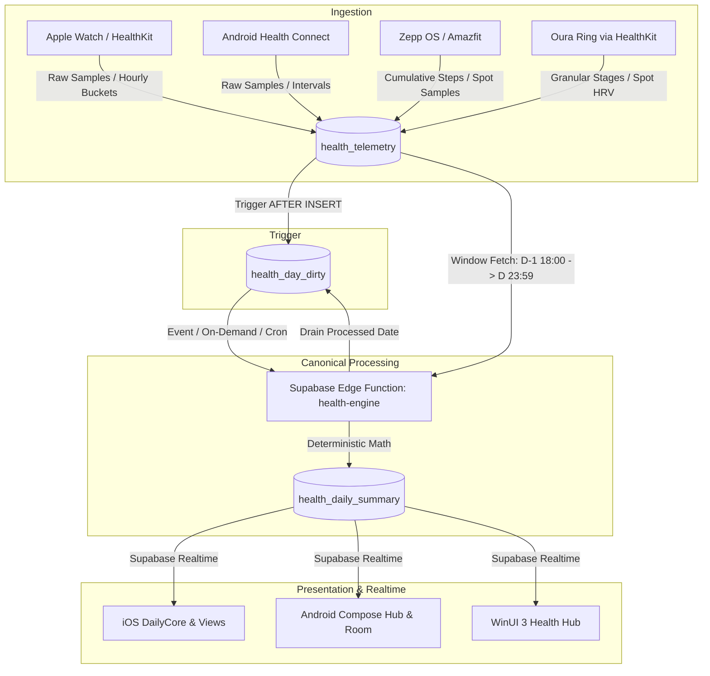

# Unified Health & Vitals — Phase P3: Canonical Edge Function Engine & Golden Fixtures

**Status:** Completed & Deployed Live  
**Deployment Target:** Supabase Edge Function `health-engine` (`https://akkfouifxztnfwwiclwg.supabase.co/functions/v1/health-engine`)  
**Specification:** `HealthSpec/ENGINE_SPEC_v1.md`  
**Test Coverage:** TypeScript Runner (`HealthSpec/generate_and_test_fixtures.ts`), Swift Package Tests (`DailyCoreTests/GoldenFixturesTests.swift`), Android JUnit (`GoldenFixturesTest.kt`)

---

## 1. Executive Summary

Phase P3 establishes the **Canonical Mathematical Source of Truth** for Daily's Health & Vitals system across all platforms:
1. **Engine Specification v1.0 (`HealthSpec/ENGINE_SPEC_v1.md`)**: A deterministic mathematical specification detailing time windowing, multi-wearable tracker priority hierarchies, sleep stage clustering & interval clipping, calibrated 4-pillar sleep scoring, step deduplication and cumulative-vs-interval aggregation, cardiovascular intraday curves & 4-tier heart rate zones, and autonomic nervous system stress analysis with hyperbolic tangent HRV transfer functions.
2. **TypeScript Canonical Engine (`supabase/functions/health-engine/engine.ts`)**: Pure TypeScript implementation with zero external runtime dependencies, providing 100% mathematical parity with native client code.
3. **Supabase Edge Function (`supabase/functions/health-engine/index.ts`)**: Deployed live on Supabase Deno runtime, providing on-demand day processing via HTTP POST/GET, automatic processing of dirty days from `health_day_dirty`, upserting into `health_daily_summary`, and clearing dirty queue records.
4. **Golden Fixtures Suite (`HealthSpec/fixtures/`)**: 8 comprehensive, real-world anonymized test scenarios covering multi-wearable arbitration, cumulative Zepp OS steps, Android Health Connect, daytime naps, fragmented sleep awakenings, zero-data honest states, sedentary stress elevation, and multi-device arbitration. Verified across TypeScript, Swift, and Kotlin with **zero mathematical divergence**.

---

## 2. Architecture & Data Flow

---

## 3. Mathematical Algorithms & Specifications

### 3.1 Time Windowing
- **Nocturnal Sleep Window**: $[D-1\text{ 18:00 local}, D\text{ 18:00 local}]$. All stages and sleep telemetry falling in this 24-hour bracket are attributed to morning wake-up day $D$.
- **Daytime Nap Window**: $[D\text{ 09:00 local}, D\text{ 20:30 local}]$. Explicit naps on day $D$ shorter than 3.5 hours are segregated into `naps`.
- **Activity & Cardiovascular Window**: $[D\text{ 00:00:00 local}, D\text{ 23:59:59 local}]$.

### 3.2 Sleep Tracker Priority Ranking
When multiple devices record nocturnal sleep simultaneously, the primary session is selected by:
1. `has_granular_hypnogram` (granular micro-stages prioritized over aggregate duration).
2. Clinical device priority hierarchy:
   - **Rank 100**: Oura Ring (`oura`)
   - **Rank 80**: Apple Watch (`apple`, `watch`)
   - **Rank 70**: Amazfit / Zepp OS (`amazfit`, `zepp`, `balance`)
   - **Rank 60**: OnePlus / Wear OS (`oneplus`, `wearos`)
   - **Rank 50**: Huawei / HarmonyOS (`huawei`, `harmony`, `gt5`)
   - **Rank 40**: HealthKit / Health Connect (`healthkit`, `health`)
   - **Rank 10**: Unknown / Generic
3. Total `asleep_seconds` (highest duration breaks remaining ties).

### 3.3 Calibrated 4-Pillar Clinical Sleep Score (0..100)
$$\text{SleepScore} = \text{round}(\text{DurationScore} + \text{EfficiencyScore} + \text{RestorativeScore} + \text{RestfulnessScore})$$
Clamped strictly to $[0, 100]$.

- **Pillar 1: Duration Score (Max 40 pts)**:
  - Benchmark: 7.5h to 9.0h ($H = \text{asleepSeconds} / 3600.0$).
  - $7.5 \le H \le 9.0 \implies 38.0 + \min\left(\frac{H - 7.5}{1.5} \times 2.0, 2.0\right)$
  - $H > 9.0 \implies \max(34.0, 40.0 - (H - 9.0) \times 2.0)$
  - $H \ge 7.0 \implies 34.0 + \frac{H - 7.0}{0.5} \times 4.0$
  - $H \ge 6.0 \implies 24.0 + (H - 6.0) \times 10.0$
  - $H \ge 5.0 \implies 14.0 + (H - 5.0) \times 10.0$
  - $H < 5.0 \implies \max\left(0.0, \frac{H}{5.0} \times 14.0\right)$
- **Pillar 2: Efficiency Score (Max 25 pts)**:
  - Clinical baseline $\ge 88\%$.
  - $Eff \ge 95 \implies 25.0$
  - $Eff \ge 90 \implies 21.0 + \frac{Eff - 90}{5} \times 4.0$
  - $Eff \ge 85 \implies 16.0 + \frac{Eff - 85}{5} \times 5.0$
  - $Eff \ge 80 \implies 10.0 + \frac{Eff - 80}{5} \times 6.0$
  - $Eff < 80 \implies \max\left(0.0, \frac{Eff}{80} \times 10.0\right)$
- **Pillar 3: Restorative Architecture Score (Max 25 pts)**:
  - **Deep Sleep (Max 13 pts)**: Target $\ge 16\%$.
    - $DP \ge 16 \implies 11.0 + \min\left(\frac{DP - 16}{6} \times 2.0, 2.0\right)$
    - $DP \ge 10 \implies 6.0 + \frac{DP - 10}{6} \times 5.0$
    - $DP < 10 \implies \max\left(0.0, \frac{DP}{10} \times 6.0\right)$
  - **REM Sleep (Max 12 pts)**: Target $\ge 20\%$.
    - $RP \ge 20 \implies 10.0 + \min\left(\frac{RP - 20}{5} \times 2.0, 2.0\right)$
    - $RP \ge 14 \implies 5.0 + \frac{RP - 14}{6} \times 5.0$
    - $RP < 14 \implies \max\left(0.0, \frac{RP}{14} \times 5.0\right)$
- **Pillar 4: Restfulness & Sleep Continuity (Max 10 pts)**:
  - Awakening count penalty: $C_{awake} \le 2 \implies 0.0$; $C_{awake} \le 4 \implies 1.5$; $> 4 \implies \min(1.5 + (C_{awake} - 4) \times 0.75, 5.0)$.
  - Awake duration penalty: $M_{awake} \le 25\text{m} \implies 0.0$; $> 25\text{m} \implies \min\left(\frac{M_{awake} - 25}{10} \times 1.0, 5.0\right)$.
  - Restfulness score: $\max(1.0, 10.0 - \text{CountPenalty} - \text{DurationPenalty})$.

### 3.4 Activity & Steps Aggregation
- **Cumulative Sources** (Zepp OS, Amazfit, Huawei Health): $Total = \max(values)$, with hourly deltas $\Delta_i = val_i - val_{i-1}$ mapped into respective hour buckets.
- **Interval Sources** (Apple Watch, HealthKit, Health Connect): Overlapping slices within 5 seconds are deduplicated, and samples are summed across 24 hourly buckets ($00:00$ to $23:00$).
- **Multi-Device Resolution**: Dedicated wearable devices take precedence over handset devices (`iPhone`, `Pixel`, `Galaxy`), preventing double-counting when watches are placed on chargers.
- **Active Calories**: Calculated from telemetry `active_energy` or estimated via clinical constant $0.042 \times \text{TotalSteps}\text{ kcal}$.

### 3.5 Cardiovascular & 4-Tier Zones
- Intraday heart rate telemetry filtered between $30\text{ bpm}$ and $240\text{ bpm}$.
- Zones:
  - **Resting**: $< 100\text{ bpm}$
  - **Fat Burn**: $100 - 119\text{ bpm}$
  - **Cardio**: $120 - 149\text{ bpm}$
  - **Peak**: $\ge 150\text{ bpm}$
- Resting heart rate: measured value from telemetry or fallback $\text{MinBpm} + 4$.

### 3.6 Autonomic Nervous System & Stress Model
- **HRV Sigmoid Transfer Function**:
  $$z = \frac{\text{HRV} - \text{baselineHRV}}{16.0}$$
  $$\text{hrvScore} = \text{clamp}(50.0 - (\tanh(z) \times 45.0), 0.0, 100.0)$$
- **Hourly Stress Integration**:
  - Sedentary detection: $< 300\text{ steps/h}$.
  - HR Elevation: $\text{elevation} = \max(0.0, \text{avgHR} - \text{baselineRHR})$; $\text{hrScore} = \min\left(100.0, \frac{\text{elevation}}{25.0} \times 100.0\right)$.
  - Recovery penalty: $100 - \text{SleepScore}$.
  - Blended hourly score: $0.50 \times \text{hrvScore} + 0.30 \times \text{hrScore} + 0.20 \times \text{sleepPenalty}$.
- **Stylized Monkey Mood & Breathing**:
  - $0..25$ (`Restful`): *Zen Monkey* | *Resonance Flow (5.5s)*
  - $26..50$ (`Calm`): *Curious Monkey* | *Relaxing 4-7-8*
  - $51..75$ (`Moderate`): *Busy Monkey* | *Box Breathing (4-4-4-4)*
  - $76..100$ (`High`): *Overheated Monkey* | *Physiological Sigh*

---

## 4. Golden Fixtures Verification Matrix

The test suite in `HealthSpec/fixtures/` covers 8 canonical real-world scenarios:

| Fixture | Scenario | Highlights Verified |
|---|---|---|
| `case_01_apple_watch_plus_oura.json` | Dual Tracker (Oura + Apple Watch) | Oura priority rank 100 over 80, stage clipping, 10,500 steps, sleep score 91, stress 19 |
| `case_02_zepp_cumulative_steps.json` | Amazfit Balance Cumulative Steps | 12,350 max steps, hourly deltas, 580 kcal, resting HR 59 |
| `case_03_health_connect_samsung.json` | Android Health Connect + Samsung | Explicit interval deltas, 8,800 steps, 369.6 kcal, sleep score 83, SpO2 98.2% |
| `case_04_nocturnal_with_daytime_nap.json` | Sleep + Daytime Nap | Nocturnal 425m asleep (score 90), distinct 40m daytime nap segregated |
| `case_05_fragmented_sleep.json` | Severe Sleep Fragmentation | 6 awakenings, count & duration penalties applied, score 45 ("Restless") |
| `case_06_empty_day_zero_data.json` | Zero Telemetry Day | Honest data: all metrics null or 0, zero synthetic fallbacks |
| `case_07_high_stress_sedentary_day.json` | High Stress / Low HRV | HRV 20ms, elevated sedentary HR 92 bpm, stress avg 80 ("Overheated Monkey") |
| `case_08_multi_device_watch_on_charger.json` | Multi-Device Arbitration | Apple Watch (3,800 steps) chosen over iPhone (4,600 steps) |

### Test Execution Results
- **TypeScript**: `node --experimental-strip-types HealthSpec/generate_and_test_fixtures.ts` $\implies$ **8/8 PASSED (0 errors)**.
- **Swift**: `swift test --package-path DailyCore --filter GoldenFixturesTests` $\implies$ **53/53 PASSED (0 errors)**.
- **Kotlin**: `./gradlew :core-health:test` $\implies$ **6/6 PASSED (0 errors)**.

---

## 5. Live Supabase Deployment

The canonical engine is deployed and operational on live Supabase:
- **Function Name:** `health-engine`
- **Project Ref:** `akkfouifxztnfwwiclwg` (eu-west-1)
- **Endpoint:** `POST https://akkfouifxztnfwwiclwg.supabase.co/functions/v1/health-engine`
- **Database Tables Target:** `public.health_daily_summary`, `public.health_day_dirty`
- **Trigger Pipeline:** `trigger_mark_dirty_telemetry` on `health_telemetry` inserts rows into `health_day_dirty`, which the Edge Function processes and clears upon summary computation.
