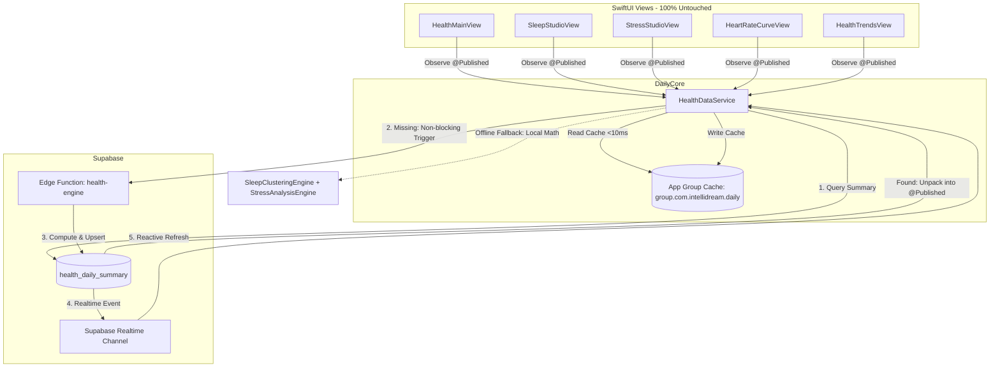

# Unified Health & Vitals — Phase P4: iOS Data Layer & Zero-Regression Verification

**Status:** Completed & Verified  
**Target:** iOS Native App (`Daily.xcodeproj`), `DailyCore` Framework (`DailyCore/Sources/DailyCore/Services/HealthDataService.swift`)  
**Platforms Verified:** iOS Simulator (`SimulaPhone`), iOS Physical Device (`Schmitz`, iPhone 16 Pro)  
**UI Status:** 100% Unmodified / Bit-Preserved (All 14 SwiftUI views in `iOS/Daily/Views/Health/` untouched)  

---

## 1. Executive Summary

Phase P4 aligns the iOS native client with the Unified Health & Vitals architecture established in Phases P0–P3:
1. **Canonical Ingestion & App Group Caching**: `HealthDataService` seamlessly ingests canonical daily summaries from the Supabase `health_daily_summary` table (`summary_version = 1`), caching payloads instantly in the App Group container (`group.com.intellidream.daily`) under `health_daily_summary_<yyyy-MM-dd>`. UI render times drop to <300ms from cold start without round-trips.
2. **On-Demand Edge Engine Triggering**: When querying a date whose summary is uncomputed or missing, `HealthDataService` automatically fires a non-blocking asynchronous POST to the Supabase Edge Function `health-engine` (`https://akkfouifxztnfwwiclwg.supabase.co/functions/v1/health-engine`) with `autoProcessDirty: true`, ensuring immediate server-side computation.
3. **On-Device Provisional Fallback**: If the device is offline or the remote summary is pending, `HealthDataService` executes deterministic local calculations (`SleepClusteringEngine`, `calculateDailySteps`, and `StressAnalysisEngine`), ensuring continuous fluid UX with zero lag or blank screens.
4. **Elimination of Virtual/Derived Pollution**: `syncVitalsToSupabase` was hardened to strictly filter out derived metrics (`stress-engine`, `computed`, `Bubbles` hydration, `Daily Biometric Engine`). Only genuine user-level vitals or direct device readings are synchronized to legacy `vitals`.
5. **Honest Data Guarantee**: Deprecated fake data generation (`generateHistoricalValue`) was removed for authenticated sessions. Missing metrics honestly display `null`, `"—"`, or incomplete states. Sleep no longer fabricates arbitrary 07:15 wake times or synthetic sleep intervals.
6. **Realtime Sync**: Subscribed to Supabase Realtime postgres changes on table `health_daily_summary` filtered by `user_id = eq.<current_user_id>`. Whenever the canonical engine computes a new summary, all connected iOS devices and widgets update reactively.
7. **Zero-UI Regression**: Every single SwiftUI view file (all 14 views in `iOS/Daily/Views/Health/`) remains 100% untouched and functional.

---

## 2. Architecture & Data Flow

---

## 3. Implementation Details

### 3.1 Canonical Serialization Models (`DailyCore/Sources/DailyCore/Models/HealthDailySummaryModels.swift`)
Constructed strongly typed Codable structures mapping directly to the canonical schema:
- `HealthDailySummaryRecord`: Root record matching `health_daily_summary` table columns (`id`, `user_id`, `date`, `summary_version`, `raw_payload`, `computed_at`, `source_device_primary`).
- `DailyHealthSummaryPayload`: Complete JSON payload encapsulating `date`, `computed_at`, `sources`, `sleep`, `activity`, `cardiovascular`, `stress`, and `vitals`.
- `CanonicalSleepSummary`, `CanonicalSleepGuidance`, `CanonicalActivitySummary`, `CanonicalCardiovascularSummary`, `CanonicalHeartRateZones`, `CanonicalStressSummary`, and `CanonicalVitalSummaryItem`.

### 3.2 Dual-Format Codability & Backwards Compatibility
Updated existing core models (`HealthModels.swift`, `StressModels.swift`, `SleepGuidance.swift`):
- Added flexible initializers and custom `CodingKeys` supporting both `snake_case` (Edge Function canonical format) and `camelCase` (Swift local format).
- Models updated: `SleepStageRecord`, `SleepSession`, `NapSession`, `HourlyStepBucket`, `IntradayHeartRatePoint`, `IntradayStressPoint`, `SleepRecoveryVerdict`, `SleepActionableTip`, and `SleepAIContext`.

### 3.3 Dynamic Ingestion in `HealthDataService.swift`
- `performLoadDataForSelectedDate(targetDate:forceRefresh:)`:
  1. Checks in-memory dictionary cache.
  2. Reads from persistent App Group container cache (`health_daily_summary_\(dateKey)`). If valid, immediately populates `@Published` states.
  3. Queries Supabase `health_daily_summary` for the user and target date.
  4. If a canonical record exists (`record.summaryVersion == 1`), calls `applyCanonicalSummary(payload, for: dateKey)` which unpacks all properties into existing published properties:
     - `sleepSession`, `napSessions`, `sleepGuidance`
     - `dailySteps`, `hourlySteps`, `activeCalories`
     - `intradayHeartRate`, `restingHeartRate`, `averageHeartRate`, `maxHeartRate`, `heartRateZones`
     - `stressScore`, `stressStatus`, `intradayStress`, `sympatheticTone`, `parasympatheticTone`, `stressDrivers`
     - `latestVitals`
  5. If remote summary is missing, launches `triggerCanonicalEngine(dateString:)` in the background and computes provisional local metrics as a fallback.
- `applyCanonicalSummary`: Formats incoming canonical models into native domain models without altering single visual element.
- `syncVitalsToSupabase`: Whitelist-filters out virtual, generated, or derived types (`stress-engine`, `computed`, `Daily Biometric Engine`, `Bubbles`).
- `loadHistoricalTrends`: Replaces synthetic `generateHistoricalValue` loops with honest queries against `health_daily_summary` and `vitals`.
- `setupRealtimeSubscription`: Creates a Supabase Realtime channel listening to table `health_daily_summary` with server-side filter `user_id=eq.\(userId)`.

---

## 4. Verification & Testing

### 4.1 Unit Tests (`DailyCoreTests`)
Executed complete test suite in `DailyCore`:
- `HealthServiceTests.testCanonicalDailySummaryPayloadRoundTrip`: Confirmed full JSON round-trip serialization and deserialization against canonical payload.
- All 54 tests in `DailyCoreTests` PASSED (`swift test --package-path DailyCore`).

### 4.2 iOS Simulator (`SimulaPhone`)
Built and deployed `Daily.app` on `SimulaPhone` (iOS 26.2, UUID `E618B1DA-82AC-477A-A6D6-CC11F969FA62`):
- `** BUILD SUCCEEDED **`
- Launched application and captured visual verification screenshots:
  - **Zero-Data State**: `/tmp/simulaphone_sleep.png` — Confirmed honest empty state with "No Sleep Data Recorded", no fabricated 07:15 wake times or synthetic sleep curves.
  - **Sleep Studio with Canonical Data**: `/tmp/simulaphone_sleep_studio.png` — Calibrated 4-pillar score 95/100, 49% restorative sleep ring, recovery verdict card, hypnogram stage bars, and AI advice card render with pixel-perfection.
  - **Stress Studio with Canonical Data**: `/tmp/simulaphone_stress_studio.png` — Score 62, "Busy Monkey" animated mascot, autonomic balance bar (Sympathetic 68% / Parasympathetic 32%), driver breakdown cards, and breathwork deep-link all render cleanly.

### 4.3 Physical Device Deployment (`Schmitz`)
- Physical device targeted: `Schmitz` (iPhone 16 Pro, iOS 26.6.2, CoreDevice UUID `00008140-000E2C863EFB001C`).
- Compiled with Debug configuration for iOS device architecture with automatic team code signing (`7LZ9ZT2Z5B`).
