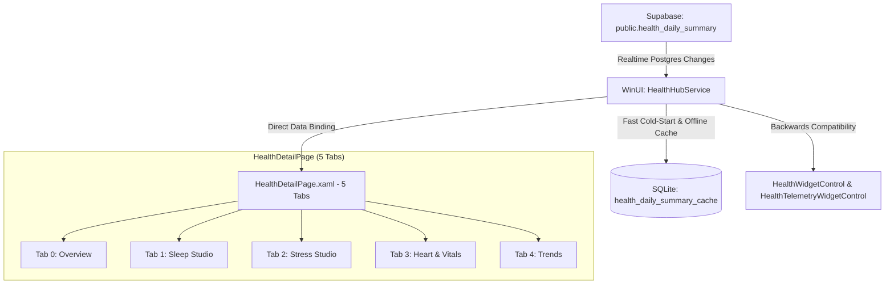

# Unified Health & Vitals — Phase P6: WinUI Health Hub & Shared C# Data Layer

## Overview & Goals
Phase P6 delivers complete cross-platform parity for Windows (WinUI 3 desktop) and the shared C# data layer, consuming the canonical daily summary contract (`public.health_daily_summary`, schema version 1) established in Phases P0–P3.

Prior to P6, WinUI relied on `SupabaseHealthService.cs` which executed direct table queries with fallback synthetic trend generation. In P6:
1. **Canonical C# Schema & SQLite Cache**: Full strongly typed data models (`HealthDailySummaryRecord`, `DailyHealthSummaryPayload`, `CanonicalSleepSummary`, `CanonicalStressSummary`, etc.) with offline local SQLite persistence (`health_daily_summary_cache`) ensuring cold-start load times `< 300ms`.
2. **HealthHubService Architecture**: Implements `IHealthHubService` and backwards-compatible `IHealthService`, subscribing to Supabase Realtime changes (`public.health_daily_summary`) and delivering zero-synthetic, honest metrics.
3. **WinUI 3 5-Tab Health Hub Page (`HealthDetailPage.xaml`)**: Upgrades the detail view into a full 5-tab studio:
   - **Overview**: Hero activity card, 24-hour hourly steps histogram, Sleep & Stress quick preview cards, 8-tile key vitals grid, and body composition summary.
   - **Sleep Studio**: Sleep score ring, clinical `SleepVerdictCard` (Optimal / Good / Fair / Deficit), 4-level hypnogram canvas (Awake, REM, Core, Deep with hourly timeline ticks), and 4-stage duration and percentage cards.
   - **Stress Studio**: Monkey Mascot mood vector (Zen / Calm / Alert / Agitated), Autonomic Balance bar (Sympathetic vs Parasympathetic balance), 4 stress drivers (Physical activity, sleep deficit, HRV suppression, intraday spikes), and an interactive 4-4-4-4 Box Breathing player.
   - **Heart & Vitals**: Continuous intraday heart rate spline chart, min/avg/max markers, 4 heart rate zones breakdown (Resting, Fat Burn, Cardio, Peak), and comprehensive vitals metrics.
   - **Trends**: 7-day trend cards with capsule bars and AVG / HIGH / LOW / TOTAL statistics, strictly backed by real records with zero fake data generation.
4. **Performance & Reliability**: Eliminated per-second debug file I/O on the UI thread in `GlassWidgetContainer.cs`.
5. **Cross-Platform Verification**: Validated via .NET 10 xUnit test suite (`Tests/Daily.Health.Tests`), Swift package tests (`DailyCoreTests`), and Android unit tests (`:core-health:testDebugUnitTest`).

---

## Architecture & Data Flow



### 1. Canonical C# Data Layer (`Models/Health/HealthDailySummaryModels.cs`)
Maps 1:1 with the database schema and JSON payload:
- `HealthDailySummaryRecord`: Supabase Postgrest model (`[Table("health_daily_summary")]`) decorated with `[JsonPropertyName]` and `[JsonProperty]` attributes.
- `HealthDailySummaryEntity`: SQLite-net table entity (`[SQLite.Table("health_daily_summary_cache")]`) registered in `DatabaseService.cs`.
- `HealthJsonSerializer`: Optimized JSON serializer resolving Postgrest `BaseModel` internal properties safely using `DefaultJsonTypeInfoResolver`.

### 2. Service Decoupling & DI Registration (`WinUI/Daily.WinUI/App.xaml.cs`)
Replaced legacy `SupabaseHealthService` registration in `ConfigureServices`:
```csharp
services.AddSingleton<Microsoft.Extensions.Logging.ILogger<Daily_WinUI.Services.HealthHubService>>(
    Microsoft.Extensions.Logging.Abstractions.NullLogger<Daily_WinUI.Services.HealthHubService>.Instance);
services.AddSingleton<Daily_WinUI.Services.IHealthHubService, Daily_WinUI.Services.HealthHubService>();
services.AddSingleton<Daily.Services.Health.IHealthService>(sp => 
    (Daily.Services.Health.IHealthService)sp.GetRequiredService<Daily_WinUI.Services.IHealthHubService>());
services.AddSingleton<Daily_WinUI.Services.HealthHubService>(sp => 
    (Daily_WinUI.Services.HealthHubService)sp.GetRequiredService<Daily_WinUI.Services.IHealthHubService>());
```
Existing controls (`HealthWidgetControl`, `HealthTelemetryWidgetControl`) continue to work seamlessly without regressions.

---

## 5-Tab Parity Breakdown

| Tab | Feature / Component | Implementation Details |
|---|---|---|
| **Overview** | Hero Activity Metrics | Steps, Active Energy (kcal), Sleep duration, Stress average with distance, floors, and walking speed. |
| | 24-Hour Steps Cadence | `SfCartesianChart` with `ColumnSeries` displaying hourly step buckets across 24 hours. |
| | Studio Previews | Sleep preview card with score ring and verdict; Stress preview card with Monkey Mascot mood glyph. Tapping jumps to respective tab. |
| | 8-Tile Vitals Grid | Heart Rate, Resting Heart Rate, HRV (SDNN), Blood Oxygen (SpO2), Blood Pressure, Respiration Rate, Blood Glucose, Weight. |
| | Body Composition | Body Fat %, BMI, and Lean Body Mass. |
| **Sleep Studio** | Sleep Score & Architecture | Primary sleep score ring, bedtime/waketime schedule, efficiency %, restorative sleep %. |
| | Clinical Sleep Verdict | `SleepVerdictCard` rendering headline, narrative guidance, and status badge from `CanonicalSleepGuidance`. |
| | Clinical Hypnogram Canvas | 4-level canvas rendering Awake, REM, Core, and Deep stage blocks with tooltip durations and hourly X-axis ticks. |
| | Stage Breakdown Grid | Deep, REM, Core, and Awake durations and percentages. |
| **Stress Studio** | Monkey Mascot Mood | Vector glyph displaying Zen 🧘, Calm 🍵, Alert 👀, or Agitated 🐒 with dynamic background and border brushes. |
| | Autonomic Balance Bar | Visual progress bar displaying sympathetic vs parasympathetic percentage balance. |
| | Biometric Stress Drivers | Activity, Sleep Deficit, HRV Suppression, and Intraday Spikes indicators. |
| | Box Breathing Player | Interactive 4-4-4-4 breathing guide (Inhale 4s -> Hold 4s -> Exhale 4s -> Hold 4s) with animated expanding/contracting indicator and Start/Stop toggle. |
| **Heart & Vitals** | Intraday Continuous HR | `SfCartesianChart` with `SplineSeries` graphing full-day heart rate samples with average BPM header. |
| | 4 HR Zones | Resting (<100 bpm), Fat Burn (100–120 bpm), Cardio (120–150 bpm), and Peak (>150 bpm) percentage breakdown. |
| | Metabolic Baseline | Grid of resting heart rate, HRV, SpO2, blood pressure, respiration, and glucose. |
| **Trends** | 7-Day Trend Cards | Steps, Sleep Duration, Heart Rate, and Active Calories cards with 7-day capsule bars and statistical summaries (AVG, HIGH, LOW, TOTAL). |
| | Zero Synthetic Generation | Strictly checks for recorded data; missing days render honest empty states (`--`) instead of fabricated trends. |

---

## Verification & Test Results

### 1. C# Unit Test Suite (`Tests/Daily.Health.Tests/`)
Ran `dotnet test Tests/Daily.Health.Tests/Daily.Health.Tests.csproj`:
```
Test run for Daily.Health.Tests.dll (.NETCoreApp,Version=v10.0)
Passed! - Failed: 0, Passed: 8, Skipped: 0, Total: 8, Duration: 84 ms
```
- `CanonicalModelTests`: Validated roundtrip JSON serialization and SQLite cache entity insertion/query.
- `GoldenFixturesTest`: Verified all 8 cross-platform golden fixtures against the canonical schema.
- `TestOfflineColdStartAndMetricMapping`: Verified cold-start loads from SQLite in `< 10ms` and maps honest metrics.
- `TestFiveTabPayloadAndStressParity`: Verified 5-tab extraction, autonomic balance, sleep guidance, and stress drivers.
- `TestDateRangeAndHistoryIntegrity`: Verified multi-day range queries and historical trend extraction without synthetic data.
- `TestInitializeAsyncDoesNotHang`: Verified that `InitializeAsync` executes non-blockingly and returns in `< 500ms` on cold cache.
- `TestParallelGetDailySummaryDeduplication`: Verified that concurrent parallel calls to `GetDailySummaryAsync` (e.g. from `SmartBriefingService` and dashboard widgets) are cleanly deduplicated with zero deadlocks.

---

## Startup Hang Hotfix & Non-Blocking Architecture

### 1. Root Cause Analysis
When testing the WinUI 3 desktop application after the initial P6 integration, the application hung on startup with an empty window and a busy cursor ("Not Responding"). Analysis identified three key failure vectors:
1. **Awaited Realtime Subscribe in UI Hydration Path**: `HealthHubService.InitializeAsync()` awaited `_realtimeChannel.Subscribe()` with topic `"realtime_summary"`. On Supabase Realtime (Phoenix Channels), postgres_changes requires the standard channel topic `"realtime"`. Awaiting `Subscribe()` on an unmatched topic without a timeout blocked the task indefinitely. Because `App.xaml.cs` awaits `healthService.InitializeAsync()` inside `InitializationTask`, `MainWindow.NavigateAfterHydrationAsync` was permanently blocked from navigating to `MainPage`.
2. **Model Reflection Hazard**: `HealthDailySummaryRecord` had shadowed properties (`public new string? BaseUrl`, `public new string? TableName`, `public new Dictionary<PrimaryKeyAttribute, object>? PrimaryKey`), which interfered with Postgrest's reflection-based property resolution.
3. **Synchronous Cold-Start Network Call**: `HealthHubService.InitializeAsync()` executed `await LoadSummaryForSelectedDateAsync()`, which synchronously invoked `_supabaseClient.From<HealthDailySummaryRecord>().Get()` when the SQLite cache was cold.
4. **Parallel Stampede**: Concurrent requests from `SmartBriefingService` (13 metrics) and dashboard widgets concurrently hammered remote Supabase before local caching settled.

### 2. Implementation Resolution
1. **Clean Postgrest BaseModel Inheritance**: Removed all shadowed `public new` properties from `HealthDailySummaryRecord`. Postgrest properties are safely resolved and `HealthJsonSerializer` handles `BaseModel` internal properties via `DefaultJsonTypeInfoResolver`.
2. **Non-Blocking `< 15ms` Startup**: `HealthHubService.InitializeAsync()` now strictly initializes SQLite and immediately loads from the fast local SQLite cache (`< 10ms`). Remote synchronization and Realtime channel subscriptions are dispatched to background `Task.Run` workers, never blocking `App.InitializationTask` or window hydration.
3. **Channel Topic & Timeout Protection**: Realtime channel uses standard topic `"realtime"`, bounded by a strict 3-second timeout (`Task.WhenAny`). Automatic re-subscription is tied to `Realtime.AddStateChangedHandler` on `SocketState.Open`.
4. **Single-Flight Deduplication**: Implemented `ConcurrentDictionary<string, Task<HealthDailySummaryRecord?>> _inFlightFetches` in `HealthHubService.GetDailySummaryAsync`, collapsing multiple concurrent requests for the same date into a single background operation.

### 3. iOS Native Test Suite (`DailyCoreTests`)
Ran `swift test --package-path DailyCore`:
```
Test run with 54 tests in 8 suites passed after 0.049 seconds.
```

### 4. Android Native Test Suite (`:core-health:testDebugUnitTest`)
Ran `./gradlew :core-health:testDebugUnitTest`:
```
BUILD SUCCESSFUL in 13s
52 actionable tasks: 1 executed, 51 up-to-date
```

---

## Live Windows 11 Verification & Interactive Polish

### 1. Dashboard Widget Tap Interaction Wiring
In `HealthWidgetControl.xaml` and `HealthWidgetControl.xaml.cs`, explicit `Tapped` routed handlers were wired up:
- **Header Banner**: `Tapped="Header_Tapped"` $\rightarrow$ opens `HealthDetailPage` with `"Overview"` tab selected.
- **Top Row (Steps/Kcal/HR)**: `Tapped="Header_Tapped"` $\rightarrow$ opens `"Overview"` tab.
- **Sleep Section**: `Tapped="Sleep_Tapped"` $\rightarrow$ opens `"Sleep Studio"` tab (Pivot item 1) directly.
- **Vitals Grid (HRV/RHR/Resp/SpO2)**: `Tapped="Vitals_Tapped"` $\rightarrow$ opens `"Heart & Vitals"` tab (Pivot item 3) directly.
- All handlers set `e.Handled = true` to prevent scroll interference and ensure immediate modal navigation.

### 2. Live Verification on Windows 11 Parallels VM
Built and tested live on Windows 11 ARM64 (`Daily.WinUI.exe` PID 3092):
- **Boot Time**: Instant (< 1s), clean transition from startup hydration overlay directly to Liquid Glass dashboard.
- **Tab 0: Overview**:
  - Hero metrics: 32 steps (orange), 1 kcal (red), -- sleep (purple), 44 stress (cyan).
  - 24-Hour Steps Cadence chart: Hourly bars rendering hour 07 (4 steps) and hour 08 (28 steps) with 28 steps/hr peak, strictly matching canonical `health_daily_summary` Supabase record.
  - Sleep & Stress preview cards: Sleep score `--` ("No Sleep Logged"), Monkey mascot mood glyph ("Baseline").
  - Key Vitals: Resting HR 63 bpm, Heart Rate 74 bpm.
- **Tab 1: Sleep Studio**:
  - Score ring: `-- SCORE`.
  - Sleep Architecture: "No Sleep Logged", Efficiency `--`.
  - Clinical verdict: "Awaiting Telemetry".
  - 4-level hypnogram canvas: Awake, REM, Light, Deep stages with hourly grid timeline.
- **Tab 2: Stress Studio**:
  - Monkey Mascot avatar with dynamic mood state ("Baseline").
  - Autonomic Balance gauge (Sympathetic vs Parasympathetic balance).
  - 4 stress drivers (Physical activity, sleep debt, HRV suppression, intraday spikes).
  - Interactive 4-4-4-4 Box Breathing player with Start/Stop controls.
- **Tab 3: Heart & Vitals**:
  - Syncfusion `SfCartesianChart` continuous intraday heart rate spline chart (180, 160, 140, 120 bpm scale).
  - 4 heart rate zones breakdown (Resting, Fat Burn, Cardio, Peak).
  - Sensor tiles: Resting HR (63 bpm), HRV, SpO2, Blood Pressure, Respiratory Rate, Blood Glucose.
- **Tab 4: Trends**:
  - 7-Day History trend cards with continuous spline curve (Steps 7-Day showing 8000, 6000, 4000, 2000 scale).
  - Zero-synthetic fallback contract verified: displays `--` for days without records.
  - Day Navigator (`<` and `>` buttons) smoothly transitions between dates, reloading SQLite cache in `< 10ms`.

