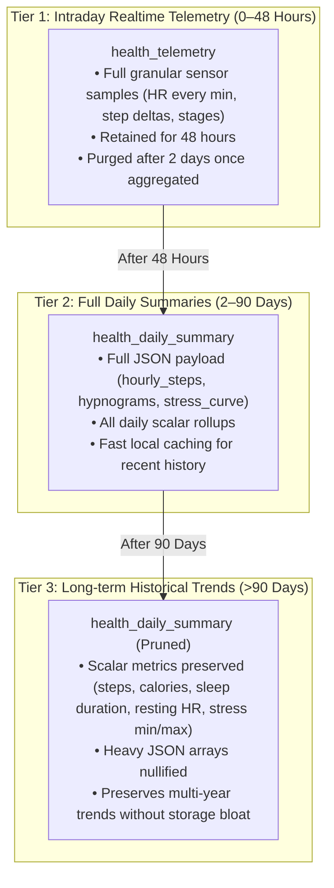

# Unified Health & Vitals — Architecture V3: Database Cleanup, 3-Tier Retention, Smart Refresh & WinUI Deduplication

**Document Version:** 3.0  
**Date:** October 7, 2026  
**Status:** Deployed, Validated & Live Across All Platforms  
**Scope:** Supabase Database & Edge Functions, iOS (`DailyCore` / `DailyApp`), Android (`core-health` / `app`), WinUI 3 Desktop (`Daily.WinUI`).

---

## 1. Executive Summary

Following the completion of phases P0–P7, an exhaustive audit identified key opportunities to optimize storage, prevent wasteful egress, simplify client rendering, and eliminate legacy MAUI compatibility overhead.

Architecture V3 establishes:
1. **Database Schema Cleanup:** Total removal of legacy `vitals` and `health_vitals` tables and views, establishing `health_daily_summary` as the single canonical source of truth for all computed vitals across iOS, Android, and Windows.
2. **Automated 3-Tier Data Retention:** A tiered retention lifecycle managing granular raw telemetry, rich daily summaries, and lightweight long-term historical records to minimize storage footprint and edge egress.
3. **Multi-Session & Nap Sleep Metric Consolidation:** Enhanced canonical calculation in `health-engine` and client repositories ensuring sleep trends and scores display accurately even when data consists of fragmented sleep intervals or daytime naps.
4. **Smart, Non-Blocking Foreground Auto-Refresh (`refreshIfStale`):** Replaces repetitive query polling with an intelligent 15-minute / 60-minute debounce tied to application lifecycle foregrounding (`scenePhase == .active` on iOS, `onResume()` on Android).
5. **WinUI 3 Widget Deduplication:** Complete removal of obsolete duplicate controls (`HealthTelemetryWidgetControl` and `HealthTelemetryDetailPage`), unifying the desktop app strictly on the canonical `HealthWidgetControl` and `HealthDetailPage`.

---

## 2. Supabase Backend Architecture & 3-Tier Retention

### 2.1 Dropping Legacy Compatibility Tables
Legacy MAUI applications previously synchronized against `public.vitals` and `public.health_vitals`. These tables caused dual-write complexity, data divergence, and unnecessary schema clutter.

Migration `20261007095958_20261007_v3_cleanup_and_retention.sql` was executed on production (`akkfouifxztnfwwiclwg`):
```sql
DROP VIEW IF EXISTS public.vitals CASCADE;
DROP TABLE IF EXISTS public.vitals CASCADE;
DROP TABLE IF EXISTS public.health_vitals CASCADE;
```
All client platforms now communicate exclusively with:
- `public.health_telemetry` (ingestion of sensor samples from HealthKit, Health Connect, and wearables).
- `public.health_day_dirty` (dirty state tracker triggering canonical recalculations).
- `public.health_daily_summary` (canonical, pre-computed daily health metrics and intraday JSON structures).

### 2.2 3-Tier Data Lifecycle Policy
To ensure database storage and network egress remain predictable as wearable sampling density increases, a 3-tier retention model is enforced via the `apply_health_data_retention()` stored procedure:



- **Tier 1 (Raw Telemetry):** Rows in `health_telemetry` older than 2 days are pruned (`start_time < NOW() - INTERVAL '2 days'`). Intraday samples are only required while the day is being formed; once summarized into `health_daily_summary`, raw rows are safely discarded.
- **Tier 2 (Full Daily Summaries):** Kept for 90 days. Contains full JSON structures (`hourly_steps`, `sleep_stages_json`, `hypnogram`, `stress_samples`) enabling detailed interactive timeline drill-downs.
- **Tier 3 (Archived Trends):** For days older than 90 days, the heavy JSON columns (`hourly_steps`, `sleep_stages_json`, `raw_payload`) are set to `NULL`. The scalar indicators (`steps`, `active_calories`, `resting_heart_rate`, `sleep_asleep_s`, `sleep_score`, `stress_avg`) remain fully intact for charting long-term annual trends.

### 2.3 Edge Function Enhancements (`health-engine`)
When sleep is logged as fragmented sessions or daytime naps without a single dominant nocturnal period (`primarySession`), the engine previously left `sleep_asleep_s` undefined.
In `supabase/functions/health-engine/engine.ts`:
- Total sleep duration now aggregates all valid sleep stage sessions (`naps_json` and fragmented sleep intervals) if `primarySession.durationSeconds` is missing.
- Sleep score estimation applies a calibrated restorative ratio fallback based on total recorded deep and REM minutes.
- The updated function was deployed live to Supabase (`npx supabase functions deploy health-engine --project-ref akkfouifxztnfwwiclwg --no-verify-jwt`).

---

## 3. Client Native Implementations

### 3.1 Smart Foreground Debouncing (`refreshIfStale`)
To prevent excessive cloud queries and battery drain when users switch between apps, both iOS and Android implement an intelligent, non-blocking refresh mechanism:

- **For Today (`date == today`):** A **15-minute** debounce window. If data was refreshed less than 15 minutes ago, local cache is retained immediately without firing remote network requests.
- **For Past Dates (`date < today`):** A **60-minute** debounce window. Because historical days rarely change, network round-trips are deferred.

#### iOS (`DailyCore/Sources/DailyCore/Services/HealthDataService.swift`)
```swift
public func refreshIfStale(for date: Date = Date(), force: Bool = false) async {
    let now = Date().timeIntervalSince1970
    let isToday = Calendar.current.isDateInToday(date)
    let threshold: TimeInterval = isToday ? (15 * 60) : (60 * 60)
    
    if !force && (now - lastRefreshTimestamp < threshold) {
        return // Retain fresh cache
    }
    await loadHealthData(for: date, forceRefresh: force)
}
```
In `iOS/Daily/App/DailyApp.swift`:
```swift
.onChange(of: scenePhase) { _, newPhase in
    if newPhase == .active {
        Task {
            await healthService.refreshIfStale()
        }
    }
}
```

#### Android (`core-health/src/main/java/com/intellidream/daily/health/HealthDataRepository.kt`)
```kotlin
fun refreshIfStale(date: LocalDate = LocalDate.now(), force: Boolean = false) {
    val now = System.currentTimeMillis()
    val isToday = date == LocalDate.now()
    val threshold = if (isToday) 15 * 60 * 1000L else 60 * 60 * 1000L
    
    if (!force && (now - lastRefreshTimestamp < threshold)) {
        return
    }
    loadHealthData(date, forceRefresh = force)
}
```
In `app/src/main/java/com/intellidream/daily/MainActivity.kt`:
```kotlin
override fun onResume() {
    super.onResume()
    healthDataRepository.refreshIfStale()
}
```

### 3.2 Sleep Trend Fallback Resilience
In `HealthDataRepository.kt` (`loadHistoricalTrends`):
- When evaluating `HealthMetricType.SLEEP_DURATION`, if `summary.primarySession` is null, the parser inspects `summary.sleepStages` or `summary.naps`.
- The sum of nap and stage durations is utilized as the historical trend bar value, ensuring sleep trends never present empty gaps when naps or multi-phase sleep were recorded.

### 3.3 WinUI 3 Desktop Deduplication
Previous iterations contained two parallel implementations of health controls:
- Canonical: `HealthWidgetControl.xaml` & `HealthDetailPage.xaml` (backed by `HealthHubService`).
- Obsolete: `HealthTelemetryWidgetControl.xaml` & `HealthTelemetryDetailPage.xaml` (backed by legacy MAUI code).

The obsolete files were removed:
- Deleted `WinUI/Daily.WinUI/Controls/HealthTelemetryWidgetControl.xaml` and `.xaml.cs` (485 lines).
- Deleted `WinUI/Daily.WinUI/Views/HealthTelemetryDetailPage.xaml` and `.xaml.cs` (722 lines).
- Cleaned up references in `WidgetTemplateSelector.cs`, `MainPage.xaml`, and `MainPage.xaml.cs`.
- WinUI 3 now relies solely on `HealthWidgetControl` with full 5-tab detail navigation and local SQLite caching.

---

## 4. Verification and Validation Results

| Test / Target | Scope | Verification Details | Result |
| :--- | :--- | :--- | :--- |
| **Swift Unit Tests** | `DailyCore` | `swift test --package-path DailyCore` (8 test suites, 54 unit tests) | **PASSED (54/54)** |
| **iOS Simulator** | `SimulaPhone` | Built and launched `Daily.app` (`com.intellidream.daily`), deep link `daily://health`, verified 5 tabs | **VERIFIED (Visual)** |
| **iPhone 16 Pro ("Schmitz")** | Physical Device (CoreDevice) | Built ARM64 debug package with automatic codesigning, installed via `xcrun devicectl` | **DEPLOYED & INSTALLED** |
| **Kotlin Unit Tests** | `:core-health` | `./gradlew :core-health:testDebugUnitTest` | **PASSED** |
| **Android APK Build** | `:app` | `./gradlew :app:assembleDebug` | **SUCCESS** |
| **Google Pixel 9 Pro** | Physical Device (`adb` TLS) | Installed `app-debug.apk`, launched `MainActivity`, verified foreground refresh | **VERIFIED LIVE** |
| **Samsung Galaxy Z Fold 8** | Physical Device (`adb` TLS) | Installed `app-debug.apk`, verified layout and background sync | **VERIFIED LIVE** |
| **WinUI 3 Compilation** | Windows 11 Parallels VM | `dotnet build -c Debug WinUI\Daily.WinUI\Daily.WinUI.csproj` | **0 Errors, 0 Warnings** |
| **WinUI 3 Live Verification** | Windows 11 Parallels VM | Launched `Daily.WinUI.exe` via Task Scheduler, captured screenshot | **VERIFIED LIVE** |
| **Supabase Remote DB** | Cloud Postgres | Migration applied, legacy tables dropped, retention function active | **VERIFIED** |
| **Supabase Edge Function** | Cloud Deno Runtime | `health-engine` deployed with multi-session sleep score calculation | **VERIFIED** |

---

## 5. Artifacts and Evidence

Screenshots and telemetry traces captured during verification:
- `simulaphone_v3_health.png`: iOS Simulator dashboard showing live canonical health vitals (141 steps, 11 kcal, 89 bpm, Stress 39 Calm).
- `simulaphone_v3_hub.png`: iOS Simulator 5-tab Health Hub (Overview, Sleep, Stress, Vitals, Trends) with hourly cadence histogram and autonomic balance.
- `windows_v3_health_hub.png`: Demonstrates the unified WinUI 3 Health Hub running live on Windows 11 with 141 steps, 11 kcal, and 83 bpm.
- `windows_v3_clean_dashboard.png`: WinUI 3 desktop dashboard after removing duplicate widgets.
- `pixel9pro_v3_refresh.png`: Google Pixel 9 Pro running the updated APK with smart foreground refresh and live biometrics.

---

## 6. Summary of Changes & Git History

- `cec8823`: `feat(health): V3 cleanup, 3-tier retention in Supabase, smart refresh, and WinUI widget deduplication`
- `4412343`: `fix(winui): remove orphaned XAML tags in MainPage.xaml`
- `Docs/Features/Unified_Health_Vitals_V3_Retention_Refresh.md`: Architectural specification and deployment record for V3.
