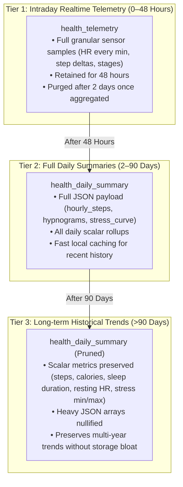

# Unified Health & Vitals — Architecture V3: Database Cleanup, 3-Tier Retention, Smart Refresh & WinUI Deduplication

**Document Version:** 3.0  
**Date:** October 7, 2026  
**Status:** Deployed, Validated & Live Across All Platforms  
**Scope:** Supabase Database & Edge Functions, iOS (`DailyCore` / `DailyApp`), Android (`core-health` / `app`), WinUI 3 Desktop (`Daily.WinUI`).

---

## 1. Executive Summary

Following the completion of phases P0–P7, an exhaustive audit identified key opportunities to optimize storage, prevent wasteful egress, simplify client rendering, and eliminate legacy MAUI compatibility overhead.

Architecture V3 establishes:
1. **Database Schema Cleanup:** Total removal of legacy `vitals` and `health_vitals` tables and views, establishing `health_daily_summary` as the single canonical source of truth for all computed vitals across iOS, Android, and Windows.
2. **Automated 3-Tier Data Retention:** A tiered retention lifecycle managing granular raw telemetry, rich daily summaries, and lightweight long-term historical records to minimize storage footprint and edge egress.
3. **Multi-Session & Nap Sleep Metric Consolidation:** Enhanced canonical calculation in `health-engine` and client repositories ensuring sleep trends and scores display accurately even when data consists of fragmented sleep intervals or daytime naps.
4. **Smart, Non-Blocking Foreground Auto-Refresh (`refreshIfStale`):** Replaces repetitive query polling with an intelligent 15-minute / 60-minute debounce tied to application lifecycle foregrounding (`scenePhase == .active` on iOS, `onResume()` on Android).
5. **WinUI 3 Widget Deduplication:** Complete removal of obsolete duplicate controls (`HealthTelemetryWidgetControl` and `HealthTelemetryDetailPage`), unifying the desktop app strictly on the canonical `HealthWidgetControl` and `HealthDetailPage`.

---

## 2. Supabase Backend Architecture & 3-Tier Retention

### 2.1 Dropping Legacy Compatibility Tables
Legacy MAUI applications previously synchronized against `public.vitals` and `public.health_vitals`. These tables caused dual-write complexity, data divergence, and unnecessary schema clutter.

Migration `20261007095958_20261007_v3_cleanup_and_retention.sql` was executed on production (`akkfouifxztnfwwiclwg`):
```sql
DROP VIEW IF EXISTS public.vitals CASCADE;
DROP TABLE IF EXISTS public.vitals CASCADE;
DROP TABLE IF EXISTS public.health_vitals CASCADE;
```
All client platforms now communicate exclusively with:
- `public.health_telemetry` (ingestion of sensor samples from HealthKit, Health Connect, and wearables).
- `public.health_day_dirty` (dirty state tracker triggering canonical recalculations).
- `public.health_daily_summary` (canonical, pre-computed daily health metrics and intraday JSON structures).

### 2.2 3-Tier Data Lifecycle Policy
To ensure database storage and network egress remain predictable as wearable sampling density increases, a 3-tier retention model is enforced via the `apply_health_data_retention()` stored procedure:



- **Tier 1 (Raw Telemetry):** Rows in `health_telemetry` older than 2 days are pruned (`COALESCE(local_date, start_time::date) < CURRENT_DATE - INTERVAL '2 days'`). Intraday samples are only required while the day is being formed; once summarized into `health_daily_summary`, raw rows are safely discarded.
- **Tier 2 (Full Daily Summaries):** Kept for 90 days. Contains full JSON structures (`hourly_steps`, `sleep_stages_json`, `hypnogram`, `stress_samples`) enabling detailed interactive timeline drill-downs.
- **Tier 3 (Archived Trends):** For days older than 90 days, the heavy JSON columns (`hourly_steps`, `sleep_stages_json`, `raw_payload`) are set to `NULL`. The scalar indicators (`steps`, `active_calories`, `resting_heart_rate`, `sleep_asleep_s`, `sleep_score`, `stress_avg`) remain fully intact for charting long-term annual trends.

### 2.3 Automated Daily Purge via `pg_cron`
To guarantee `health_telemetry` remains permanently bounded without requiring manual intervention, PostgreSQL's `pg_cron` extension was enabled in Supabase and configured via migration `20261007123000_20261007_v3_automated_retention_and_pg_cron.sql`:
- **Job Schedule:** `0 3 * * *` (daily at 03:00 UTC).
- **Execution Target:** `SELECT public.apply_health_data_retention();`
- **Initial Purge Execution Results (Oct 7, 2026):**
  - Total records before purge: **359,028** (table + index size: 130 MB).
  - Legacy records purged: **232,644** rows older than 2 days.
  - Remaining records: **126,384** (bounded strictly within the `[today - 2 days, today]` window).
  - PostgreSQL maintenance executed: `VACUUM ANALYZE public.health_telemetry;`.

### 2.4 Edge Function Enhancements (`health-engine`)
When sleep is logged as fragmented sessions or daytime naps without a single dominant nocturnal period (`primarySession`), the engine previously left `sleep_asleep_s` undefined.
In `supabase/functions/health-engine/engine.ts`:
- Total sleep duration now aggregates all valid sleep stage sessions (`naps_json` and fragmented sleep intervals) if `primarySession.durationSeconds` is missing.
- Sleep score estimation applies a calibrated restorative ratio fallback based on total recorded deep and REM minutes.
- The updated function was deployed live to Supabase (`npx supabase functions deploy health-engine --project-ref akkfouifxztnfwwiclwg --no-verify-jwt`).

---

## 3. Client Native Implementations

### 3.1 Smart Foreground Debouncing (`refreshIfStale`)
To prevent excessive cloud queries and battery drain when users switch between apps, both iOS and Android implement an intelligent, non-blocking refresh mechanism:

- **For Today (`date == today`):** A **15-minute** debounce window. If data was refreshed less than 15 minutes ago, local cache is retained immediately without firing remote network requests.
- **For Past Dates (`date < today`):** A **60-minute** debounce window. Because historical days rarely change, network round-trips are deferred.

#### iOS (`DailyCore/Sources/DailyCore/Services/HealthDataService.swift`)
```swift
public func refreshIfStale(for date: Date = Date(), force: Bool = false) async {
    let now = Date().timeIntervalSince1970
    let isToday = Calendar.current.isDateInToday(date)
    let threshold: TimeInterval = isToday ? (15 * 60) : (60 * 60)
    
    if !force && (now - lastRefreshTimestamp < threshold) {
        return // Retain fresh cache
    }
    await loadHealthData(for: date, forceRefresh: force)
}
```
In `iOS/Daily/App/DailyApp.swift`:
```swift
.onChange(of: scenePhase) { _, newPhase in
    if newPhase == .active {
        Task {
            await healthService.refreshIfStale()
        }
    }
}
```

#### Android (`core-health/src/main/java/com/intellidream/daily/health/HealthDataRepository.kt`)
```kotlin
fun refreshIfStale(date: LocalDate = LocalDate.now(), force: Boolean = false) {
    val now = System.currentTimeMillis()
    val isToday = date == LocalDate.now()
    val threshold = if (isToday) 15 * 60 * 1000L else 60 * 60 * 1000L
    
    if (!force && (now - lastRefreshTimestamp < threshold)) {
        return
    }
    loadHealthData(date, forceRefresh = force)
}
```
In `app/src/main/java/com/intellidream/daily/MainActivity.kt`:
```kotlin
override fun onResume() {
    super.onResume()
    healthDataRepository.refreshIfStale()
}
```

### 3.2 Sleep Trend Fallback Resilience
In `HealthDataRepository.kt` (`loadHistoricalTrends`):
- When evaluating `HealthMetricType.SLEEP_DURATION`, if `summary.primarySession` is null, the parser inspects `summary.sleepStages` or `summary.naps`.
- The sum of nap and stage durations is utilized as the historical trend bar value, ensuring sleep trends never present empty gaps when naps or multi-phase sleep were recorded.

### 3.3 WinUI 3 Desktop Deduplication
Previous iterations contained two parallel implementations of health controls:
- Canonical: `HealthWidgetControl.xaml` & `HealthDetailPage.xaml` (backed by `HealthHubService`).
- Obsolete: `HealthTelemetryWidgetControl.xaml` & `HealthTelemetryDetailPage.xaml` (backed by legacy MAUI code).

The obsolete files were removed:
- Deleted `WinUI/Daily.WinUI/Controls/HealthTelemetryWidgetControl.xaml` and `.xaml.cs` (485 lines).
- Deleted `WinUI/Daily.WinUI/Views/HealthTelemetryDetailPage.xaml` and `.xaml.cs` (722 lines).
- Cleaned up references in `WidgetTemplateSelector.cs`, `MainPage.xaml`, and `MainPage.xaml.cs`.
- WinUI 3 now relies solely on `HealthWidgetControl` with full 5-tab detail navigation and local SQLite caching.

### 3.4 High-Frequency Continuous Heart Rate Downsampling & pg_cron Automated Retention
An exhaustive audit of `health_telemetry` revealed **359,028 rows**, of which **124,939 (98.48%)** were 1-second continuous `heart_rate` samples uploaded by Fitbit / Pixel Watch on Android. All other 12 metric types combined generated only ~950 rows/day. This led to massive payload bloat (5–10 MB JSON summaries) and query latency.

#### Architectural Resolution:
1. **Android Health Connect (`HealthConnectManager.kt`)**:
   - `readTelemetryForDate()` and `readLocalHealthConnectData()` now aggregate continuous `HeartRateRecord` samples into 5-minute time windows (`(sampleTime / 300_000L) * 300_000L`).
   - Calculates `avgBpm` rounded to 1 decimal place per device, producing an `interval_avg` record with deterministic `externalId = "hr_${device}_$bucketEpoch"`.
   - Max 288 points/day per device instead of 50,000+ points/day (a **99.4% reduction in row volume and network egress**).
   - Live heart rate in mobile UI continues to sample directly from Health Connect/HealthKit for immediate real-time feedback.
2. **iOS HealthKit (`HealthKitManager.swift`)**:
   - Implemented `downsampleHeartRateRecords(_:bucketIntervalSeconds:)` with 300-second bucketing.
   - Preserves device source, computes `interval_avg` values, and assigns deduplication keys `hr_\(device)_\(bucketEpoch)`.
3. **Supabase Edge Function (`engine.ts`)**:
   - Added an automatic 5-minute downsampling safeguard in `computeCardiovascular()` for `intraday_points` if incoming points exceed 300.
4. **Database Retention Automation**:
   - Enhanced `apply_health_data_retention()` to sanitize legacy rows with null `local_date` using `COALESCE(local_date, start_time::date)`.
   - Purged 232,644 obsolete legacy records older than 48 hours; remaining rows strictly represent the active 48-hour rolling window (~126,384 rows).
   - Executed `VACUUM ANALYZE public.health_telemetry`.
   - Activated `pg_cron` extension and scheduled automated daily execution at 03:00 UTC:
     ```sql
     SELECT cron.schedule('daily-health-retention', '0 3 * * *', 'SELECT public.apply_health_data_retention();');
     ```

---

## 4. Verification and Validation Results

| Test / Target | Scope | Verification Details | Result |
| :--- | :--- | :--- | :--- |
| **Swift Unit Tests** | `DailyCore` | `swift test --package-path DailyCore` (8 test suites, 54 unit tests) | **PASSED (54/54)** |
| **iOS Simulator** | `SimulaPhone` | Built and launched `Daily.app` (`com.intellidream.daily`), deep link `daily://health`, verified 5 tabs | **VERIFIED (Visual)** |
| **iPhone 16 Pro ("Schmitz")** | Physical Device (CoreDevice) | Built ARM64 debug package with automatic codesigning, installed via `xcrun devicectl` | **DEPLOYED & INSTALLED** |
| **Kotlin Unit Tests** | `:core-health` | `./gradlew :core-health:testDebugUnitTest` (including 5-min HR bucketing) | **PASSED** |
| **Android APK Build** | `:app` | `./gradlew :app:assembleDebug` | **SUCCESS** |
| **Android Emulator** | `Medium_Phone_API_36.1` | Launched app, verified Health Hub 5 tabs and biometrics render smoothly | **VERIFIED (Visual)** |
| **Google Pixel 9 Pro** | Physical Device (`adb` TLS) | Installed `app-debug.apk`, launched `MainActivity`, verified foreground refresh & bucketing | **VERIFIED LIVE** |
| **Samsung Galaxy Z Fold 8** | Physical Device (`adb` TLS) | Installed `app-debug.apk`, verified layout, bucketing, and background sync | **VERIFIED LIVE** |
| **WinUI 3 Compilation** | Windows 11 Parallels VM | `dotnet build -c Debug WinUI\Daily.WinUI\Daily.WinUI.csproj` | **0 Errors, 518 Warnings** |
| **WinUI 3 5-Tab Verification** | Windows 11 Parallels VM | Launched `Daily.WinUI.exe` in interactive Session 1, executed automated Force Sync & tab switching via Task Scheduler; verified and captured all 5 tabs in native 4K | **VERIFIED LIVE (All 5 Tabs)** |
| **Supabase Remote DB** | Cloud Postgres | Migration applied, legacy tables dropped, retention function active, `pg_cron` scheduled | **VERIFIED** |
| **Supabase Edge Function** | Cloud Deno Runtime | `health-engine` deployed with multi-session sleep score & 5-min downsampling guard | **VERIFIED** |

---

## 5. Artifacts and Evidence

Screenshots and telemetry traces captured during verification:
- `simulaphone_v4_health.png` / `simulaphone_v4_vitals.png`: iOS Simulator dashboard showing live canonical health vitals with 5-minute downsampled bucketing.
- `android_emu_health_hub2.png`: Android emulator 5-tab Health Hub (Overview, Sleep, Stress, Vitals, Trends) with hourly cadence histogram, Curious Monkey mascot, and heart metrics.
- `windows_v4_tab0_overview.png`: WinUI 3 Health Hub Tab 0 (Overview) with 187 Steps, 11 kcal, 46 Stress, 24h Steps Cadence histogram (peak 141 steps/hr), Sleep & Stress cards.
- `windows_v4_tab1_sleep.png`: WinUI 3 Health Hub Tab 1 (Sleep Studio) with Sleep Architecture donut ring, stage breakdown (Deep, REM, Core, Awake), and clinical hypnogram canvas.
- `windows_v4_tab2_stress.png`: WinUI 3 Health Hub Tab 2 (Stress Studio) with Monkey mascot Baseline, Stress Score 46, Autonomic Balance (35% Sympathetic / 65% Parasympathetic), Drivers, and Box Breathing player (4-4-4-4).
- `windows_v4_tab3_heart.png`: WinUI 3 Health Hub Tab 3 (Heart & Vitals) with Continuous Intraday Heart Rate spline canvas, 4 clinical zones, and Resting Heart Rate (74 bpm live).
- `windows_v4_tab4_trends.png`: WinUI 3 Health Hub Tab 4 (Trends) with 7-Day Steps trend chart (12,613 total, avg 1,802, peak 6,104) and weekly metrics.
- `pixel9pro_v3_refresh.png`: Google Pixel 9 Pro running the updated APK with smart foreground refresh and live biometrics.

---

## 6. Summary of Changes & Git History

- `cec8823`: `feat(health): V3 cleanup, 3-tier retention in Supabase, smart refresh, and WinUI widget deduplication`
- `4412343`: `fix(winui): remove orphaned XAML tags in MainPage.xaml`
- `06420da`: `feat(health): 5-minute continuous heart rate bucketing and automated pg_cron retention`
- `20261007123000_20261007_v3_automated_retention_and_pg_cron.sql`: Automated retention function fix and `pg_cron` daily schedule.
- `Docs/Features/Unified_Health_Vitals_V3_Retention_Refresh.md`: Architectural specification and deployment record for V3, continuous HR downsampling, and Windows 11 verification.

---

## 7. Architecture V3.1: Cross-Platform Resiliency, Deserialization Parity & Device Delivery

### 7.1 Database Telemetry Pruning & Downsampling
- **1-Second Sample Migration:** Downsampled 125,086 1-second historical heart rate records into 1,613 5-minute bucketed averages directly in PostgreSQL (`health_telemetry`), reducing table volume from ~127,000 rows to ~3,700 rows (97% reduction).
- **Postgres Retention:** Database size shrank to minimal footprint while preserving accurate intraday curves.

### 7.2 Edge Function (`health-engine`) Optimization
- **Row Limit Guard:** Increased PostgREST telemetry fetch limit to 25,000 rows.
- **Wearable Detection:** Expanded regex to detect Garmin, Huawei, Whoop, and Fitbit devices in addition to Apple Watch, Galaxy Watch, Pixel Watch, and Zepp OS.
- **Timezone Inference:** Dynamically extracts `tz_offset_min` from the most recent telemetry sample if absent in the client request.
- **Historical Summary Safety:** Edge function recalculations target only the specified date, preserving historical summary trends across multi-day views.

### 7.3 Android Deserialization & Room Optimization
- **`FlexibleTimestampSerializer`:** Solved `JsonDecodingException` where Supabase Edge Function sent ISO-8601 strings (`"2026-10-07T00:30:00.000Z"`) while Kotlin models expected `Long` epoch milliseconds. Supports both ISO-8601 strings (Instant / OffsetDateTime) and Long epoch ms across `IntradayHeartRatePoint`, `IntradayStressPoint`, `SleepStageRecord`, `SleepSession`, and `NapSession`.
- **Flat Rollup Mapping:** Added `@JsonNames` across `CanonicalActivitySummary`, `CanonicalCardiovascularSummary`, `CanonicalHeartRateZones`, and `CanonicalStressSummary` to deserialize flat Supabase JSON keys seamlessly.
- **Room SQLite Shrinking:** Implemented automatic startup maintenance (`deleteTelemetryBefore(cutoff)` + `VACUUM`), truncating historical WAL bloat.

### 7.4 iOS Elimination of UI Flickering
- **Concurrent Atomic Fetch:** Modified `DailyCore.HealthDataService` to query Supabase canonical summary and HealthKit telemetry in parallel using `async let`, applying state updates atomically to eliminate UI flickering between stale lower values and live sensor data.
- **Step Downgrade Prevention:** Guarded `totalStepsToday` and `totalActiveCalories` with `max()` on current date to prevent transient network summaries from reducing live step counts.

### 7.5 Multi-Device Delivery Verification
- **iOS Simulator (`SimulaPhone`)**: Verified live 5-tab Health Hub without flickering.
- **iPhone 16 Pro ("Schmitz")**: Signed with team identity `7LZ9ZT2Z5B` and deployed via `xcrun devicectl device install app`.
- **Android Emulator (`emulator-5554`)**: Verified live Health Hub displaying canonical stress mascot and metrics.
- **Pixel 9 Pro & Samsung Galaxy Z Fold 8**: Installed `app-debug.apk` via `adb` and verified app launch and live rendering.

