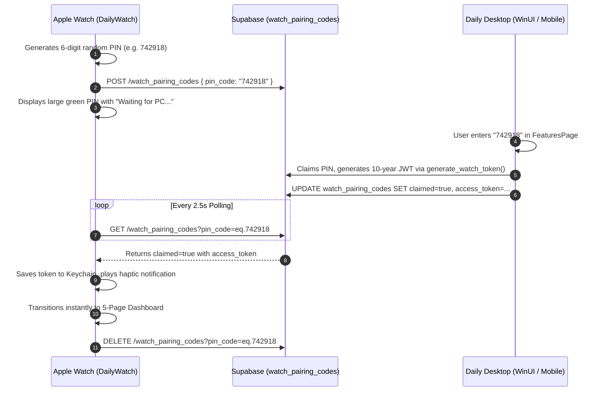

# watchOS Feature & UI Parity, Resilient Token Persistence, and Orbit PIN Pairing

## Overview
This document details the architectural overhaul of the **Apple Watch companion app (`WatchOS/DailyWatch`)**, bringing it to 100% visual and functional parity with the Zepp OS companion app, resolving chronic token loss, adopting the watch-driven Orbit PIN pairing flow, enabling standalone Wi-Fi/Cellular cloud communication, and expanding HealthKit telemetry collection.

---

## 1. Root Cause Analysis: Fixing Chronic Token Loss

Prior to this update, Apple Watch users experienced frequent, involuntary logouts whenever the watch screen turned off or the app returned from background. The audit revealed **4 compounding failure modes**:

1. **Auto-Logout on Empty Refresh Token (`recoverSessionFromStorage`)**:
   - The DayOne Orbit backend issues 10-year watch JWTs via `generate_watch_token()` with `RefreshToken = ""` intentionally, preventing token rotation desyncs.
   - When the watch suspended and woke up (`onAppBecameActive()`), it called `recoverSessionFromStorage()`. The code previously checked `guard let refreshToken = ... !refreshToken.isEmpty else { self.logout() }`. Because `refreshToken` was empty, the app **wiped all credentials and logged the user out on every sleep cycle**.
   - *Fix*: The 10-year JWT access token is treated as an authoritative, long-lived session. `recoverSessionFromStorage()` and `onAppBecameActive()` verify the access token from Keychain and never log out if the refresh token is empty.

2. **Spurious Logout on `checkForRepairTokens()`**:
   - The watch queried `paired_watches` using `Bearer \(supabaseAnonKey)`. Under RLS policies restricting anon access, or when network was initializing, the query returned `[]`.
   - The previous guard `guard let row = rows.first, row.is_active != false else { self.logout() }` treated an empty result as a forced remote unpair, triggering immediate logout on launch.
   - *Fix*: Remote unpair is only honored if the watch pairing row is successfully fetched and explicitly has `is_active == false`. Network errors or missing rows never trigger a logout.

3. **Supabase Swift SDK `.signedOut` State Handling**:
   - When the Supabase Swift client encountered an empty refresh token during background timer suspends, it emitted a `.signedOut` auth event.
   - *Fix*: The `authStateChanges` listener no longer triggers a cascade logout on `.signedOut`. The 10-year access token remains active for PostgREST queries.

4. **Volatile Storage $\rightarrow$ Apple Keychain Migration**:
   - Tokens stored solely in standard `UserDefaults` were vulnerable to eviction under watchOS memory pressure.
   - *Fix*: Created [`KeychainHelper.swift`](file:///Users/mihai/Source/Daily/WatchOS/DailyWatch/DailyWatch%20Watch%20App/KeychainHelper.swift) providing hardware-backed, encrypted storage on the watch's Secure Enclave (`kSecClassGenericPassword` with `kSecAttrAccessibleAfterFirstUnlockThisDeviceOnly`), mirrored to App Group `UserDefaults` for widget extensions.

---

## 2. Watch-Driven Orbit PIN Pairing ("Noul Mod")

The pairing experience was transformed to match the frictionless Zepp OS standard:



- **No On-Watch Typing**: The tiny watch numeric keypad (`OrbitPinEntryView`) was eliminated. The user simply reads the large green PIN on the watch display and types it on their PC or phone.

---

## 3. 5-Page Swiper Architecture & UI Parity

The vertical scrolling list was replaced with a native horizontal pager (`TabView` with `.tabViewStyle(.page(indexDisplayMode: .automatic))`):

| Page | Name | Component | Key Features |
| :--- | :--- | :--- | :--- |
| **1** | `💧 Bubbles` | [`BubblesView.swift`](file:///Users/mihai/Source/Daily/WatchOS/DailyWatch/DailyWatch%20Watch%20App/BubblesView.swift) | Dual-color circular ring (Cyan for Water, Orange for Coffee), center `Total / Goal`, quick add `+300`, `+150`, `+100`, temporal navigation `◀ [Today] ▶`, breakdown with exact button icons/colors, historical logging, sync footer. |
| **2** | `💧 7 Days` | [`Bubbles7DaysView.swift`](file:///Users/mihai/Source/Daily/WatchOS/DailyWatch/DailyWatch%20Watch%20App/Bubbles7DaysView.swift) | 7-day BarChart (Monday to Sunday calendar week), instant cache loading (0ms), stacked Water (.cyan) / Coffee (.orange) bars, dashed goal line, week navigation `◀ [This Week] ▶`, weekly average summary, sync footer. |
| **3** | `🔥 Smokes` | [`SmokesView.swift`](file:///Users/mihai/Source/Daily/WatchOS/DailyWatch/DailyWatch%20Watch%20App/SmokesView.swift) | Status-colored ring, header `flame.fill` in `.red`, center `Count / Baseline`, quick add `+1 Cig` (Red), `+1 Heat` (Blue), temporal navigation `◀ [Today] ▶`, breakdown with button icons/colors, historical logging, sync footer. |
| **4** | `🔥 7 Days` | [`Smokes7DaysView.swift`](file:///Users/mihai/Source/Daily/WatchOS/DailyWatch/DailyWatch%20Watch%20App/Smokes7DaysView.swift) | 7-day BarChart (Monday to Sunday calendar week), instant cache loading (0ms), Cigarette (.red) and Heated tobacco (.blue) bars, baseline rule mark, week navigation `◀ [This Week] ▶`, daily average, sync footer. |
| **5** | `⚙️ About` | [`AboutView.swift`](file:///Users/mihai/Source/Daily/WatchOS/DailyWatch/DailyWatch%20Watch%20App/AboutView.swift) | "DayOne Orbit", clean "v1.0" label under app name, connection status, user ID, and destructive "Unpair Watch" button with confirmation alert. |

---

## 4. Calendar Weeks (Monday to Sunday) & Instant Cached Loading

### Calendar Week Range (Mon - Sun):
Both `Bubbles7DaysView` and `Smokes7DaysView` align to full calendar weeks starting on **Monday** and ending on **Sunday**:
```swift
let startOfToday = calendar.startOfDay(for: now)
let weekday = calendar.component(.weekday, from: startOfToday) // 1=Sun, 2=Mon...
let daysFromMonday = (weekday == 1) ? 6 : (weekday - 2)
let thisMonday = calendar.date(byAdding: .day, value: -daysFromMonday, to: startOfToday)!
let targetMonday = calendar.date(byAdding: .day, value: offset * 7, to: thisMonday)!
let nextMonday = calendar.date(byAdding: .day, value: 7, to: targetMonday)!
```
- Day 0 is always **Monday**, and Day 6 is always **Sunday**.
- X-Axis marks use `AxisValueLabel(format: .dateTime.weekday(.narrow))` displaying M, T, W, T, F, S, S unambiguously mapped to dates.
- Headers show `This Week` (`weekOffset == 0`), `Last Week` (`weekOffset == -1`), or the exact Monday–Sunday date range (e.g. `24 Aug - 30 Aug`).

### Instant 0ms Load Time via Caching:
- To eliminate sluggish loading and blank spinners, both 7 Days views cache the current week's computed buckets in App Group `UserDefaults` (`bubbles_week_cache` and `smokes_week_cache`).
- Upon swiping to either chart, `loadCache()` renders the full chart **instantly on frame 0**.
- `fetchWeekData()` queries only `.select("value,metadata,logged_at")`, reducing data transfer by >70% and updating the chart smoothly with background sync.

---

## 5. Strict Iconography & Color Consistency

All icons and colors across headers, quick-add buttons, descriptions, breakdowns, charts, and log list items strictly match the designated habit types:
- **Water**:
  - Icon: `drop.fill` (Large) / `drop` (Small)
  - Color: `.cyan` everywhere (headers, buttons, breakdown, chart bars, log rows)
- **Coffee**:
  - Icon: `cup.and.saucer.fill`
  - Color: `.orange` everywhere (buttons, breakdown, chart bars, log rows)
- **Cigarette**:
  - Icon: `flame.fill`
  - Color: `.red` everywhere (headers, buttons, breakdown, chart bars, log rows)
- **Heated Tobacco / Vape**:
  - Icon: `bolt.fill`
  - Color: `.blue` everywhere (buttons, breakdown, chart bars, log rows)

---

## 6. Temporal Navigation & Historical Habit Logging

All 4 habit screens feature [`TemporalNavHeader.swift`](file:///Users/mihai/Source/Daily/WatchOS/DailyWatch/DailyWatch%20Watch%20App/TemporalNavHeader.swift):
- **Navigation Controls**:
  - `◀` button: decrements `dayOffset` (Days) or `weekOffset` (Weeks).
  - Center label: `Today`, `Yesterday`, or formatted date (`EEE, d MMM`); `This Week`, `Last Week`, or date range (`d MMM - d MMM`).
  - `▶` button: increments offset towards current date. Automatically hidden when `offset == 0` to prevent future navigation.
- **Historical Logging**:
  - When tapping a quick-add button while viewing a past day (`dayOffset < 0`), the app calculates the exact ISO8601 timestamp for that day (`logged_at`) and saves it to Supabase.
  - UI updates optimistically with immediate visual and tactile response.
- **Transactional Haptic Feedback**:
  - Temporal navigation: `WKInterfaceDevice.current().play(.click)`.
  - Habit logging: `WKInterfaceDevice.current().play(.success)`.
  - Pairing completion & sync: `WKInterfaceDevice.current().play(.notification)`.

---

## 7. Direct Wi-Fi / Cellular Cloud Communication

Unlike platforms requiring a mobile companion proxy, Apple Watch operates as a **fully independent cloud node**:
- All PostgREST API requests run directly via `URLSession` over the watch's native Wi-Fi or Cellular LTE connection.
- `WCSession` is maintained purely as a secondary companion channel.
- If offline, [`OfflineSyncManager.swift`](file:///Users/mihai/Source/Daily/WatchOS/DailyWatch/DailyWatch%20Watch%20App/OfflineSyncManager.swift) queues logs locally and automatically flushes them upon network re-establishment.

---

## 8. Expanded HealthKit Telemetry & Zero-Loss Delta Sync

[`HealthTelemetryManager.swift`](file:///Users/mihai/Source/Daily/WatchOS/DailyWatch/DailyWatch%20Watch%20App/HealthTelemetryManager.swift) collects high-fidelity biometrics into `public.health_telemetry`:

| Metric | HealthKit Identifier | Unit | Sync Tier |
| :--- | :--- | :--- | :--- |
| **Heart Rate** | `HKQuantityTypeIdentifier.heartRate` | `bpm` | Tier 1 (Fast Sync) |
| **Steps** | `HKQuantityTypeIdentifier.stepCount` | `count` | Tier 1 (Fast Sync) |
| **Active Energy** | `HKQuantityTypeIdentifier.activeEnergyBurned` | `kcal` | Tier 1 (Fast Sync) |
| **Sleep Analysis** | `HKCategoryTypeIdentifier.sleepAnalysis` | `hours` | Tier 2 (Deep Sync) |
| **HRV (SDNN)** | `HKQuantityTypeIdentifier.heartRateVariabilitySDNN` | `ms` | Tier 2 (Deep Sync) |
| **Resting HR** | `HKQuantityTypeIdentifier.restingHeartRate` | `bpm` | Tier 2 (Deep Sync) |
| **Blood Oxygen (SpO2)**| `HKQuantityTypeIdentifier.oxygenSaturation` | `%` | Tier 2 (Deep Sync) |

### Zero-Loss Delta Anchoring:
Pending `HKQueryAnchor` objects are held in memory and **only committed to persistent storage after Supabase confirms HTTP 200/201 OK**, eliminating data loss on transient network dropouts.
