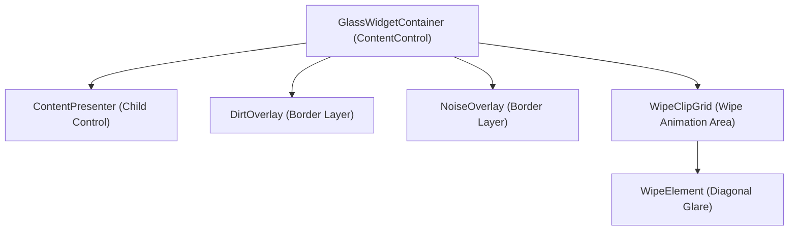

# Widget Glass Panel Aging & Squeegee Cleaning Animations

The Dashboard Widget Glass Panel Aging and Squeegee Cleaning feature adds an immersive, tactile, and premium aesthetic layer to the WinUI 3 dashboard. Widgets represent "physical glass panels" that accumulate dust, smudges, and fingerprints over time as their underlying data ages. Manual or automatic data refreshes trigger a diagonal squeegee wipe animation, sweeping the glass clean.

---

## 1. Functional Specification

### 1.1 Data-Driven Panel Aging
* **Behavior**: As time passes since the last data refresh, the widget accumulates visual "dirt" (fingerprint smudges) and "dust" (procedural grain) to simulate data aging.
* **Enable / Disable Toggle**: The visual aging feature can be toggled on or off via the `Widget glass aging` ToggleSwitch under settings. When disabled, overlays remain completely clean (opacity `0.0`), and configuration sliders are disabled in the UI.
* **Duration Timeline Configuration**: The duration for a panel to reach maximum dirtiness is configurable via settings under **Settings -> Features -> Traditional Features -> Widget Glass Aging Settings**. The `Widget glass aging duration` slider provides a 10-step timeline from 10 seconds to 3 hours (10s, 30s, 1m, 2m, 5m, 10m, 30m, 1h, 2h, 3h).
* **Grain Intensity Configuration**: Users can control the visibility of the dust layer independently via the `Widget glass grain intensity` slider (range: 0% to 100%).
* **Opacity Progression**:
  - Aging calculates a ratio based on elapsed time:
    $$\text{Ratio} = \min\left(1.0, \frac{\text{ElapsedSeconds}}{\text{WidgetAgingDurationSeconds}}\right)$$
  - To simulate natural grease and dust accumulation, the opacity scales non-linearly using an ease-in power curve:
    $$\text{Dirtiness} = \text{Ratio}^{1.5}$$
  - The maximum opacity of the fingerprints (`DirtOverlay`) is capped at `0.75` (75%) and the dust (`NoiseOverlay`) is capped at `0.55` (55%) to maintain readable text and layout visibility.
  - The dust overlay is scaled further by the user's intensity setting:
    $$\text{NoiseOpacity} = \text{Dirtiness} \times \text{MaxNoiseOpacity} (0.55) \times \left(\frac{\text{GrainIntensitySetting}}{100.0}\right)$$

### 1.2 Interactive Squeegee Wiping
* **Refresh Trigger**: Initiating a refresh (either by clicking the DayOne / Refresh title bar action or triggering specific widget refreshes) calls the squeegee sequence.
* **Wipe Animation**:
  - A diagonal, glowing blue-white glare bar (`WipeElement`) sweeps from left to right across the widget.
  - The glare element rotates by 20 degrees, scales up on the Y-axis to cover the diagonal corners, and glides smoothly.
  - **Left-to-Right Clipping**: Instead of fading the overlays globally, they are clipped dynamically using a composition-based `InsetClip` in lockstep with the trailing edge of the squeegee.
  - This ensures that fingerprints and dust to the right of the moving squeegee remain fully visible, while the area to the left is wiped completely clean, creating a highly realistic physical wipe effect.
  - Once the animation completes, the last-refresh timestamp is reset, the clip is removed, and the overlays are reset to `0.0` opacity to begin the aging timer anew.

---

## 2. Technical Architecture & Implementation

The feature is implemented inside the custom control `GlassWidgetContainer` (subclassing `ContentControl`) to wrap and overlay children templates cleanly without affecting their interactive hit-tests.



### 2.1 Control Template Style (`App.xaml`)
The container's styling is defined inside the global resources in `App.xaml` under the key `GlassWidgetContainerStyle`. It layers four main elements inside a single-cell `Grid`:
1. **ContentPresenter**: Hosts the nested child control (e.g. `WeatherWidgetControl`).
2. **DirtOverlay Border**: Displays the fingerprint smudges texture. Has `IsHitTestVisible="False"` enabled.
3. **NoiseOverlay Border**: Displays the vector dust/grain texture. Has `IsHitTestVisible="False"` enabled.
4. **WipeClipGrid**: Contains the `WipeElement` border which is translated off-screen by default (`TranslateX="-250"`) and rotated by `20` degrees.

### 2.2 Vector Assets
To avoid scaling artifacts and support light/dark modes with maximum visual premium feel, all textures are SVG vector-based assets. Because WinUI's native SVG parser does not support procedural filters like `<feTurbulence>`, the SVGs include a high-performance vector fallback utilizing a custom `<pattern>` filled with dense, microscopic vector dust circles.
* **Dirt / Smudges (`WidgetDirtBrush`)**:
  - `glass_smudges_dark.svg`: Thin-lined, concentric ellipses representing classic whorl structures in light grey/white for dark mode.
  - `glass_smudges_light.svg`: Dark charcoal-grey concentric ellipses for light mode.
* **Dust / Noise (`WidgetNoiseBrush`)**:
  - `glass_noise_dark.svg`: Microscopic vector dust grain pattern in light white/grey.
  - `glass_noise_light.svg`: Microscopic vector dust grain pattern in charcoal-grey.

---

### 2.3 Aging Timer & Animation Code (`GlassWidgetContainer.cs`)
A `DispatcherTimer` ticks every 1 second, updating the `Opacity` of `DirtOverlay` and `NoiseOverlay` based on the elapsed time and user settings:

```csharp
private void AgingTimer_Tick(object? sender, object e)
{
    if (_dirtOverlay == null) return;

    var settings = SettingsService.Load();
    int durationSeconds = settings.WidgetAgingDurationSeconds;
    if (durationSeconds <= 0) durationSeconds = 30;
    double grainIntensity = settings.WidgetAgingGrainIntensity;

    var elapsed = DateTime.Now - _lastRefreshedTime;
    double ratio = Math.Min(1.0, elapsed.TotalSeconds / durationSeconds);
    double dirtiness = Math.Pow(ratio, 1.5);

    _dirtOverlay.Opacity = dirtiness * MaxDirtOpacity;

    if (_noiseOverlay != null)
    {
        _noiseOverlay.Opacity = dirtiness * MaxNoiseOpacity * (grainIntensity / 100.0);
    }
}
```

When a refresh occurs, `StartWipeAnimation()` constructs and plays the animations:
1. **Squeegee Glare Animation**: Animates the diagonal glare `WipeElement`'s translation from `-250` to `width + 250` (using cubic ease-in-out).
2. **Left-to-Right Clipping (`InsetClip`)**:
   Retrieves the composition `Visual` objects of both overlays and instantiates an `InsetClip` on them.
   Since the squeegee starts off-screen and moves diagonally, a mathematical solver `SolveCubicEaseInOut` calculates the exact times (`tStart` and `tEnd`) when the trailing edge of the squeegee crosses the left and right bounds of the widget.
   The clip's `LeftInset` is animated from `0` to `width` exactly between `tStart` and `tEnd`, synchronizing perfectly with the squeegee:

```csharp
private static float SolveCubicEaseInOut(double targetY)
{
    double low = 0.0;
    double high = 1.0;
    for (int i = 0; i < 20; i++)
    {
        double mid = (low + high) / 2.0;
        double y = mid < 0.5 ? 4.0 * mid * mid * mid : 1.0 - 4.0 * Math.Pow(1.0 - mid, 3);
        if (y < targetY)
            low = mid;
        else
            high = mid;
    }
    return (float)((low + high) / 2.0);
}
```

3. **Cleanup**: On storyboard completion, the clips are set to `null` to ensure the full overlay area is visible again, and the overlays' global opacities are reset to `0.0`.

---

## 3. Layout Integration

To apply the glass-aging effect, widget templates declared inside [MainPage.xaml](file:///c:/Users/mihai/source/repos/Daily/WinUI/Daily.WinUI/MainPage.xaml) are wrapped inside the container:

```xml
<DataTemplate x:Key="WeatherWidgetTemplate">
    <Border Background="{ThemeResource AppGlassColorBrush}" BorderBrush="{ThemeResource AppGlassBorderColorBrush}" BorderThickness="1" Style="{StaticResource GlassPanelStyle}" Translation="0,0,18" CornerRadius="16">
        <controls:GlassWidgetContainer CornerRadius="16">
            <controls:WeatherWidgetControl x:Name="WeatherWidget" />
        </controls:GlassWidgetContainer>
    </Border>
</DataTemplate>
```

---

## 4. Verification & Testing

### 4.1 Manual Verification Protocol
1. Open the application and navigate to **Settings -> Features -> Traditional Features**.
2. Locate the **Widget Glass Aging Settings** section.
3. Verify that the **Widget glass aging** ToggleSwitch is visible, text wrapped, and not clipped.
4. Toggle the **Widget glass aging** switch off. Verify that:
   - The aging duration and grain intensity sliders become disabled (greyed out).
   - Go back to the dashboard. Observe that the widgets remain 100% clean and do not age.
5. Toggle the **Widget glass aging** switch on. Verify that:
   - Both sliders become enabled again.
   - Adjust the **Widget glass aging duration** slider to **10s** (step index 0).
   - Adjust the **Widget glass grain intensity** slider to **70%**.
6. Return to the dashboard. Watch the widget panels. Over the course of 10 seconds, fingerprints and dust grain fade onto the widgets.
7. Click **Refresh** in the TitleBar.
8. Verify that the squeegee sweeps from left to right, clipping the overlays behind its trailing edge.
9. Verify that the sliders' labels (e.g. `10s`, `30s`, `1m`, `2m`, `5m`, `10m`, `30m`, `1h`, `2h`, `3h`) display correctly and do not get clipped.
10. Click, scroll, and interact with the widgets while they are aged/clean to verify that `IsHitTestVisible="False"` allows mouse/touch events to pass through the overlay.
