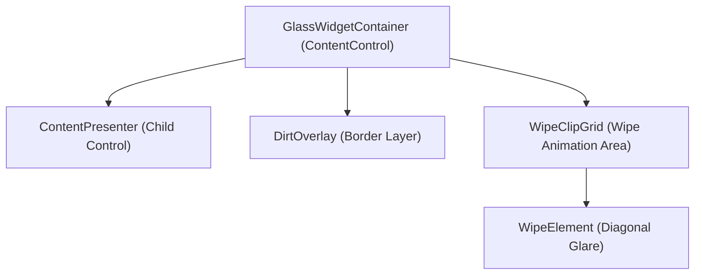

# Widget Glass Panel Aging & Squeegee Cleaning Animations

The Dashboard Widget Glass Panel Aging and Squeegee Cleaning feature adds an immersive, tactile, and premium aesthetic layer to the WinUI 3 dashboard. Widgets represent "physical glass panels" that accumulate dust, smudges, and fingerprints over time as their underlying data ages. Manual or automatic data refreshes trigger a diagonal squeegee wipe animation, sweeping the glass clean.

---

## 1. Functional Specification

### 1.1 Data-Driven Panel Aging
* **Behavior**: As time passes since the last data refresh, the widget accumulates visual "dirt" (a mix of fingerprints, smudges, and fine dust) to simulate data aging.
* **Duration Configuration**: The duration for a panel to reach maximum dirtiness is configurable via settings. Under **Settings -> Features -> Traditional Features -> Testing**, users can adjust the `Widget glass aging duration` slider (range: 10s to 300s).
* **Opacity Progression**:
  - Aging calculates a ratio based on elapsed time:
    $$\text{Ratio} = \min\left(1.0, \frac{\text{ElapsedSeconds}}{\text{WidgetAgingDurationSeconds}}\right)$$
  - To simulate natural grease and dust accumulation, the opacity scales non-linearly using an ease-in power curve:
    $$\text{Dirtiness} = \text{Ratio}^{1.5}$$
  - The overlay's maximum opacity is capped at `0.75` (75%) to maintain readable text and layout visibility.

### 1.2 Interactive Squeegee Cleaning
* **Refresh Trigger**: Initiating a refresh (either by clicking the DayOne / Refresh title bar action or triggering specific widget refreshes) calls the squeegee sequence.
* **Wipe Animation**:
  - A diagonal, glowing blue-white glare bar (`WipeElement`) sweeps from left to right across the widget.
  - The glare element rotates by 20 degrees, scales up on the Y-axis to cover the diagonal corners, and glides smoothly.
  - Concurrently, the accumulated dirt overlay fades back to `0.0` opacity, revealing a pristine, clear glass panel.
  - Once the animation completes, the last-refresh timestamp is reset, starting the aging timer anew.

---

## 2. Technical Architecture & Implementation

The feature is implemented inside the custom control `GlassWidgetContainer` (subclassing `ContentControl`) to wrap and overlay children templates cleanly without affecting their interactive hit-tests.



### 2.1 Control Template Style (`App.xaml`)
The container's styling is defined inside the global resources in `App.xaml` under the key `GlassWidgetContainerStyle`. It layers three main elements inside a single-cell `Grid`:
1. **ContentPresenter**: Hosts the nested child control (e.g. `WeatherWidgetControl`).
2. **DirtOverlay Border**: Displays the smudge/fingerprint texture. It has `IsHitTestVisible="False"` enabled so that all pointer inputs pass directly to the interactive elements underneath.
3. **WipeClipGrid**: Contains the `WipeElement` border which is translated off-screen by default (`TranslateX="-250"`) and rotated by `20` degrees.

### 2.2 Theme-Adaptive Assets
To support both dark and light dashboard backgrounds with high contrast, the smudges texture uses theme-dictionary resources:
* **Dark Theme Dictionary (`WidgetDirtBrush`)**:
  Loads `glass_smudges_dark.png` which contains light grey/white inverted smudges. These stand out clearly against the deep violet-blue glass panels.
* **Light Theme Dictionary (`WidgetDirtBrush`)**:
  Loads `glass_smudges_light.png` which contains dark grey/black grease smudges. These are visible against light cream/grey backgrounds.

```xml
<!-- App.xaml Theme Resource Definitions -->
<ResourceDictionary x:Key="Dark">
    <ImageBrush x:Key="WidgetDirtBrush" ImageSource="ms-appx:///Assets/glass_smudges_dark.png" Stretch="Fill" />
</ResourceDictionary>

<ResourceDictionary x:Key="Light">
    <ImageBrush x:Key="WidgetDirtBrush" ImageSource="ms-appx:///Assets/glass_smudges_light.png" Stretch="Fill" />
</ResourceDictionary>
```

### 2.3 Aging Timer & Animation Code (`GlassWidgetContainer.cs`)
A `DispatcherTimer` ticks every 1 second, updating the `Opacity` of `DirtOverlay` based on the elapsed time and user settings:

```csharp
private void AgingTimer_Tick(object? sender, object e)
{
    if (_dirtOverlay == null) return;

    var settings = SettingsService.Load();
    int durationSeconds = settings.WidgetAgingDurationSeconds;
    if (durationSeconds <= 0) durationSeconds = 30;

    var elapsed = DateTime.Now - _lastRefreshedTime;
    double ratio = Math.Min(1.0, elapsed.TotalSeconds / durationSeconds);
    double dirtiness = Math.Pow(ratio, 1.5);

    _dirtOverlay.Opacity = dirtiness * MaxDirtOpacity;
}
```

When a refresh occurs, `StartWipeAnimation()` constructs and plays a `Storyboard`:
1. **TranslateX Animation**: Animates the diagonal glare from `-250px` to `ActualWidth + 250px`.
2. **Glare Opacity Animations**: Fades the glare in quickly (`0.0` to `1.0` in `0.25s`) and fades it out at the end of the sweep.
3. **Dirt Opacity Invalidation**: Fades out the dirt overlay's opacity to `0.0` over `1.0s` as the squeegee passes.

---

## 3. Layout Integration

To apply the glass-aging effect, widget templates declared inside [MainPage.xaml](file:///c:/Users/mihai/source/repos/Daily/WinUI/Daily.WinUI/MainPage.xaml) are wrapped inside the container:

```xml
<DataTemplate x:Key="WeatherWidgetTemplate">
    <Border Background="{ThemeResource AppGlassColorBrush}" BorderBrush="{ThemeResource AppGlassBorderColorBrush}" BorderThickness="1" Style="{StaticResource GlassPanelStyle}" Translation="0,0,18" CornerRadius="16">
        <controls:GlassWidgetContainer CornerRadius="16">
            <controls:WeatherWidgetControl x:Name="WeatherWidget" />
        </controls:GlassWidgetContainer>
    </Border>
</DataTemplate>
```

---

## 4. Verification & Testing

### 4.1 Manual Verification Protocol
1. Open the application and navigate to **Settings -> Features -> Traditional Features**.
2. Scroll to the **Testing** section and move the **Widget glass aging duration** slider to **10 seconds**.
3. Return to the dashboard.
4. Watch the widget panels. Over the course of 10 seconds, light-grey fingerprints, grease smudges, and dust marks will fade onto the widgets.
5. Click **Refresh** in the TitleBar.
6. Verify that a diagonal glowing blue/white bar sweeps smoothly from left to right, clearing all smudges.
7. Click, scroll, and interact with the widgets while they are aged/clean to verify that `IsHitTestVisible="False"` allows mouse/touch events to pass through the overlay.
