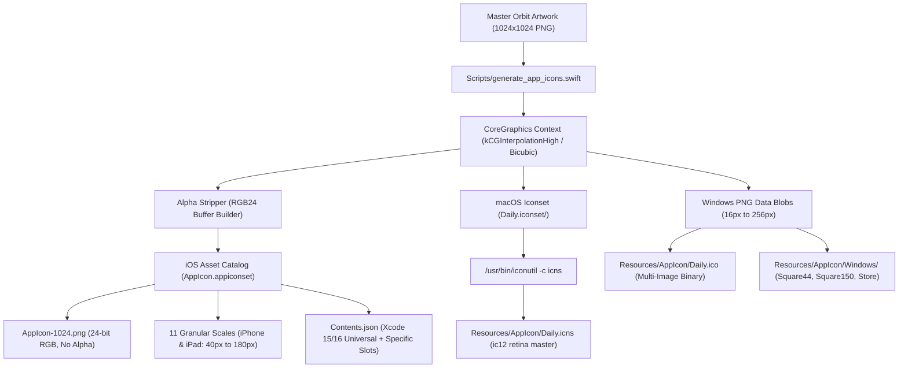

# Feature: iOS Production & App Store Readiness (Multiplatform Icon Suite & Compliance)

This document details the high-fidelity icon rasterization pipeline, Apple App Store compliance manifests, metadata audit, and multiplatform asset generation for **DayOne iOS**, with forward compatibility for **macOS** and **Windows**.

---

## 1. Executive Summary

To prepare the native DayOne iOS application for App Store distribution and ecosystem consistency, we established a unified master asset pipeline rooted in the **Orbit Liquid Glass** visual identity:

| Dimension | Previous State | Production / App Store Ready State |
| :--- | :--- | :--- |
| **App Icon Artwork** | Placeholder empty asset catalog. | **Orbit Liquid Glass**: Iridescent 3D glass planetary core with neon cyan & electric violet orbital caustics. |
| **iOS Transparency Compliance** | N/A | **24-bit Truecolor RGB (No Alpha)**: Strict compliance with Apple's `ITMS-90717` rejection rule (zero alpha channel in master 1024x1024). |
| **macOS Native Format** | Missing. | **`Daily.icns`**: Apple native multi-resolution icon binary compiled via `/usr/bin/iconutil` (16x16 through 512x512@2x / 1024x1024). |
| **Windows Native Format** | Older monochrome letterform. | **`Daily.ico` & WinUI Tiles**: Multi-resolution Windows binary icon container (16, 24, 32, 48, 64, 128, 256 px) plus MSIX package tiles. |
| **Privacy Manifest** | Missing in native iOS target. | **`PrivacyInfo.xcprivacy`**: Apple-mandated privacy manifest declaring `CA92.1` for `UserDefaults`, file timestamp, disk space, and boot time reason codes, with zero commercial tracking. |
| **Display Name** | Target name `Daily`. | **`DayOne`**: Configured via `CFBundleDisplayName` for home screen, app switcher, and spotlight. |
| **App Store Review Safety** | Generic strings. | **Refined Usage Descriptions**: Clear justifications for CoreLocation (weather) and HealthKit (biometric read + dietary water write). |

---

## 2. Multiplatform Asset Pipeline (`generate_app_icons.swift`)

The automated script [**`Scripts/generate_app_icons.swift`**](file:///Users/mihai/Source/Daily/Scripts/generate_app_icons.swift) executes an end-to-end rasterization workflow using Apple's native **CoreGraphics** and **ImageIO** engines:



### 2.1 Apple `ITMS-90717` Alpha Stripping Technique
Apple's App Store Connect ingestion engine automatically rejects app store icons that have an alpha channel or transparency:
$$\text{Rejection: } \texttt{ERROR ITMS-90717: Invalid App Store Icon. The App Store Icon... can't be transparent nor contain an alpha channel.}$$

Our generator solves this at the byte level:
1. Renders the master image onto an opaque black sRGB canvas (`CGColor(srgbRed: 0, green: 0, blue: 0, alpha: 1.0)`).
2. Extracts raw 32-bit pixel bytes (`R, G, B, A`).
3. Strips the 4th component, creating a tight 3-byte-per-pixel buffer:
   $$\text{Offset}_{24}(i) = [R_i, G_i, B_i]$$
4. Constructs a 24-bit `CGImage` with `bitsPerPixel = 24`, `bitsPerComponent = 8`, and `bitmapInfo = CGImageAlphaInfo.none`.
5. Encodes using ImageIO's `kUTTypePNG` destination. Verified via `sips`:
   ```
   samplesPerPixel: 3
   bitsPerSample: 8
   hasAlpha: no
   space: RGB
   ```

---

## 3. iOS Asset Catalog Specifications (`AppIcon.appiconset`)

Generated files located at `iOS/Daily/Resources/Assets.xcassets/AppIcon.appiconset/`:

| Filename | Point Size | Scale | Pixel Dimensions | Target Platform / Role |
| :--- | :--- | :--- | :--- | :--- |
| **`AppIcon-1024.png`** | 1024x1024 | 1x | 1024 x 1024 | App Store / Universal Master |
| **`AppIcon-20x20@2x.png`** | 20x20 | 2x | 40 x 40 | iPhone Notification Center |
| **`AppIcon-20x20@3x.png`** | 20x20 | 3x | 60 x 60 | iPhone Notification Center |
| **`AppIcon-29x29@2x.png`** | 29x29 | 2x | 58 x 58 | iPhone Settings |
| **`AppIcon-29x29@3x.png`** | 29x29 | 3x | 87 x 87 | iPhone Settings |
| **`AppIcon-40x40@2x.png`** | 40x40 | 2x | 80 x 80 | iPhone Spotlight Search |
| **`AppIcon-40x40@3x.png`** | 40x40 | 3x | 120 x 120 | iPhone Spotlight Search |
| **`AppIcon-60x60@2x.png`** | 60x60 | 2x | 120 x 120 | iPhone Home Screen (@2x) |
| **`AppIcon-60x60@3x.png`** | 60x60 | 3x | 180 x 180 | iPhone Home Screen (@3x Pro) |
| **`AppIcon-76x76@1x.png`** | 76x76 | 1x | 76 x 76 | iPad Home Screen (Standard) |
| **`AppIcon-76x76@2x.png`** | 76x76 | 2x | 152 x 152 | iPad Home Screen (Retina) |
| **`AppIcon-83.5x83.5@2x.png`**| 83.5x83.5| 2x | 167 x 167 | iPad Pro Home Screen |

---

## 4. macOS Native Assets (`Resources/AppIcon/Daily.icns`)

Compiled via `/usr/bin/iconutil` into standard binary format (`1.59 MB`, type `ic12`):
- `icon_16x16.png` & `@2x` (16x16, 32x32)
- `icon_32x32.png` & `@2x` (32x32, 64x64)
- `icon_128x128.png` & `@2x` (128x128, 256x256)
- `icon_256x256.png` & `@2x` (256x256, 512x512)
- `icon_512x512.png` & `@2x` (512x512, 1024x1024)

Directly reusable for the macOS DayOne native application.

---

## 5. Windows Native Assets (`Resources/AppIcon/Daily.ico` & Tiles)

1. **`Daily.ico`**: Windows multi-resolution icon container embedding 7 discrete resolutions:
   $$\{16\times 16, \; 24\times 24, \; 32\times 32, \; 48\times 48, \; 64\times 64, \; 128\times 128, \; 256\times 256\}$$
2. **WinUI 3 MSIX Package Assets** in `Resources/AppIcon/Windows/`:
   - `Square44x44Logo.png` & `@2x` (44x44, 88x88)
   - `Square150x150Logo.png` & `@2x` (150x150, 300x300)
   - `StoreLogo.png` (50x50)

---

## 6. Apple Privacy Manifest (`PrivacyInfo.xcprivacy`)

Located at [**`iOS/Daily/Resources/PrivacyInfo.xcprivacy`**](file:///Users/mihai/Source/Daily/iOS/Daily/Resources/PrivacyInfo.xcprivacy) and bundled directly into `Daily.app`:

```xml
<dict>
    <key>NSPrivacyTracking</key>
    <false/>
    <key>NSPrivacyTrackingDomains</key>
    <array/>
    <key>NSPrivacyCollectedDataTypes</key>
    <array/>
    <key>NSPrivacyAccessedAPITypes</key>
    <array>
        <!-- UserDefaults (CA92.1) -->
        <dict>
            <key>NSPrivacyAccessedAPIType</key>
            <string>NSPrivacyAccessedAPICategoryUserDefaults</string>
            <key>NSPrivacyAccessedAPITypeReasons</key>
            <array><string>CA92.1</string></array>
        </dict>
        <!-- FileTimestamp (C617.1) -->
        <dict>
            <key>NSPrivacyAccessedAPIType</key>
            <string>NSPrivacyAccessedAPICategoryFileTimestamp</string>
            <key>NSPrivacyAccessedAPITypeReasons</key>
            <array><string>C617.1</string></array>
        </dict>
        <!-- DiskSpace (E174.1) -->
        <dict>
            <key>NSPrivacyAccessedAPIType</key>
            <string>NSPrivacyAccessedAPICategoryDiskSpace</string>
            <key>NSPrivacyAccessedAPITypeReasons</key>
            <array><string>E174.1</string></array>
        </dict>
        <!-- SystemBootTime (35F9.1) -->
        <dict>
            <key>NSPrivacyAccessedAPIType</key>
            <string>NSPrivacyAccessedAPICategorySystemBootTime</string>
            <key>NSPrivacyAccessedAPITypeReasons</key>
            <array><string>35F9.1</string></array>
        </dict>
    </array>
</dict>
```

---

## 7. App Store Metadata & Compliance Checklist

- [x] **`CFBundleDisplayName`**: Set to `"DayOne"` in `Info.plist`.
- [x] **`CFBundleName`**: Set to `"Daily"`.
- [x] **`CFBundleIdentifier`**: Set to `"com.intellidream.daily"`.
- [x] **`CFBundleShortVersionString`**: Set to `"1.0.0"`.
- [x] **`CFBundleVersion`**: Set to `"1"`.
- [x] **`ITSAppUsesNonExemptEncryption`**: Set to `<false/>` (bypasses export compliance documentation requirement).
- [x] **`NSLocationWhenInUseUsageDescription`**: Clear explanation for weather forecasting.
- [x] **`NSHealthShareUsageDescription`**: Clear explanation for reading steps, HR, sleep, and vitals.
- [x] **`NSHealthUpdateUsageDescription`**: Clear explanation for recording water hydration intake.
- [x] **`UILaunchScreen`**: Modern edge-to-edge system declaration.
- [x] **`Assets.car` Compilation**: Compiled with zero warnings (`actool` outputting `Opaque: true`).
- [x] **App Store Icon Validation**: 1024x1024 px, 24-bit Truecolor RGB with zero transparency chunks.

---

## 8. Ecosystem Roadmap: Future Application to macOS & WinUI 3

The multi-resolution assets generated in this phase are staged in the centralized `Resources/AppIcon/` directory, ready to be integrated into companion platforms:

1. **Native macOS Application**:
   - Asset: [**`Resources/AppIcon/Daily.icns`**](file:///Users/mihai/Source/Daily/Resources/AppIcon/Daily.icns) and the [**`Daily.iconset/`**](file:///Users/mihai/Source/Daily/Resources/AppIcon/Daily.iconset) folder.
   - When the native macOS Xcode project is created, `Daily.icns` will be wired directly into the target's `CFBundleIconFile` and asset catalog, ensuring instantaneous 100% visual consistency with the iOS app in the macOS Dock, App Switcher, and Finder.
2. **WinUI 3 Desktop Application**:
   - Asset: [**`Resources/AppIcon/Daily.ico`**](file:///Users/mihai/Source/Daily/Resources/AppIcon/Daily.ico) (for Window icon and Taskbar) and MSIX tile assets in [**`Resources/AppIcon/Windows/`**](file:///Users/mihai/Source/Daily/Resources/AppIcon/Windows/) (`Square44x44Logo`, `Square150x150Logo`, `StoreLogo`).
   - In the upcoming desktop alignment phase, these assets will replace the legacy monochrome "D" assets in `WinUI/Daily.WinUI/Assets/`, unifying the desktop identity with the Orbit Liquid Glass design system.

---

## 9. Native Launch Screen & Dashboard Header HIG Visual Polish

### 9.1 Launch Screen Pipeline (`generate_launch_assets.swift`)
To replace the default system text ("DayOne") on cold startup with the premium Orbit icon:
1. **Automated Squircle Cropping & Masking**:
   - [**`Scripts/generate_launch_assets.swift`**](file:///Users/mihai/Source/Daily/Scripts/generate_launch_assets.swift) crops the 828x828 squircle artwork out of the 1024x1024 canvas (eliminating the 98px black outer boundary).
   - Applies Apple's continuous squircle clipping path (`cornerWidth = 0.2237 * width`) with transparent exterior corners and an overlaid 1.2px specular highlight rim.
   - Generates multi-scale assets (`120x120` @1x, `240x240` @2x, `360x360` @3x) in `iOS/Daily/Resources/Assets.xcassets/LaunchLogo.imageset` and `AppLogo.imageset`.
2. **OLED Black Launch Background**:
   - Generated `LaunchBackground.colorset` with sRGB `(0, 0, 0)` for true black pixel-off rendering on iPhone OLED displays.
3. **`Info.plist` UILaunchScreen Declaration**:
   ```xml
   <key>UILaunchScreen</key>
   <dict>
       <key>UIColorName</key>
       <string>LaunchBackground</string>
       <key>UIImageName</key>
       <string>LaunchLogo</string>
       <key>UIImageRespectsSafeAreaInsets</key>
       <true/>
   </dict>
   ```
4. **Seamless In-App Initializing Transition**:
   - `RootView.swift` `.initializing` state displays `Image("LaunchLogo")` at the identical 120pt center coordinate with a subtle cyan ambient aura and sleek progress indicator, creating a 100% fluid cold boot transition without layout jumps or textual placeholders.

### 9.2 Dashboard Header Tile & Apple HIG Spacing
1. **Dynamic Island & Status Bar Clearance**:
   - According to Apple Human Interface Guidelines (HIG), scroll containers below the status bar and Dynamic Island require dedicated vertical clearance (typically 12–16pt) so container cards don't collide with the sensor housing / camera cutouts.
   - `DashboardView.swift` added `.padding(.top, 14)` to provide optimal breathing room below the 59pt safe area boundary on modern iPhone devices.
2. **Translucent Aurora Liquid Glass Hero Container**:
   - Refactored `HeaderGreetingView.swift` from generic `GlassCard` to a custom translucent hero banner:
     - **Frosted Glass Base**: `.ultraThinMaterial` on continuous 24pt rounded rectangle.
     - **Translucent Aurora Wash**: Multi-stop gradient blend of `accentCyan` (0.14), `accentBlue` (0.08), and `glowPurple` (0.07).
     - **Specular Dual Border**: Luminous multi-stop border with white-to-cyan specular gradient (`lineWidth: 1.2`).
     - **Ambient Radial Backlight**: Diffuse cyan glow behind the avatar.
     - **Micro Date Pill Badge**: Translucent cyan capsule with glowing live status pulse (`● FRIDAY, SEPTEMBER 11`).
     - **Live Sync Status Dot**: Emerald green indicator dot on the user's avatar.
     - **Haptic Tactile Buttons**: Medium impact feedback on avatar and frosted glass settings button taps.

