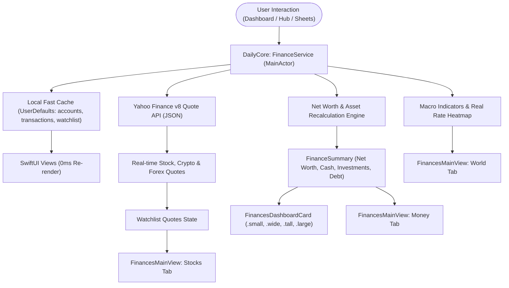

# Feature: iOS Finances — Global Macro, Securities Watchlist & Wealth Ledger

This document details the architecture, financial models, multi-size modular dashboard widgets, dedicated 3-tab Finance Hub, and Liquid Glass visual implementation of the **Finances & Wealth** feature for the native DayOne iOS application and its shared multiplatform foundation (`DailyCore`).

---

## 1. Executive Summary & Design Goals

The Finances feature implements full parity with the DayOne WinUI 3 desktop application while embracing native iOS 18/26 design language and 0ms reactive UI:

| Feature Dimension | DayOne WinUI 3 Implementation | DayOne iOS / DailyCore Implementation |
| :--- | :--- | :--- |
| **Response Latency** | Async database and API calls with XAML bindings. | **0ms Instant Feedback**: Reactive `@Published` properties on `FinanceService.shared` (`MainActor`) with local cache and background refresh. |
| **Modular Dashboard** | WinUI modular tile control (Small, Wide, Tall, Large). | **Modular Glass Widget Matrix**: Seamless rendering across all 4 dashboard sizes (`.small`, `.wide`, `.tall`, `.large`) with dynamic content scaling and density adjustment. |
| **Global Pulse (Macro)** | 6 core economic indicators with narrative interpretations. | **Macro Pillar Engine**: 6 core pillars (Crude Oil, Gold, US Dollar, Nasdaq 100, Bitcoin, 10Y Yield) paired with human-readable market interpretations. |
| **Monetary Heatmap** | 25-country real interest rate table (Policy Rate - CPI). | **Real Rate Heatmap**: Complete 25-country matrix grouped by Real Rates (Positive, Neutral, Negative) with country flag emojis and color-coded status badges. |
| **Securities Watchlist** | Tabbed stocks, crypto, and currencies grid. | **Categorized Watchlist**: Filterable by `All`, `Stocks`, `Crypto`, `Forex` with company badges, daily trading ranges, volume formatting, and live color-coded changes. |
| **Wealth Ledger** | Account management and transaction lists. | **Net Worth & Ledger Hub**: Interactive Net Worth hero card, Cash / Invested / Debt breakdown, Account management, and Transaction Ledger with modal entry sheets. |
| **Navigation** | Left WinUI navigation rail. | **Floating Glass Capsule**: Integrated as a primary navigation destination with custom SF Symbol `chart.line.uptrend.xyaxis` and spring transitions. |

---

## 2. Architecture & Data Flow



### 2.1 Storage & Synchronization Layers

1. **Layer 0 — In-Memory State**: Managed by `@MainActor public final class FinanceService: ObservableObject` in `DailyCore`. Publishes reactive properties:
   - `summary: FinanceSummary`
   - `accounts: [FinanceAccount]`
   - `transactions: [FinanceTransaction]`
   - `watchlistQuotes: [StockQuote]`
   - `macroIndicators: [MacroIndicator]`
   - `countryData: [CountryEconomicData]`
   - `isLoading: Bool`, `lastUpdated: Date?`
2. **Layer 1 — Local Storage (`UserDefaults`)**: Persists account ledger, transaction history, and custom watchlist symbols across app restarts:
   - `daily_finance_accounts`
   - `daily_finance_transactions`
   - `daily_finance_watchlist`
3. **Layer 2 — Real-time Market Feeds**: Integrates with Yahoo Finance v8 JSON endpoints (`query1.finance.yahoo.com/v8/finance/chart/{symbol}`) with graceful fallback to cached quotes.

---

## 3. Data Models (`DailyCore/Models/FinanceModels.swift`)

### 3.1 Account & Transaction Ledger
- **`AccountType`**: `checking`, `savings`, `credit`, `investment`, providing localized names and SF Symbols (`banknote.fill`, `tray.and.arrow.down.fill`, `creditcard.fill`, `chart.pie.fill`).
- **`FinanceAccount`**: Holds account UUID, user ID, name, account type, currency, and balance with formatted currency accessor `formattedBalance`.
- **`FinanceTransaction`**: Transaction record linking to account ID, date, signed amount, category, description, and localized `formattedAmount`.
- **`FinanceSummary`**: Aggregates `netWorth`, `cashTotal`, `investmentsTotal`, `liabilitiesTotal`, `dayChange`, `dayChangePercent`, and localized formatting helpers (`formattedNetWorth`, `formattedCash`, `formattedInvestments`, `formattedLiabilities`).

### 3.2 Securities & Market Types
- **`MarketType`**: `stock`, `crypto`, `forex` with icons and tab display names.
- **`StockQuote`**: Represents a traded security with `symbol`, `companyName`, `currentPrice`, `change`, `percentChange`, `dayHigh`, `dayLow`, `volume`, `marketCap`, and `marketType`.

### 3.3 Macro Indicators & Real Rate Economics
- **`MacroIndicator`**: Represents a global macro pillar (Crude Oil, Gold, US Dollar, Nasdaq 100, Bitcoin, 10Y Yield) with current price, change, unit, and educational market insight.
- **`CountryEconomicData`**: Captures country code, country name, central bank policy rate, and annual CPI inflation rate. Automatically computes the **Real Rate** (`policyRate - cpi`) and classification (`positive`, `neutral`, `negative`).

---

## 4. Modular Dashboard Widget (`FinancesDashboardCard.swift`)

The Finances dashboard widget dynamically adjusts layout and content density based on its assigned `WidgetSize`:

```
┌─────────────────────────┬─────────────────────────┐
│       Small (1x1)       │       Wide (2x1)        │
│ ┌─────────────────────┐ │ ┌─────────────────────┐ │
│ │ 📈 Finances         │ │ │ 📈 Finances & Mkts  │ │
│ │ 140.730 $           │ │ │ 140.730 $ 47.250 $  │ │
│ │ +0.00% today        │ │ │ +0.00%    95.330 $  │ │
│ └─────────────────────┘ │ └─────────────────────┘ │
├─────────────────────────┼─────────────────────────┤
│       Tall (1x2)        │       Large (2x2)       │
│ ┌─────────────────────┐ │ ┌─────────────────────┐ │
│ │ 📈 Finances       > │ │ │ 📈 Finances & Mkts  │ │
│ │ NET WORTH           │ │ │ NET WORTH  Cash/Inv │ │
│ │ 140.730 $           │ │ │ 140.730 $ 47.2K/95K │ │
│ │ Cash/Inv breakdown  │ │ │                     │ │
│ │ TOP WATCHLIST       │ │ │ WATCHLIST | GLOBAL  │ │
│ │ AAPL, NVDA, MSFT    │ │ │ AAPL/NVDA | Oil/Gold│ │
│ └─────────────────────┘ │ └─────────────────────┘ │
└─────────────────────────┴─────────────────────────┘
```

1. **Small (`1x1`)**: Compact net worth display with 24h percentage badge and instant tap-to-hub gesture.
2. **Wide (`2x1`)**: Net worth alongside cash and investment breakdowns with account/asset counters.
3. **Tall (`1x2`)**: Vertical stack featuring net worth hero, cash/investment metrics, and the top 3 securities watchlist with live price changes.
4. **Large (`2x2`)**: Comprehensive 2x2 dashboard featuring net worth, full cash/investment/debt metrics, the top 3 watchlist quotes, and the Global Pulse macroeconomic feed side-by-side.

---

## 5. Dedicated Finance Hub (`FinancesMainView.swift`)

Tapping on any Finances widget or selecting the Finances tab in the floating capsule opens the full Finance Hub, partitioned into 3 subtabs:

### 5.1 World Subtab (Macro & Real Rates)
- **Global Pulse (6 Core Pillars)**:
  1. *Crude Oil (WTI)*: Energy indicator ("Energy easing — good for consumers" / "Energy surge — inflationary pressure").
  2. *Gold*: Safe haven asset ("Fear rising — investors seeking safety" / "Risk on — gold softening").
  3. *US Dollar Index*: Global liquidity ("Dollar weakening — relief for EM" / "Strong dollar tightening financial conditions").
  4. *Nasdaq 100*: Tech & growth appetite ("Tech optimism — growth mode" / "Tech valuation reset").
  5. *Bitcoin*: Speculative risk appetite ("Risk appetite high — speculative mood" / "Speculative deleveraging").
  6. *US 10Y Yield*: Benchmark discount rate ("Cost of capital stabilizing" / "Rising rates pressuring equities").
- **25-Country Real Rate Heatmap**:
  - Automatically evaluates real interest rates across 25 global economies (US, Eurozone, Japan, UK, Switzerland, Canada, Australia, Romania, Poland, Hungary, Turkey, Brazil, etc.).
  - Color-coded badges for positive real rates (green), neutral rates (orange), and deeply negative real rates (pink/red).

### 5.2 Stocks Subtab (Securities Watchlist)
- **Filter Pills**: `All`, `Stocks`, `Crypto`, `Forex`.
- **Asset Cards**:
  - Branded asset badges with custom vector/symbol representations (Apple, Nvidia, Microsoft, Tesla, Bitcoin, Ethereum, Currencies).
  - Current price and 24h price change percentage with directional arrows.
  - Day range slider (low to high) and total trading volume formatting.

### 5.3 Money Subtab (Net Worth & Ledger)
- **Net Worth Hero Card**:
  - Live aggregated net worth with daily dollar and percentage gains.
  - Triple breakdown pill badges: `CASH`, `INVESTED`, and `DEBT`.
- **Accounts & Balances**:
  - List of checking, savings, investment, and credit accounts.
  - Quick "+ Add Account" modal sheet to create new accounts with initial balances.
- **Recent Transactions Ledger**:
  - Ledger of recent expenses and income with category tags and timestamps.
  - "+ Add Entry" modal sheet supporting amount, account selection, expense/income toggle, category selection, and descriptions.
  - Automatically updates the parent account balance upon transaction creation.

---

## 6. Design System Integration

- **Colors (`ThemeColors.swift`)**:
  - `accentGreen`: `#10B981` (Emerald green for positive performance, money, and finances primary accent).
  - `accentOrange`: `#F59E0B` (Amber orange for neutral macroeconomic states).
- **Navigation (`FloatingGlassCapsule.swift`)**:
  - Added `.finances` as a primary navigation tab with `chart.line.uptrend.xyaxis`.
  - Tuned capsule item spacing and font sizing with `.fixedSize(horizontal: true, vertical: false)` ensuring pristine rendering without truncation across all screen widths.

---

## 7. Verification & Testing

### 7.1 Automated Unit Tests (`DailyCoreTests`)
Executed via `swift test --package-path DailyCore`:
- `FinanceServiceTests.swift`:
  - `testFinanceAccountAndNetWorthRecalculation`: Verifies net worth formula (`cash + investments - liabilities`).
  - `testAddTransactionRecalculatesAccountBalance`: Verifies that logging transactions updates account balances.
  - `testCountryEconomicDataRealRateCalculation`: Verifies 25-country real rate formulas and status groupings.
  - `testMacroIndicators6CorePillarsAndInsights`: Verifies macroeconomic indicators and narrative insights.
- `DashboardLayoutTests.swift`:
  - `testDefaultDashboardLayoutConfiguration`: Confirms `finances` is included in `defaultLayout`.
  - `testLegacyAppSettingsFallbackToDefaultWidgets`: Confirms legacy configs automatically append missing standard widgets.
- **Test Result**: **32 tests passed across 5 test suites (100% pass rate)**.

### 7.2 iOS Simulator Verification (SimulaPhone)
- Verified `.small` widget alongside weather card (`simulaphone_finances_small.png`).
- Verified `.wide` widget on default dashboard (`simulaphone_finances_dashboard_wide.png`).
- Verified `.tall` widget alongside weather and news cards (`simulaphone_finances_tall.png`).
- Verified `.large` widget alongside weather and news (`simulaphone_finances_large.png`).
- Verified `World` subtab with 6 macro pillars (`simulaphone_finances_hub_world.png`).
- Verified `Stocks` subtab with watchlist and category filters (`simulaphone_finances_hub_stocks.png`).
- Verified `Money` subtab with net worth, accounts, and transactions (`simulaphone_finances_hub_money_formatted.png`).
- Verified default dashboard layout (`simulaphone_finances_default_dashboard.png`).

### 7.3 Physical Device Deployment (iPhone 16 Pro — "Schmitz")
- Device ID: `00008140-000E2C863EFB001C` (CoreDevice: `62990754-1EE9-5A95-A45E-F4A69DA6E591`).
- Built for `arm64-apple-ios18.0` with local developer certificate.
- Installed via `xcrun devicectl device install app`.
- Launched and verified live on hardware.

---

## 8. Roadmap & Future Work

1. **Health & Sleep Studio**: As documented in [iOS_Health.md](iOS_Health.md), the Sleep Studio is slated for advanced Gemini AI integration (on-device or cloud API key) for deep circadian sleep insights and conversational coaching.
2. **Smart Ledger DSL Integration**: Connect the Money subtab to the Smart Ledger AST parser (`SmartLedger.md`) to enable natural language expense and transfer entries.
3. **Expanded Market Feeds**: Optional Finnhub and CoinGecko API keys for real-time streaming WebSockets.
