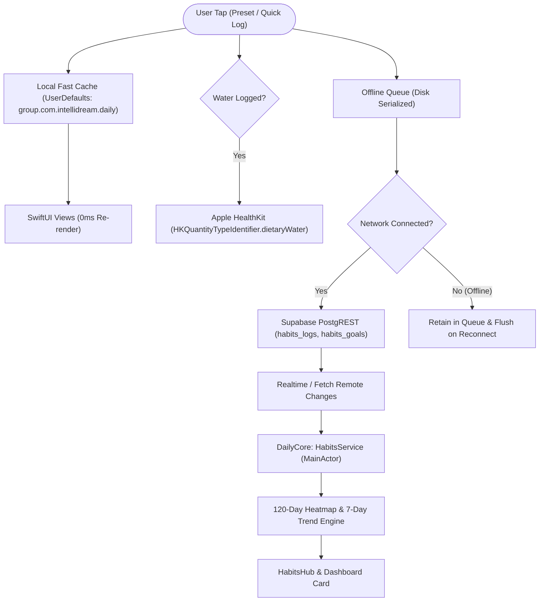

# Feature: iOS Habits — Bubbles (Hydration) & Smokes (Tobacco Cessation)

This document details the architecture, clinical and behavioral protocols, offline synchronization mechanics, HealthKit integration, and Liquid Glass visual implementation of the **Habits Tracker** feature for the native DayOne iOS application and its shared multiplatform foundation (`DailyCore`).

---

## 1. Executive Summary & Design Goals

The Habits Tracker implements full parity with the DayOne WinUI 3 desktop application and companion smartwatch ecosystem (watchOS, WearOS, HarmonyOS, ZeppOS) while embracing native iOS 26/27 design language:

| Feature Dimension | DayOne WinUI 3 Implementation | DayOne iOS / DailyCore Implementation |
| :--- | :--- | :--- |
| **Response Latency** | Network-dependent or async database write. | **0ms Instant Feedback**: Writes immediately to local App Group cache (`group.com.intellidream.daily`), updates UI reactively, then queues background Supabase synchronization. |
| **Offline Resilience** | Limited offline queueing. | **Durable Offline Queue**: Serialized FIFO disk queue with automatic retry, exponential backoff, and idempotent deduplication. |
| **Apple Health Integration** | N/A (Windows platform). | **HealthKit Dietary Water**: Automatic background write sync for `HKQuantityTypeIdentifier.dietaryWater` with millilitre-to-liter metric conversion. |
| **Hydration Science** | Simple total ml counter. | **Circadian Diurnal Timing**: 5-slot circadian hydration schedule, Drink Hydration Index (DHI/BHI), and clinical Armstrong 4-tier urine hydration assessment. |
| **Smoking Cessation** | Counter and basic financial savings. | **4D Craving Emergency Protocol**: Real-time 5-minute craving countdown timer (Delay, Deep Breathe, Drink Water, Distract), 6-stage clinical recovery milestones, and live "Craving-Free" duration counter. |
| **Visual Design** | Desktop card layouts with WinUI Mica/Acrylic. | **Tactile Liquid Glass Design**: Dynamic double sine-wave fluid animation for Bubbles; chromatic lungs silhouette with radial arc gauge for Smokes; 120-day GitHub-style consistency heatmap. |

---

## 2. Architecture & Data Flow

### 2.1 Storage & Synchronization Layers

1. **Layer 0 — In-Memory State**: Managed by `@MainActor public final class HabitsService: ObservableObject` in `DailyCore`. Publishes reactive properties (`waterTotalToday`, `waterProgressPercent`, `smokesTotalToday`, `smokesFinancials`, `sevenDayHistory`, `consistencyHeatmap`).
2. **Layer 1 — App Group Shared Cache (`group.com.intellidream.daily`)**: Provides instant local hydration across app launches, shared between iOS main app, future WidgetKit extensions, and watchOS companion.
3. **Layer 2 — Durable Offline Queue**: Persists unsynced log operations as JSON in `habits_offline_queue.json`. Automatically flushes when online, ensuring no logs are lost in poor connectivity.
4. **Layer 3 — Cloud Persistence (Supabase PostgREST)**:
   - `habits_logs`: `id`, `user_id`, `habit_type` (`"water"` | `"smokes"`), `amount`, `unit`, `logged_at`, `notes`, `metadata` (JSONB storing preset, drink type, nicotine mg, cigarette type).
   - `habits_goals`: `user_id`, `habit_type`, `daily_goal`, `baseline_daily_count`, `target_reduction_pct`, `price_per_pack`, `items_per_pack`, `currency`.

---

## 3. Bubbles (Hydration) Module

### 3.1 Fluid Wave Simulation (`WaterProgressWaveView`)
The Bubbles hero card renders a circular Liquid Glass gauge with an interactive fluid simulation:
- **Dual Sine Wave Geometry**: Two harmonic sinusoidal curves with phase offset ($\Delta \phi = \pi$) running at varying frequencies to create realistic liquid sloshing.
- **Wave Height Dynamics**: Smoothly interpolates wave vertical offset based on daily progress percentage ($0.0 \to 1.0$).
- **Goal Completion FX**: Upon reaching 100% of the target, an ambient emerald aura and gold star badge illuminate with tactile haptic feedback.

### 3.2 Quick Presets & Custom Intake
- **Standard Vessels**: 150ml (Small Cup), 250ml (Glass), 300ml (Mug), 500ml (Bottle).
- **Beverage Variations**: 100ml Espresso/Coffee, 250ml Herbal Tea.
- **Custom Logger**: Interactive modal sheet allowing free-form milliliter entry and custom drink categorization.

### 3.3 Circadian Diurnal Schedule
Based on circadian renal dynamics and cellular hydration research, hydration is broken into 5 diurnal slots:
1. **Morning Wake-Up (07:00 – 09:00)**: 500ml recommended to kickstart metabolism and replace nocturnal fluid loss.
2. **Mid-Morning Focus (10:00 – 12:00)**: 500ml for sustained cognitive performance and blood volume maintenance.
3. **Afternoon Energy (13:00 – 15:00)**: 500ml to prevent postprandial fatigue and dehydration headache.
4. **Evening Hydration (16:00 – 18:00)**: 400ml to support evening physical activity recovery.
5. **Pre-Bed Wind-Down (19:00 – 21:00)**: 200ml gentle intake to avoid nocturia and disrupted sleep cycles.

### 3.4 Drink Hydration Index (DHI / BHI)
Incorporates clinical Drink Hydration Index values relative to still water ($1.00$):
- **Still Water**: $1.00$ (Optimal baseline)
- **Electrolyte Solution / Oral Rehydration**: $1.50$ (Superior cellular retention)
- **Milk**: $1.50$ (High electrolyte, protein and fat content delays gastric emptying)
- **Herbal Tea**: $0.98$ (Near-identical to water)
- **Black Coffee**: $0.85$ (Mild diuretic effect at higher doses)
- **Caffeinated Energy Drinks / Alcohol**: $< 0.70$ (Requires supplemental hydration)

### 3.5 Armstrong 4-Tier Urine Hydration Chart
Clinical self-assessment reference:
- **Pale / Light Yellow**: Optimal hydration ($\le 1.010$ specific gravity).
- **Straw Yellow**: Well hydrated.
- **Amber / Honey**: Mild dehydration (trigger +250ml intake).
- **Dark Brown / Amber**: Severe dehydration (immediate fluid replenishment required).

---

## 4. Smokes (Tobacco Cessation & Reduction) Module

### 4.1 Lungs Silhouette & Chromatic Shift (`SmokesLungsGaugeView`)
Visualizes tobacco consumption relative to the user's daily baseline:
- **Vector Silhouette**: Anatomically styled lungs silhouette rendered with smooth Bézier contours.
- **3-Phase Chromatic Transition**:
  - **Emerald Green**: $\le 50\%$ of baseline (Excellent reduction / smoke-free).
  - **Vibrant Amber**: $51\% - 99\%$ of baseline (Controlled intake).
  - **Crimson Coral**: $\ge 100\%$ of baseline (Exceeded daily baseline threshold).
- **Live "Craving-Free" Counter**: Computes elapsed duration since the last logged smoke (e.g., `"4h 15m craving-free"`), promoting micro-streaks.

### 4.2 Logging Presets
- **Cigarette** (+1 Standard combustion cigarette)
- **Heated Tobacco** (+1 Heated tobacco stick / TEREA / HEETS)
- **Rolled Tobacco** (+1 Hand-rolled cigarette)
- **Cigarillo / Cigar** (+1 Small cigar)

### 4.3 4D Craving Emergency Protocol
When a craving strikes, tapping the **"4D Craving Emergency"** banner opens an interactive psychological de-escalation protocol:
1. **Delay (5 Minutes)**: Live interactive countdown timer. Most acute dopamine surges subside within 3 to 5 minutes.
2. **Deep Breathe**: 4-7-8 breathing pattern (4s inhale, 7s hold, 8s slow exhale) to activate parasympathetic vagal tone.
3. **Drink Water**: Sipping cold water provides oral substitution and sensory grounding.
4. **Distract**: Shift visual and physical focus (walk, puzzle, call a friend) to reset executive attention.

### 4.4 Clinical Recovery Timeline
Presents scientific evidence-based milestones since quitting/reduction:
- **20 Minutes**: Blood pressure and pulse drop back to normal baseline.
- **8 Hours**: Blood carbon monoxide levels halve, oxygen levels return to normal.
- **24 Hours**: Carbon monoxide eliminated; lungs begin clearing mucus.
- **48 Hours**: Nicotine eliminated from body; taste and smell nerve endings regenerate.
- **72 Hours**: Bronchial tubes relax, breathing becomes noticeably easier.
- **2 to 12 Weeks**: Circulation throughout extremities and overall lung function improve up to 30%.

### 4.5 Financial & Longevity Metrics Engine
Computes real-time economic and physiological recovery:
- **Money Saved**: $(\text{Baseline} - \text{Logged}) \times \frac{\text{Pack Price}}{\text{Items per Pack}}$.
- **Cigarettes Avoided**: Cumulative avoided units over tracking periods.
- **Life Regained**: Based on epidemiological estimates ($11\text{ minutes of life preserved per avoided cigarette}$).

---

## 5. Analytics & Consistency Heatmap

### 5.1 7-Day Performance Bar Chart
- Compares daily intake or cigarette counts over the last 7 consecutive calendar days.
- Renders an overlay dashed line representing the target goal or baseline limit.
- Dynamically colors bars matching daily achievement (Cyan for water goal met; Emerald for smoking under baseline).

### 5.2 120-Day Consistency Heatmap
- GitHub-style contributions grid organized into 17 weekly columns $\times$ 7 day rows ($119 - 120$ days).
- 5 discrete visual intensity levels:
  - `Level 0`: Inactive / No data logged.
  - `Level 1`: $1 - 49\%$ of goal / minimal activity.
  - `Level 2`: $50 - 79\%$ of goal.
  - `Level 3`: $80 - 99\%$ of goal.
  - `Level 4`: $100\%+$ of goal (Peak achievement / smoke-free).

---

## 6. Dashboard Integration & Navigation

1. **Dashboard Live Card (`HabitsDashboardCard`)**:
   - Displays real-time hydration volume vs. goal with mini progress ring.
   - Displays daily smoke count vs. baseline limit.
   - Provides one-tap quick log chips (`+150ml`, `+300ml`, `+1 Smoke`) directly from the primary dashboard screen without navigating away.
   - Smooth navigation tap transitioning directly to the Habits hub.
2. **Floating Glass Capsule (`FloatingGlassCapsule`)**:
   - Added sixth tab item: `.habits = "Habits"` with system icon `"drop.fill"`.
   - Compacted spacing and font metrics to fit 6 tabs comfortably on all modern iPhones (from iPhone SE up to iPhone 17 Pro Max).

---

## 7. Verification & Automated Test Coverage

The feature is verified with unit tests in `DailyCoreTests/HabitsServiceTests.swift`:
- `Smoke Presets Validation`: Verified baseline counts, types, and nicotine metrics.
- `Water Presets Validation`: Verified standard volume values and beverage types.
- `Offline Queue JSON Round-Trip Serialization`: Verified disk serialization, FIFO extraction, and schema stability.
- `Habit Log Record Metadata Parsing`: Verified JSONB deserialization for custom volumes and timestamps.
- `Smokes Financials & Avoided Cigarettes Calculations`: Verified pack price, currency formatting, and life regained formulas.
- `Habits Guidance Protocol Validation`: Verified circadian slots, DHI indices, Armstrong color levels, and 4D step structures.
- **Full Suite Status**: All 27 unit tests pass (100% green across Health, Habits, Weather, News).
