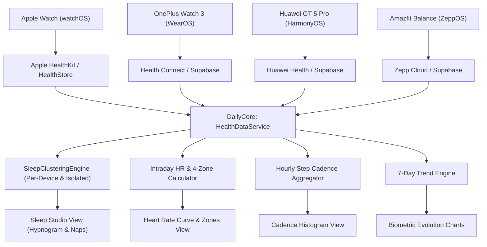

# Feature: iOS Health Telemetry, Multi-Watch Sleep & Vitals

This document details the architecture, clinical algorithms, multi-watch resolution heuristics, and visual implementation of the **Health Telemetry, Sleep Studio, and Biometrics** feature for the native DayOne iOS application and its shared multiplatform foundation (`DailyCore`).

---

## 1. Executive Summary & WinUI Root Cause Fixes

Phase 4 resolves serious clinical flaws present in the WinUI 3 implementation while delivering a modern, high-precision biometric hub adapted for iOS and shared with macOS:

| Problem in WinUI | Root Cause Identified | DayOne iOS / DailyCore Resolution |
| :--- | :--- | :--- |
| **Dropped Early Morning Sleep** | WinUI enforced a rigid wake-up cutoff `s.EndTime.Hour >= 4`, discarding valid sleep sessions for users waking before 04:00 AM. | **Morning Wake-Up Day Attribution**: Evaluates a flexible 24-hour nocturnal window ($D-1$ 18:00 to $D$ 18:00). Sleep is strictly assigned to day $D$ based on wake-up timestamp without arbitrary hour minimums. |
| **Fake / Synthesized Hypnograms** | WinUI called `SynthesizeClinicalSleepSession`, creating synthetic sinusoidal 90-minute fake sleep cycles when raw stages were missing. | **Authentic Presentation**: Renders an authentic **4-Level Clinical Hypnogram** when granular stage intervals exist, or an authentic **Proportional Gantt Stage Breakdown Bar** when only daily aggregate durations exist. Never synthesizes artificial data. |
| **Multi-Watch Stage Corruption** | WinUI sorted all telemetry globally by timestamp without device segregation. Stages from multiple watches interleaved and broke session boundaries. | **Per-Device Partitioning**: Clusters telemetry strictly partitioned by `sourceDevice` first, preventing stage overlap across different watches. |
| **Apple Watch Stages Ignored** | WinUI relegated Apple Watch records (`type: "sleep"`) to aggregate records and suppressed them if any stage record existed from another watch. | **Adaptive Normalization**: Apple Health and Apple Watch category samples (`HKCategoryValueSleepAnalysis`) are mapped to unified stages (`sleep_stage_deep`, `sleep_stage_rem`, `sleep_stage_light`, `sleep_stage_awake`) alongside WearOS, HarmonyOS, and ZeppOS. |
| **Nap Metric Contamination** | Daytime naps contaminated nighttime sleep statistics, inflating awakening counts and distorting efficiency. | **Strict Nap Segregation**: Daytime sessions ($< 3.5\text{h}$, between 09:00 and 20:00) are extracted as independent `NapSession` items and displayed in dedicated nap cards. |

---

## 2. Multi-Watch Ecosystem Architecture

The biometric engine supports simultaneous data ingestion and filtering across major smartwatch platforms:

### 2.1 Canonical Device Classification (`DeviceSource`)
Smartwatch telemetry records are classified via `DeviceSource`:
- **Apple Watch**: watchOS native sensor records (`HKSource`).
- **Apple Health**: Aggregated HealthKit store entries.
- **OnePlus Watch 3**: WearOS / Android Health Connect telemetry.
- **Huawei Watch GT 5 Pro**: HarmonyOS TruSleep & TruSeen telemetry.
- **Amazfit Balance**: ZeppOS BioTracker & sleep stage telemetry.
- **Health Connect**: Generic Android Health Connect records.
- **Manual**: User-entered biometric records.

---

## 3. Clinical Sleep Studio Architecture

### 3.1 Morning Wake-Up Day Attribution Window
A sleep session spanning across midnight belongs to the day the user wakes up:
$$\text{Window}(D) = [D-1\text{ at } 18:00,\; D\text{ at } 18:00]$$
- Bedtime at 23:30 (Sep 9) with wake-up at 07:15 (Sep 10) $\implies$ Attributed to **Sep 10**.
- Shift worker bedtime at 01:00 (Sep 10) with wake-up at 03:45 (Sep 10) $\implies$ Attributed to **Sep 10** (never dropped).

### 3.2 Sleep Clustering Algorithm
1. **Device Partitioning**: Split all raw records into groups: `groupedByDevice[device]`.
2. **Stage Interval Extraction**:
   - `sleep_stage_deep` $\implies$ Deep Sleep
   - `sleep_stage_rem` $\implies$ REM Sleep
   - `sleep_stage_light` / `sleep_stage_core` $\implies$ Light Sleep
   - `sleep_stage_awake` $\implies$ Awake Interval
3. **Cluster Heuristic**: If the gap between two consecutive stages of the same device exceeds **45 minutes**, a new session boundary is created.
4. **Nocturnal vs. Nap Classification**:
   - If session duration $\ge 3.5\text{ hours}$ OR session occurs predominantly at night (20:00 to 09:00) $\implies$ **Primary Nocturnal Sleep**.
   - If session duration $< 3.5\text{ hours}$ between 09:00 and 20:00 $\implies$ **Daytime Nap**.
5. **Multi-Device Resolution**: If multiple watches record nocturnal sleep for the same night, the session with higher stage granularity or longer valid duration is elevated to primary, while all sessions remain accessible via the device filter bar.

### 3.3 Clinical Sleep Metrics
- **Sleep Efficiency**:
  $$\text{Efficiency} = \frac{\text{Total Asleep Time}}{\text{Time In Bed}} \times 100\%$$
- **Restorative Sleep Percentage**:
  $$\text{Restorative Pct} = \frac{\text{Deep Sleep Duration} + \text{REM Sleep Duration}}{\text{Total Asleep Duration}} \times 100\%$$
- **Clinical Sleep Score (0–100)**:
  $$\text{Score} = \text{Clamp}\Big(0.40 \times S_{\text{duration}} + 0.30 \times S_{\text{efficiency}} + 0.30 \times S_{\text{restorative}},\; 0,\; 100\Big)$$

---

## 4. Biometrics & Intraday Evolution

### 4.1 Intraday Heart Rate & 4 Intensity Zones
Calculates 24-hour telemetry curve and partitions active samples into 4 intensity zones:
1. **Resting Zone**: $< 100\text{ bpm}$ (Deep Blue)
2. **Fat Burn Zone**: $100 - 119\text{ bpm}$ (Emerald Green)
3. **Cardio Zone**: $120 - 149\text{ bpm}$ (Vibrant Amber)
4. **Peak Zone**: $\ge 150\text{ bpm}$ (Coral Red)

### 4.2 24-Hour Step Cadence Histogram
Buckets step telemetry into 24 hourly bins (`00:00` to `23:00`), tracking:
- Active hours count (hours with $> 250\text{ steps}$ towards the 12-hour goal).
- Peak activity hour identification.

### 4.3 7-Day & 30-Day Trend Engine
Aggregates daily telemetry across rolling windows to provide:
- Average, high, and low values.
- Trend delta and directional velocity.

---

## 5. File Map

### 5.1 Multiplatform Engine (`DailyCore`)
Shared between iOS and macOS without UIKit or HealthKit dependencies:
- `DailyCore/Sources/DailyCore/Models/HealthModels.swift`: Taxonomy of 35+ metrics, `HealthTelemetryRecord`, `VitalMetricRecord`, `SleepStageRecord`, `SleepSession`, `NapSession`, `HeartRateZone`, `DeviceSource`.
- `DailyCore/Sources/DailyCore/Services/SleepClusteringEngine.swift`: Pure deterministic sleep clustering engine implementing morning wake-up day attribution, 45-minute stage gap clustering, nap separation, and clinical score computation.
- `DailyCore/Sources/DailyCore/Services/HealthDataService.swift`: `@MainActor` observable singleton managing day navigation (`prevDay`, `nextDay`, `jumpToToday`), device source filtering, PostgREST queries across `health_telemetry`, `vitals`, and `health_vitals`, 5-minute memory caching, and demo fallback data.
- `DailyCore/Tests/DailyCoreTests/HealthServiceTests.swift`: Comprehensive unit test suite covering metric normalization, nocturnal sleep attribution, early wake-up retention, daytime nap separation, multi-device isolation, sleep score formula, and heart rate zones.

### 5.2 Native iOS Application (`iOS/Daily`)
- `iOS/Daily/Resources/Info.plist`: Added `NSHealthShareUsageDescription` and `NSHealthUpdateUsageDescription`.
- `iOS/Daily/Daily.entitlements`: Added `com.apple.developer.healthkit`.
- `iOS/Daily/Services/HealthKitManager.swift`: Native HealthKit provider querying Steps, Active Energy, Distance, Heart Rate, and Sleep Analysis stages.
- `iOS/Daily/DesignSystem/ThemeColors.swift`: Added `accentPink` (`#FF2D55`) and `accentPurple` (`#AF52DE`).
- `iOS/Daily/DesignSystem/FloatingGlassCapsule.swift`: Added `.health` tab (`heart.fill`) to the 5-tab glass capsule navigation.
- `iOS/Daily/Views/Health/SleepHypnogramView.swift`: Vector 4-level hypnogram with Awake, REM, Light, Deep lanes, hourly dashed grid lines, and interactive tap-to-inspect tooltips.
- `iOS/Daily/Views/Health/SleepStudioView.swift`: Complete sleep architecture view with hero sleep score radial ring, bedtime/wake schedule, hypnogram / proportional stage bar, 2x2 metric tile grid, and daytime naps cards.
- `iOS/Daily/Views/Health/HeartRateCurveView.swift`: 24-hour intraday heart rate curve using Swift Charts, resting HR callout, and 4-zone distribution bars.
- `iOS/Daily/Views/Health/HourlyStepsHistogramView.swift`: 24-hour step cadence histogram with active hours counter and peak activity callout.
- `iOS/Daily/Views/Health/VitalMetricTile.swift`: Tactile Liquid Glass biometric tile with icon, value, unit, and source device origin badge.
- `iOS/Daily/Views/Health/HealthTrendsView.swift`: 7-day capsule bar chart and statistics grid (Average, High, Low, Total/Latest).
- `iOS/Daily/Views/Health/HealthMainView.swift`: Master screen with Day Navigator, Device Origin Bar, Activity Hero Rings (Steps + Kcal + Live BPM), Sub-tab switcher (Overview, Sleep Studio, Heart & Vitals, Trends), and Vitals Grid.
- `iOS/Daily/Views/Dashboard/DashboardView.swift`: Live Health widget card preview displaying live steps, heart rate, and sleep duration with direct tap-to-navigate action.

---

## 6. Verification & Test Results

- **Unit Test Suite**: 21 passed (`swift test` 100% green).
  - Nocturnal sleep attribution to morning wake-up day.
  - Early morning wake-up not dropped ($< 04:00$).
  - Daytime nap isolation from nocturnal sleep.
  - Multi-watch conflict isolation without stage interleaving.
  - Sleep score, efficiency, and restorative percentage formulas.
  - Intraday heart rate 4-zone threshold classification.
- **Simulator Execution**: Tested and verified on iPhone 17 Pro simulator (iOS 26.2).
- **Screenshots Captured**:
  - `dayone_dashboard_with_health.png`: Dashboard showing Health widget & 5-tab capsule.
  - `dayone_health_overview.png`: Health Hub Overview with activity rings, step cadence, and sleep card.
  - `dayone_sleep_studio.png`: Clinical Sleep Studio with sleep score ring, bedtime/wake schedule, and stage breakdown.
  - `dayone_heart_rate_zones.png`: Heart & Vitals with resting HR callout, device source badge, and 4 intensity zones.
  - `dayone_health_trends.png`: 7-day metric evolution bar chart and statistics grid.
