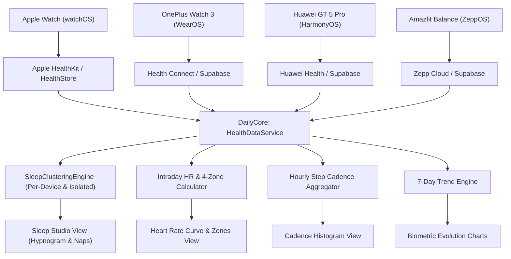

# Feature: iOS Health Telemetry, Multi-Watch Sleep & Vitals

This document details the architecture, clinical algorithms, multi-watch resolution heuristics, and visual implementation of the **Health Telemetry, Sleep Studio, and Biometrics** feature for the native DayOne iOS application and its shared multiplatform foundation (`DailyCore`).

---

## 1. Executive Summary & WinUI Root Cause Fixes

Phase 4 resolves serious clinical flaws present in the WinUI 3 implementation while delivering a modern, high-precision biometric hub adapted for iOS and shared with macOS:

| Problem in WinUI | Root Cause Identified | DayOne iOS / DailyCore Resolution |
| :--- | :--- | :--- |
| **Dropped Early Morning Sleep** | WinUI enforced a rigid wake-up cutoff `s.EndTime.Hour >= 4`, discarding valid sleep sessions for users waking before 04:00 AM. | **Morning Wake-Up Day Attribution**: Evaluates a flexible 24-hour nocturnal window ($D-1$ 18:00 to $D$ 18:00). Sleep is strictly assigned to day $D$ based on wake-up timestamp without arbitrary hour minimums. |
| **Fake / Synthesized Hypnograms** | WinUI called `SynthesizeClinicalSleepSession`, creating synthetic sinusoidal 90-minute fake sleep cycles when raw stages were missing. | **Authentic Presentation**: Renders an authentic **4-Level Clinical Hypnogram** when granular stage intervals exist, or an authentic **Proportional Gantt Stage Breakdown Bar** when only daily aggregate durations exist. Never synthesizes artificial data. |
| **Multi-Watch Stage Corruption** | WinUI sorted all telemetry globally by timestamp without device segregation. Stages from multiple watches interleaved and broke session boundaries. | **Per-Device Partitioning**: Clusters telemetry strictly partitioned by `sourceDevice` first, preventing stage overlap across different watches. |
| **Apple Watch Stages Ignored** | WinUI relegated Apple Watch records (`type: "sleep"`) to aggregate records and suppressed them if any stage record existed from another watch. | **Adaptive Normalization**: Apple Health and Apple Watch category samples (`HKCategoryValueSleepAnalysis`) are mapped to unified stages (`sleep_stage_deep`, `sleep_stage_rem`, `sleep_stage_light`, `sleep_stage_awake`) alongside WearOS, HarmonyOS, and ZeppOS. |
| **Nap Metric Contamination** | Daytime naps contaminated nighttime sleep statistics, inflating awakening counts and distorting efficiency. | **Strict Nap Segregation**: Daytime sessions ($< 3.5\text{h}$, between 09:00 and 20:00) are extracted as independent `NapSession` items and displayed in dedicated nap cards. |

---

## 2. Multi-Watch Ecosystem Architecture

The biometric engine supports simultaneous data ingestion and filtering across major smartwatch platforms:

### 2.1 Canonical Device Classification (`DeviceSource`)
Smartwatch telemetry records are classified via `DeviceSource`:
- **Apple Watch**: watchOS native sensor records (`HKSource`).
- **Apple Health**: Aggregated HealthKit store entries.
- **OnePlus Watch 3**: WearOS / Android Health Connect telemetry.
- **Huawei Watch GT 5 Pro**: HarmonyOS TruSleep & TruSeen telemetry.
- **Amazfit Balance**: ZeppOS BioTracker & sleep stage telemetry.
- **Health Connect**: Generic Android Health Connect records.
- **Manual**: User-entered biometric records.

---

## 3. Clinical Sleep Studio Architecture

### 3.1 Morning Wake-Up Day Attribution Window
A sleep session spanning across midnight belongs to the day the user wakes up:
$$\text{Window}(D) = [D-1\text{ at } 18:00,\; D\text{ at } 18:00]$$
- Bedtime at 23:30 (Sep 9) with wake-up at 07:15 (Sep 10) $\implies$ Attributed to **Sep 10**.
- Shift worker bedtime at 01:00 (Sep 10) with wake-up at 03:45 (Sep 10) $\implies$ Attributed to **Sep 10** (never dropped).

### 3.2 Sleep Clustering Algorithm
1. **Device Partitioning**: Split all raw records into groups: `groupedByDevice[device]`.
2. **Stage Interval Extraction**:
   - `sleep_stage_deep` $\implies$ Deep Sleep
   - `sleep_stage_rem` $\implies$ REM Sleep
   - `sleep_stage_light` / `sleep_stage_core` $\implies$ Light Sleep
   - `sleep_stage_awake` $\implies$ Awake Interval
3. **Cluster Heuristic**: If the gap between two consecutive stages of the same device exceeds **45 minutes**, a new session boundary is created.
4. **Nocturnal vs. Nap Classification**:
   - If session duration $\ge 3.5\text{ hours}$ OR session occurs predominantly at night (20:00 to 09:00) $\implies$ **Primary Nocturnal Sleep**.
   - If session duration $< 3.5\text{ hours}$ between 09:00 and 20:00 $\implies$ **Daytime Nap**.
5. **Multi-Device Resolution**: If multiple watches record nocturnal sleep for the same night, the session with higher stage granularity or longer valid duration is elevated to primary, while all sessions remain accessible via the device filter bar.

### 3.3 Clinical Sleep Metrics
- **Sleep Efficiency**:
  $$\text{Efficiency} = \frac{\text{Total Asleep Time}}{\text{Time In Bed}} \times 100\%$$
- **Restorative Sleep Percentage**:
  $$\text{Restorative Pct} = \frac{\text{Deep Sleep Duration} + \text{REM Sleep Duration}}{\text{Total Asleep Duration}} \times 100\%$$
- **Clinical Sleep Score (0–100)**:
  $$\text{Score} = \text{Clamp}\Big(0.40 \times S_{\text{duration}} + 0.30 \times S_{\text{efficiency}} + 0.30 \times S_{\text{restorative}},\; 0,\; 100\Big)$$

---

## 4. Biometrics & Intraday Evolution

### 4.1 Intraday Heart Rate & 4 Intensity Zones
Calculates 24-hour telemetry curve and partitions active samples into 4 intensity zones:
1. **Resting Zone**: $< 100\text{ bpm}$ (Deep Blue)
2. **Fat Burn Zone**: $100 - 119\text{ bpm}$ (Emerald Green)
3. **Cardio Zone**: $120 - 149\text{ bpm}$ (Vibrant Amber)
4. **Peak Zone**: $\ge 150\text{ bpm}$ (Coral Red)

### 4.2 24-Hour Step Cadence Histogram
Buckets step telemetry into 24 hourly bins (`00:00` to `23:00`), tracking:
- Active hours count (hours with $> 250\text{ steps}$ towards the 12-hour goal).
- Peak activity hour identification.

### 4.3 7-Day & 30-Day Trend Engine
Aggregates daily telemetry across rolling windows to provide:
- Average, high, and low values.
- Trend delta and directional velocity.

---

## 5. File Map

### 5.1 Multiplatform Engine (`DailyCore`)
Shared between iOS and macOS without UIKit or HealthKit dependencies:
- `DailyCore/Sources/DailyCore/Models/HealthModels.swift`: Taxonomy of 35+ metrics, `HealthTelemetryRecord`, `VitalMetricRecord`, `SleepStageRecord`, `SleepSession`, `NapSession`, `HeartRateZone`, `DeviceSource`.
- `DailyCore/Sources/DailyCore/Services/SleepClusteringEngine.swift`: Pure deterministic sleep clustering engine implementing morning wake-up day attribution, 45-minute stage gap clustering, nap separation, and clinical score computation.
- `DailyCore/Sources/DailyCore/Services/HealthDataService.swift`: `@MainActor` observable singleton managing day navigation (`prevDay`, `nextDay`, `jumpToToday`), device source filtering, PostgREST queries across `health_telemetry`, `vitals`, and `health_vitals`, 5-minute memory caching, and demo fallback data.
- `DailyCore/Tests/DailyCoreTests/HealthServiceTests.swift`: Comprehensive unit test suite covering metric normalization, nocturnal sleep attribution, early wake-up retention, daytime nap separation, multi-device isolation, sleep score formula, and heart rate zones.

### 5.2 Native iOS Application (`iOS/Daily`)
- `iOS/Daily/Resources/Info.plist`: Added `NSHealthShareUsageDescription` and `NSHealthUpdateUsageDescription`.
- `iOS/Daily/Daily.entitlements`: Added `com.apple.developer.healthkit`.
- `iOS/Daily/Services/HealthKitManager.swift`: Native HealthKit provider querying Steps, Active Energy, Distance, Heart Rate, and Sleep Analysis stages.
- `iOS/Daily/DesignSystem/ThemeColors.swift`: Added `accentPink` (`#FF2D55`) and `accentPurple` (`#AF52DE`).
- `iOS/Daily/DesignSystem/FloatingGlassCapsule.swift`: Added `.health` tab (`heart.fill`) to the 5-tab glass capsule navigation.
- `iOS/Daily/Views/Health/SleepHypnogramView.swift`: Vector 4-level hypnogram with Awake, REM, Light, Deep lanes, hourly dashed grid lines, and interactive tap-to-inspect tooltips.
- `iOS/Daily/Views/Health/SleepStudioView.swift`: Complete sleep architecture view with hero sleep score radial ring, bedtime/wake schedule, hypnogram / proportional stage bar, 2x2 metric tile grid, and daytime naps cards.
- `iOS/Daily/Views/Health/HeartRateCurveView.swift`: 24-hour intraday heart rate curve using Swift Charts, resting HR callout, and 4-zone distribution bars.
- `iOS/Daily/Views/Health/HourlyStepsHistogramView.swift`: 24-hour step cadence histogram with active hours counter and peak activity callout.
- `iOS/Daily/Views/Health/VitalMetricTile.swift`: Tactile Liquid Glass biometric tile with icon, value, unit, and source device origin badge.
- `iOS/Daily/Views/Health/HealthTrendsView.swift`: 7-day capsule bar chart and statistics grid (Average, High, Low, Total/Latest).
- `iOS/Daily/Views/Health/HealthMainView.swift`: Master screen with Day Navigator, Device Origin Bar, Activity Hero Rings (Steps + Kcal + Live BPM), Sub-tab switcher (Overview, Sleep Studio, Heart & Vitals, Trends), and Vitals Grid.
- `iOS/Daily/Views/Dashboard/DashboardView.swift`: Live Health widget card preview displaying live steps, heart rate, and sleep duration with direct tap-to-navigate action.

---

## 6. Verification & Test Results

- **Unit Test Suite**: 21 passed (`swift test` 100% green).
  - Nocturnal sleep attribution to morning wake-up day.
  - Early morning wake-up not dropped ($< 04:00$).
  - Daytime nap isolation from nocturnal sleep.
  - Multi-watch conflict isolation without stage interleaving.
  - Sleep score, efficiency, and restorative percentage formulas.
  - Intraday heart rate 4-zone threshold classification.
- **Simulator Execution**: Tested and verified on iPhone 17 Pro simulator (iOS 26.2).
- **Screenshots Captured**:
  - `dayone_dashboard_with_health.png`: Dashboard showing Health widget & 5-tab capsule.
  - `dayone_health_overview.png`: Health Hub Overview with activity rings, step cadence, and sleep card.
  - `dayone_sleep_studio.png`: Clinical Sleep Studio with sleep score ring, bedtime/wake schedule, and stage breakdown.
  - `dayone_heart_rate_zones.png`: Heart & Vitals with resting HR callout, device source badge, and 4 intensity zones.
  - `dayone_health_trends.png`: 7-day metric evolution bar chart and statistics grid.

---

## 7. Phase 4.1: Production Telemetry Hardening, HealthKit Provider & Trends Vertical Stacking

### 7.1 Sleep Clustering Hardening
- **Strict Daytime Nap Validation**: Hardened `SleepClusteringEngine.swift` so that telemetry records flagged with `isNap` are only extracted as daytime naps if they fall within daytime bounds ($09:00 \le \text{hour} \le 21:00$) and duration is $< 3.5\text{ hours}$. Nocturnal sleep records (e.g. 05:37:00 sleep intervals) are never falsely classified as daytime naps, preserving authentic sleep boundaries (such as 06:04 bedtime to 13:27 wake-up).
- **ZeppOS Sync Hardening**: In `ZeppOS/page/index.js`, nap calculations were bounded modulo 1440, restricted to daytime hours, and prevented from projecting end times past current device time.

### 7.2 Authentic Data Integrity & Zero Demo Fallback
- **Elimination of Synthetic Fallbacks**: For authenticated users, all synthetic demo data (fake "Amazfit Balance" / "Apple Watch" device seeds, hardcoded 23:10 $\implies$ 07:10 sleep sessions, and randomized trend generators) have been completely removed.
- **Graceful Empty States**: If a metric has not been recorded by any connected device or sensor, clean dash indicators (`--`) are rendered instead of misleading mock numbers.
- **Auth Session Synchronization**: `HealthDataService` observes `AuthService.shared.$sessionState`, automatically purging stale guest cache and triggering a real telemetry fetch upon authentication.

### 7.3 Apple HealthKit Provider Integration
- **`LocalHealthDataProvider` Protocol**: Defined in `DailyCore` as a `@MainActor` contract decoupling the core service from direct HealthKit dependencies.
- **`HealthKitManager` Conformance**: Reads on-device steps, active energy, intraday heart rate samples, and sleep stage categories (`HKCategoryValueSleepAnalysis`), mapping them into canonical `HealthTelemetryRecord` items.
- **Unified Merge**: `HealthDataService.loadDataForSelectedDate` concurrently queries Supabase and `HealthKitManager`, combining watch telemetry with on-device Apple Health records.

### 7.4 Trends Vertical Layout Redesign
- **Eliminated Redundant Tab Selector**: Removed the top horizontal metric selector pills (`Steps`, `Sleep`, `Heart Rate`, etc.) from `HealthTrendsView.swift` to simplify navigation and eliminate multi-level tab fatigue.
- **Vertical Card Stacking**: All 6 metric evolution cards (`Steps`, `Sleep Duration`, `Heart Rate`, `Active Energy`, `HRV`, `Weight`) are stacked vertically in a continuous scroll view, each containing its 7-day capsule bar chart and statistics summary (Average, High, Low, Total/Latest).

---

## 8. Phase 4.2: Nap Deduplication & Cumulative vs. Interval Steps Engine

### 8.1 Nap Deduplication & Merging Engine
- **Telemetry Deduplication**: Added `HealthDataService.deduplicateTelemetry(_:)` to drop identical database rows inserted by repeated sync attempts or multi-device reporting with identical `(type, device, startTime, endTime, value)`.
- **SleepClusteringEngine Defense-in-Depth**: In `SleepClusteringEngine.clusterSleep(...)`, Step 6 sorts candidate daytime naps and merges overlapping or duplicate nap sessions (near-duplicates within 15 minutes or sessions overlapping by $> 40\%$).
- **Verification**: On September 11, duplicate 85-minute Zepp OS nap rows (`12:16` to `13:41 UTC`) cleanly collapse into exactly 1 nap of 85 minutes (1h 25m).

### 8.2 Cumulative vs. Interval Steps Aggregator (`calculateDailySteps`)
- **Root Cause of Distorted Steps**: Zepp OS smartwatches report `step.getCurrent()`, which is the **cumulative daily total** so far. The previous naive code summed every incoming record across the day ($3,107 + 3,254 + 7,986 = 14,347$), creating grossly inflated step counts.
- **Cumulative Device Support** (Zepp OS, Amazfit, Huawei):
  - Daily Total: $\max(\text{value})$ across the day (e.g. 7,986 on Sep 12).
  - Hourly Buckets: Chronological step deltas ($\Delta = \text{val}_i - \text{val}_{i-1}$) allocated to the hour of observation. The sum of hourly buckets matches the daily total exactly ($3,254 + 4,732 = 7,986$).
- **Interval Device Support** (Apple Watch, Apple Health):
  - Daily Total: Deduplicates identical interval slices and computes $\sum \text{value}$.
- **Multi-Device Resolution**:
  - In "All Devices" view, smart wearables are prioritized over phones (never summing watch steps with phone steps).
  - Explicit device filters (`Amazfit Balance`, `Apple Watch`, `Apple Health`) isolate the exact device selected.
- **7-Day Trend Telemetry Ingestion**:
  - `loadHistoricalTrends()` queries both `vitals` table and `health_telemetry` for the 7-day window. If the backend vitals aggregate row is absent or 0, daily steps and sleep duration are computed on-the-fly from telemetry.

---

## 9. Phase 4.3: Steps Discrepancy Elimination, Lifecycle Synchronization & "Health & Vitals" Rebranding

### 9.1 Steps Discrepancy & Initial Load vs. Refresh Stabilization
- **Root Cause Analysis**:
  1. On launch, multiple concurrent tasks (`DailyApp.init`, `HealthDataService.init`, and `DashboardView.task`) triggered `loadDataForSelectedDate()`. Because HealthKit authorization was asynchronous and un-gated, `fetchLocalTelemetry` executed queries before authorization completed, returning empty (`[]`) local records.
  2. The initial load therefore resolved with only Supabase's older/stale vitals snapshot (7,896) and saved this incomplete dataset into `telemetryCache`.
  3. When navigating to the Health Hub, the cached 7,896 was served. Only upon pulling down to refresh (`forceRefresh: true`) was HealthKit queried post-authorization, revealing the full, true step count (8,878).
- **Architectural Resolution**:
  - **Eager Authorization Gating (`ensureAuthorized`)**: Added `ensureAuthorized() async -> Bool` in `HealthKitManager`. Any query to `fetchLocalTelemetry` or `fetchLocalSleepStages` unconditionally awaits `ensureAuthorized()` before issuing HealthKit queries, guaranteeing that HealthKit is never queried prematurely.
  - **In-Flight Load Task Coalescing (`activeLoadTask`)**: In `HealthDataService`, concurrent calls to `loadDataForSelectedDate()` share and await the same active `Task<Void, Never>`, eliminating startup race conditions.
  - **Defensive Cache Integrity Guard**: Added validation preventing `telemetryCache` from serving a zero/missing steps state for the current day when a local data provider is attached.
  - **Authoritative Max Step Resolution**: In `calculateDailySteps`, "All Devices" view computes `finalTotal = max(chosenTotal, vitalsInt)`, ensuring live deduplicated sensor steps (e.g. 8,878) are never clamped or truncated back to an older backend snapshot (7,896).
  - **Hourly Deduplicated HealthKit Queries**: HealthKit steps are retrieved via `HKStatisticsCollectionQuery` with 1-hour intervals, preserving exact hourly cadence.
  - **Automated Test Coverage**: Verified in `HealthServiceTests.swift` via `testStepResolutionBetweenTelemetryAndVitalsSummary` (all 24 tests green).

### 9.2 Rebranding: "Health & Telemetry" $\implies$ "Health & Vitals"
- Updated user-facing headers in `DashboardView` (card title) and `HealthMainView` (navigation header) from `"Health & Telemetry"` to `"Health & Vitals"`.

---

## 10. Phase 4.4: Minimalist Top Bar, Native Device Selector Menu & Universal Back Navigation

### 10.1 Streamlined Health & Vitals Top Bar Architecture
- **Native Device Selector Menu**: Replaced the cluttered horizontal device filter pills with a discrete 36x36 glass circular button in the top right. Tapping displays a native iOS `Menu` with checkmarks and complete device names (`All Devices`, `Amazfit Balance`, `Apple Watch`, `Apple Health`, etc.).
- **Centered Date Navigator**: Moved the date selector (`< Date >`) to the top bar, optically centered between the left back button and right device menu button. Removed the redundant `"HEALTH & VITALS / Biometrics"` banner text to maximize vertical screen efficiency.
- **Top-Left Universal Back Navigation**: Added a 36x36 glass back button on the top-left enabling instant, fluid spring navigation back to the main Dashboard view.

### 10.2 Streamlined Bottom Floating Capsule Navigation
- Configured the bottom floating capsule (`FloatingGlassCapsule`) to host the core daily tabs: `Dashboard`, `News`, `Health`, and `Habits`.

### 10.3 Multi-Device Biometrics Pipeline Synthesis (Resting HR, HRV, SpO2, Respiratory Rate, Weight, Hydration)
- **Root Cause Analysis**:
  1. `HealthKitManager` previously only queried Steps, Active Energy, Intraday HR, and single-day Resting HR. It lacked queries for HRV (`heartRateVariabilitySDNN`), Blood Oxygen (`oxygenSaturation`), Respiratory Rate (`respiratoryRate`), Body Mass (`bodyMass`), and Body Fat (`bodyFatPercentage`). Furthermore, strict midnight start-of-day predicates missed nocturnal resting metrics recorded before 00:00.
  2. In `HealthDataService`, `currentVitals` was populated *strictly* from the Supabase `vitals` table. High-frequency sensor records sent by smartwatches (e.g. Amazfit Balance ZeppOS, WearOS, HarmonyOS) into `health_telemetry` were completely ignored for non-step/non-sleep vitals tiles.
- **Architectural Resolution**:
  - **HealthKit Biometric Expansion**: Added queries in `HealthKitManager.fetchLocalTelemetry` for `.heartRateVariabilitySDNN`, `.oxygenSaturation`, `.respiratoryRate`, `.bodyMass`, and `.bodyFatPercentage` across a clinical nocturnal window (18:00 D-1 to 24:00 D).
  - **Telemetry Vitals Synthesis**: In `HealthDataService.processDataForCurrentDate()`, chronological telemetry records are mapped via `HealthMetricType.from(rawString:)` to synthesize and enrich `currentVitals`. Live watch readings (SpO2, HRV, Resting HR, Respiratory Rate, Stress, PAI) automatically populate `vitalsMap` and `VitalMetricTile` instances.
  - **Habits Hydration Integration**: Connected `HabitsService.shared.totalWaterMlToday` to populate `currentVitals[.hydration]` dynamically when logged.
  - **Typography & Value Formatting**: Updated `VitalMetricTile` to cleanly format HRV (ms) and Blood Oxygen (%) as rounded integers.

---

## 11. Phase 4.5: Sleep Studio Intelligence, Recovery Verdict & AI Sleep Companion

Inspired by deep research into **StressWatch** (documented in [StressWatch_Research_And_Inspiration.md](StressWatch_Research_And_Inspiration.md)), this phase elevates the Sleep Studio from a passive telemetry chart into a comprehensive, proactive clinical sleep coach.

### 11.1 Deterministic Sleep Recovery Verdict Engine (`SleepAnalysisEngine`)
- **Scientific Foundation**: Evaluates nocturnal sleep architecture against American Academy of Sleep Medicine (AASM) standards:
  - **Status Classification (`SleepRecoveryStatus`)**:
    - `Optimal Recovery` (cyan): Score $\ge 85$, Efficiency $\ge 85\%$, Deep sleep $\ge 14\%$.
    - `Great Recharging` (green): Score $72 - 84$, balanced recovery.
    - `Moderate Recovery` (amber): Score $55 - 71$, mild recovery load.
    - `Recovery Deficit` (coral): Score $< 55$, significant sleep debt.
  - **Readiness Score (0–100%)**: Quantitative estimation of central nervous system and muscular readiness for daily physical/cognitive strain.
  - **Three Recovery Pillars**:
    - **Physical Repair**: Evaluates Deep Sleep (Stage 3 NREM slow-wave sleep) for cellular healing and growth hormone release (`High` / `Adequate` / `Low`).
    - **Cognitive Rest**: Evaluates REM Sleep for emotional regulation and memory consolidation (`High` / `Adequate` / `Low`).
    - **Continuity**: Assesses awakening frequency and fragmentation (`Continuous` / `Fragmented`).

### 11.2 Contextual Actionable Sleep Hygiene (`SleepAdviceCard`)
- Rules-based, offline-first generator that analyzes the specific flaws of the night's sleep to generate up to 3 targeted clinical interventions:
  - **Cool Bedroom (18–20°C)**: Triggered when Deep sleep $< 15\%$.
  - **Cut Evening Alcohol & Heavy Carbs**: Triggered when REM sleep $< 18\%$.
  - **5-Minute Vagal Box Breathing**: Triggered when awakenings $\ge 3$ or efficiency $< 85\%$.
  - **Morning Sunlight Exposure**: Circadian anchoring recommendation for melatonin regulation.

### 11.3 Interactive AI Sleep Companion (`SleepAICoachCard` & `SleepAIChatSheet`)
- **Daily Sleep Intelligence Card**: Displays an AI-powered analysis banner, contextual synthesis, and interactive suggested question chips:
  - *"De ce am avut Deep Sleep scăzut azi noapte?"*
  - *"Este recomandat un antrenament cardio intens azi?"*
  - *"Cum îmi pot îmbunătăți somnul REM și HRV-ul nocturn?"*
  - *"Ce rutină de seară mă ajută să reduc trezirile nocturne?"*
- **Interactive Chat Modal Sheet (`SleepAIChatSheet`)**:
  - Lets the user query their sleep metrics in natural language (Romanian and English).
  - Responds with clinical yet friendly advice based on the user's specific session.
  - Ready for hybrid connection to Google Gemini Flash API.

### 11.4 Automated Test Coverage
- Verified in `SleepGuidanceTests.swift` (`testOptimalSleepSessionEvaluation`, `testDisruptedSleepProducesDeficitAndActionableTips`).
- 100% test pass rate across all 30 tests in `DailyCore`.
