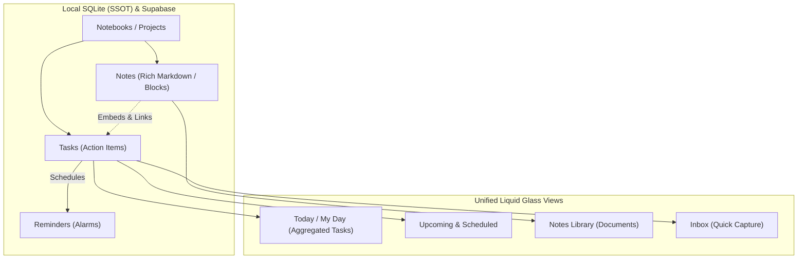
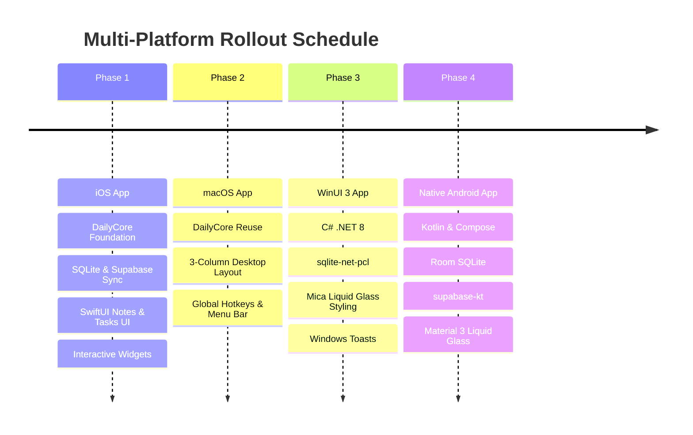

# Architecture & Feasibility Research: Unified ToDo, Reminders & Notes in DayOne

**Author**: Antigravity Architecture Team  
**Date**: September 2026  
**Status**: Proposal & Technical Feasibility Report  
**Target Ecosystem**: iOS (Phase 1) → macOS (Phase 2) → WinUI (Phase 3) → Native Android (Phase 4)

---

## 1. Executive Summary & Core Requirements

The user requested a thorough, assumption-free research analysis regarding introducing a unified **ToDo + Reminders + Notes** capability into the DayOne ecosystem:
1. **Unified Mental Model**: Seamlessly combining ToDos, interactive Tasks, scheduled Reminders, and rich Notes (similar to Apple Notes meets Things 3 / Superlist / Craft).
2. **Microsoft To Do Integration**: Objective evaluation of whether it is worthwhile, technically feasible, and whether to implement 2-way sync, 1-way import, or a selective bridge.
3. **Storage Architecture**: Supabase PostgreSQL as the central cloud sync and realtime backplane, with local SQLite databases acting as the absolute Single Source of Truth (SSOT) for zero-latency UI rendering and offline capability.
4. **Phased Multiplatform Rollout**:
   - **Phase 1**: iOS app (SwiftUI + `DailyCore` + interactive WidgetKit).
   - **Phase 2**: macOS app (leveraging shared `DailyCore` architecture, 3-column desktop layout, keyboard shortcuts).
   - **Phase 3**: WinUI 3 app (C# / .NET 8, `sqlite-net-pcl`, `supabase-csharp`, Mica/Acrylic Liquid Glass styling).
   - **Phase 4**: Future Native Android app (Kotlin, Jetpack Compose, Room SQLite, `supabase-kt`).

---

## 2. Unified Concept: Combining Notes, Tasks & Reminders

### 2.1 The Problem in Existing Tools
- **Traditional Task Managers (Things 3, Microsoft To Do, Apple Reminders)**: Tasks are rigid line items with a tiny, plain-text "notes" scratchpad. They fail when a task requires brainstorming, project context, meeting minutes, rich documentation, or embedded images.
- **Traditional Note Apps (Apple Notes, Bear, Evernote)**: Notes support checklists, but checkboxes are passive text formatting. They cannot be queried as discrete actionable entities across the app, cannot have individual due dates, reminder alarms, recurrences, or priority flags, and do not appear in a unified "Today" task view.

### 2.2 The "Actionable Document & Global Task Aggregation" Model
To solve this without clutter or complexity, DayOne should adopt a **hybrid Document-Item model**:



1. **Standalone Tasks**: Quick tasks captured directly into "Inbox" or a specific Project (e.g., *"Pay electricity bill tomorrow at 10 AM"*).
2. **Document-Bound Tasks**: Any checklist item typed inside a Note (e.g., `- [ ] Finalize contract draft #urgent @tomorrow 2pm`) is automatically parsed and registered as a first-class `Task` in SQLite.
   - It retains a bidirectional link to its parent note (`note_id` and `block_id`).
   - Tapping complete in the "Today" list updates the checkmark in the note.
   - Viewing the task in "Today" shows a subtle badge: `From: "Product Launch Strategy"`. Tapping it jumps straight to the exact paragraph in the note.
3. **Local Reminders**: Every task with a reminder timestamp automatically schedules a local system notification (iOS `UNUserNotificationCenter`, macOS `UNUserNotificationCenter`, Windows `AppNotificationManager`, Android `AlarmManager`). **Reminders work 100% offline.**

---

## 3. Microsoft To Do Integration: Feasibility & Honest Analysis

### 3.1 Microsoft Graph To Do API Capabilities
Microsoft exposes To Do through the Microsoft Graph REST API (`/v1.0/me/todo/`):
- **Endpoints**:
  - `GET /me/todo/lists` – Retrieve task folders.
  - `GET /me/todo/lists/{id}/tasks` – List tasks in a folder.
  - `POST /me/todo/lists/{id}/tasks` – Create task.
  - `PATCH /me/todo/lists/{id}/tasks/{id}` – Update task status/fields.
  - `GET /me/todo/lists/{id}/tasks/delta` – Delta query for incremental changes.

### 3.2 Key Technical Mismatches & Limitations of Microsoft To Do

| Feature / Dimension | DayOne Native (Supabase + SQLite) | Microsoft To Do (Graph API) | Risk / Impediment |
| :--- | :--- | :--- | :--- |
| **Notes / Document Body** | Full Markdown, headings, code blocks, images, tables | Plain text or basic HTML only (`itemBody`) | **Critical**: Syncing rich DayOne notes to MS To Do strips all formatting or corrupts data. |
| **Document Architecture** | Standalone Notes + Action Items combined | Tasks only. No standalone "Notes" concept (lives separately in OneNote) | **Major**: Cannot sync DayOne notes to MS To Do. |
| **Attachments** | Supabase Storage (images, PDFs, audio) | Graph ToDo task attachments API is severely restricted or unavailable | **High**: Cannot reliably mirror file attachments. |
| **Custom Priorities** | Low, Medium, High, Urgent, Eisenhower Matrix | `low`, `normal`, `high` only | Mapped with minor loss. |
| **Push Webhooks** | Supabase Realtime (WebSocket CDC) | Graph Subscriptions require public HTTPS webhook with SSL challenge | Mobile/desktop clients cannot receive direct Graph push; requires backend bridge. |
| **Rate Limiting** | Dedicated Supabase instance (unmetered DB) | Strict per-user & per-tenant Graph API throttling (HTTP 429) | High sync frequency will throttle. |

### 3.3 Evaluation of Sync Strategies

#### Option A: Full Bidirectional Sync (Not Recommended)
- Attempting to keep *all* DayOne tasks and notes bidirectionally synchronized with Microsoft To Do.
- **Verdict: Strongly Discouraged.** DayOne's rich feature set would be constrained to Microsoft To Do's lowest common denominator. Rich notes, embedded blocks, and custom metadata would either be stripped or have to be encoded into ugly JSON strings stuffed into the task body.

#### Option B: Dedicated Selective 2-Way Sync (Recommended Sweet Spot)
- DayOne creates or binds to a dedicated Microsoft To Do list: e.g., **"DayOne Sync"** or a user-selected list (such as work "Tasks").
- Only tasks within this designated list participate in 2-way sync:
  - If created/completed in MS To Do, it reflects in DayOne.
  - If created/completed in DayOne under that list, it pushes to MS To Do via Microsoft Graph.
- Rich Notes and complex projects remain sovereign within DayOne's native Supabase engine.

#### Option C: One-Way Import / On-Demand Pull
- A user triggers an "Import from Microsoft To Do" wizard. DayOne fetches lists, tasks, due dates, and checklist sub-items, mapping them into DayOne SQLite + Supabase.
- **Verdict: Very Safe and Fast to Implement.** Ideal as Phase 1 of the integration, which can later be upgraded to Option B.

### 3.4 Recommended Architecture for Microsoft Integration: Cloud Gateway
Rather than writing OAuth handling, token refresh, and delta sync logic four times (in Swift, C#, and Kotlin), use a **Supabase Edge Function** (`ms-todo-bridge`):
1. Client completes Microsoft OAuth PKCE once; refresh token is securely stored in Supabase (encrypted via Postgres Vault / user RLS).
2. The Edge Function handles Microsoft Graph calls, token refreshes, and delta sync directly against the Supabase database.
3. The native client simply syncs with Supabase as normal! This reduces client-side complexity to virtually zero.

---

## 4. Storage Architecture: Supabase & Cross-Platform SQLite Engine

In strict adherence to DayOne's established local-first principles (`Docs/Supabase_Architecture_2026.md`):
- **UI Never Queries Cloud Directly**: All UI screens read exclusively from local SQLite (`Daily.db3` / local app database).
- **Zero Latency**: Writing, checking off tasks, or typing notes commits locally in <1ms.
- **Background Sync**: Changes are flagged dirty (`synced_at = NULL`) and flushed to Supabase asynchronously.
- **Realtime Collaboration**: Supabase Realtime WebSockets push remote updates across devices.

### 4.1 Supabase PostgreSQL Database Schema

```sql
-- 1. Folders / Notebooks / Projects
CREATE TABLE public.notes_projects (
    id UUID PRIMARY KEY DEFAULT gen_random_uuid(),
    user_id UUID NOT NULL REFERENCES auth.users(id) ON DELETE CASCADE,
    name TEXT NOT NULL,
    color TEXT DEFAULT '#06B6D4',
    icon TEXT DEFAULT 'folder.fill',
    sort_order INT DEFAULT 0,
    is_archived BOOLEAN DEFAULT FALSE,
    created_at TIMESTAMPTZ NOT NULL DEFAULT NOW(),
    updated_at TIMESTAMPTZ NOT NULL DEFAULT NOW(),
    deleted_at TIMESTAMPTZ
);

-- 2. Notes (Rich Documents)
CREATE TABLE public.notes (
    id UUID PRIMARY KEY DEFAULT gen_random_uuid(),
    user_id UUID NOT NULL REFERENCES auth.users(id) ON DELETE CASCADE,
    project_id UUID REFERENCES public.notes_projects(id) ON DELETE SET NULL,
    title TEXT NOT NULL DEFAULT '',
    content_markdown TEXT NOT NULL DEFAULT '',
    content_blocks JSONB, -- For structured block editors (TipTap/ProseMirror)
    is_pinned BOOLEAN DEFAULT FALSE,
    color TEXT,
    created_at TIMESTAMPTZ NOT NULL DEFAULT NOW(),
    updated_at TIMESTAMPTZ NOT NULL DEFAULT NOW(),
    deleted_at TIMESTAMPTZ
);

-- 3. Tasks & Action Items
CREATE TABLE public.tasks (
    id UUID PRIMARY KEY DEFAULT gen_random_uuid(),
    user_id UUID NOT NULL REFERENCES auth.users(id) ON DELETE CASCADE,
    project_id UUID REFERENCES public.notes_projects(id) ON DELETE SET NULL,
    note_id UUID REFERENCES public.notes(id) ON DELETE SET NULL, -- Null if standalone task
    note_block_id TEXT, -- Anchor to specific paragraph/line in note
    title TEXT NOT NULL,
    description TEXT DEFAULT '',
    status TEXT NOT NULL DEFAULT 'todo', -- 'todo', 'in_progress', 'completed', 'cancelled'
    priority INT NOT NULL DEFAULT 1, -- 0=None, 1=Low, 2=Medium, 3=High, 4=Urgent
    due_date DATE,
    due_time TIME,
    reminder_at TIMESTAMPTZ,
    recurrence_rule TEXT, -- RRULE format (e.g. FREQ=DAILY;INTERVAL=1)
    completed_at TIMESTAMPTZ,
    ms_todo_id TEXT, -- External Microsoft To Do ID if synced
    ms_todo_etag TEXT,
    created_at TIMESTAMPTZ NOT NULL DEFAULT NOW(),
    updated_at TIMESTAMPTZ NOT NULL DEFAULT NOW(),
    deleted_at TIMESTAMPTZ
);

-- 4. Tags
CREATE TABLE public.tags (
    id UUID PRIMARY KEY DEFAULT gen_random_uuid(),
    user_id UUID NOT NULL REFERENCES auth.users(id) ON DELETE CASCADE,
    name TEXT NOT NULL,
    color TEXT DEFAULT '#8B5CF6',
    created_at TIMESTAMPTZ NOT NULL DEFAULT NOW()
);

-- 5. Row Level Security (RLS)
ALTER TABLE public.notes_projects ENABLE ROW LEVEL SECURITY;
ALTER TABLE public.notes ENABLE ROW LEVEL SECURITY;
ALTER TABLE public.tasks ENABLE ROW LEVEL SECURITY;
ALTER TABLE public.tags ENABLE ROW LEVEL SECURITY;

CREATE POLICY "Users own their projects" ON public.notes_projects FOR ALL USING (auth.uid() = user_id);
CREATE POLICY "Users own their notes" ON public.notes FOR ALL USING (auth.uid() = user_id);
CREATE POLICY "Users own their tasks" ON public.tasks FOR ALL USING (auth.uid() = user_id);
CREATE POLICY "Users own their tags" ON public.tags FOR ALL USING (auth.uid() = user_id);
```

### 4.2 Local SQLite Database Schema (All Platforms)
The local SQLite schema mirrors the Postgres schema with local sync metadata columns:

| Field | Type | Purpose |
| :--- | :--- | :--- |
| `id` | `TEXT PRIMARY KEY` | UUID string matching Supabase `id`. |
| `user_id` | `TEXT NOT NULL` | Partitioning by user account. |
| `...fields...` | Various | Direct mirror of business fields. |
| `synced_at` | `TEXT` / `INTEGER` | `NULL` if local change has not been pushed to Supabase. |
| `is_dirty` | `INTEGER` (0 or 1) | Fast index flag for dirty records pending upload. |
| `is_deleted` | `INTEGER` (0 or 1) | Tombstone flag to allow offline deletions to propagate. |
| `updated_at` | `TEXT` / `INTEGER` | Conflict resolution timestamp. |

#### Full-Text Search (FTS5) Table in SQLite
```sql
CREATE VIRTUAL TABLE notes_fts USING fts5(
    note_id UNINDEXED,
    title,
    content_markdown,
    tokenize = 'porter unicode61'
);
```
*Allows sub-millisecond instant search across thousands of offline notes as the user types.*

### 4.3 Conflict Resolution Strategy
- **Granular Entity Updates**: Updates are tracked per task and per note rather than monolithic database dumps.
- **Last-Write-Wins (LWW) with Server Timestamp**: If device A and device B both edit the same note offline, the change with the higher `updated_at` wins at the record level.
- **Tombstone Propagation**: Deleting a note sets `is_deleted = 1` locally. The sync engine sends the delete to Supabase, which soft-deletes (`deleted_at = NOW()`), and other devices purge it on their next pull.

---

## 5. Multi-Platform Phased Rollout Roadmap



### Phase 1: iOS Application
- **Foundation**: Extend `DailyCore` with `TaskItem`, `NoteItem`, `NoteProject` models, and `NotesDataService`.
- **Local Storage**: SQLite accessed via `GRDB.swift` or standard C `sqlite3` wrapped in Swift Concurrency actor (`actor LocalDatabase`).
- **UI Architecture**:
  - Dark Liquid Glass design system.
  - Note Editor: Rich Markdown rendering with inline interactive checkboxes.
  - Quick-Add Capsule: Floating input bar with natural language date parsing (e.g., *"Send invoice tomorrow at 9am #finances"*).
  - Views:
    1. **Today**: Aggregated tasks scheduled for today + overdue tasks.
    2. **Upcoming**: Timeline calendar view of tasks and reminders.
    3. **Notes**: Grid/List of notes with pinned cards and folder filtering.
    4. **Projects / Lists**: Custom lists and tags.
- **WidgetKit**:
  - Small: "Next Up" task + progress ring of today's completed tasks.
  - Medium: 3 prioritized tasks with direct interactive checkmark toggles (iOS 17+ App Intents).
  - Large: Split view of Today's tasks + latest pinned Note summary.
- **Notifications**: Local alarms via `UNUserNotificationCenter`.

### Phase 2: macOS Application
- **Foundation Reuse**: macOS targets in `DailyCore` already compile natively (`.macOS(.v15)`). Over 85% of data models, database queries, and Supabase sync logic will be shared with zero modification.
- **Desktop Specific UX**:
  - 3-Column Split View: Sidebar (Navigation & Projects) → Note/Task List → Full Document Editor & Task Inspector.
  - Keyboard Shortcuts: `⌘N` (New Note), `⌘T` (New Task), `⌘⏎` (Toggle Task Done), `⌘K` (Global Search).
  - Menu Bar Quick-Capture: Status bar icon allowing quick note taking or task creation from anywhere on the Mac without opening the main window.

### Phase 3: WinUI 3 Application (Windows 11)
- **Technology Stack**: C# / .NET 8, WinUI 3 (Windows App SDK).
- **Data Layer**:
  - `sqlite-net-pcl` (already used across the WinUI project).
  - `supabase-csharp` for authentication, table sync, and Realtime WebSocket events.
- **UI & Styling**:
  - Windows 11 Mica material and Acrylic brushes customized to match DayOne's dark Liquid Glass aesthetic.
  - Windows Toast Notifications via `AppNotificationManager` for offline reminders.

### Phase 4: Native Android Application
- **Technology Stack**: 100% Native Kotlin with Jetpack Compose.
- **Data Layer**:
  - Android Room (official SQLite ORM with Flow reactivity).
  - `supabase-kt` client.
  - `WorkManager` for background delta synchronization when app is backgrounded.
- **Reminders**: `AlarmManager` with exact alarms + heads-up notifications.
- **Design**: Modern Material 3 customized with translucent glassmorphic surfaces, glow accents, and responsive layout.

---

## 6. Detailed Comparison: Microsoft To Do vs. Native DayOne Notes & Tasks

| Dimension | Native DayOne (Recommended) | Microsoft To Do Direct Sync |
| :--- | :--- | :--- |
| **Notes Capability** | Full Markdown, embedded checklists, media, backlinks | Plain text / simple HTML snippet only |
| **Offline Performance** | Instant (<1ms) via local SQLite | Dependent on local caching library or Graph calls |
| **Custom Workflows** | Habits + Health + Finances linked to Tasks | Isolated to Microsoft task lists |
| **Data Sovereignty** | Stored in your own Supabase database | Stored in Microsoft Entra / Exchange cloud |
| **API Costs & Limits** | Free / Included in Supabase project | Microsoft Graph rate limits apply |
| **Cross-Platform UX** | 100% unified Liquid Glass UI across iOS, Mac, Windows, Android | Disjointed third-party app look and feel |

---

## 7. Concrete Next Steps & Action Plan

1. **User Sign-Off on Strategy**:
   - Confirm the **Selective 2-Way Sync / Smart Import** approach for Microsoft To Do (avoiding destructive full sync).
   - Approve the **Unified Document-Action Item** concept (Notes with embedded actionable tasks + standalone tasks).
2. **Database Migration Script**:
   - Create Supabase SQL migration for `notes_projects`, `notes`, `tasks`, and `tags`.
3. **Core Implementation (Phase 1 iOS)**:
   - Add models and SQLite sync layer into `DailyCore`.
   - Build the SwiftUI Notes & Tasks views and interactive widgets.
   - Deploy and verify on SimulaPhone and physical device "Schmitz".
