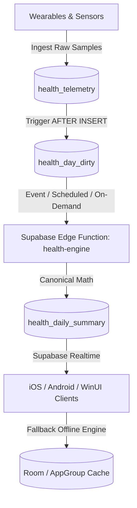

# Canonical Health & Vitals Engine Specification v1.0
**Document Version:** 1.0.0  
**Status:** Approved Canonical Specification  
**Applies to:** Supabase Edge Function (`health-engine`), iOS (`DailyCore`), Android (`core-health`), Windows (`Daily.WinUI`)

---

## 1. Overview & Architecture

The Canonical Health & Vitals Engine is the single mathematical source of truth for all health telemetry processing in Daily.



### Core Tenets:
1. **Deterministic & Identical Across Platforms**: The TypeScript Supabase Edge Function, Swift (`DailyCore`), and Kotlin (`core-health`) implementations must yield **zero mathematical divergence** on all golden fixtures.
2. **Honest Data**: No fabricated wake times (e.g. artificial 07:15 wake times), no synthetic nap times (e.g. artificial 14:00 naps), and no fake trend extrapolations. If a metric is missing, it is represented as `null` or `—`.
3. **Idempotent**: Reprocessing telemetry for date $D$ always produces the exact same summary row.

---

## 2. Windowing & Time Specification

### 2.1 Calendar Days & Timezones
- All telemetry records in `health_telemetry` carry `start_time` (`timestamptz`), `end_time` (`timestamptz`), `tz_offset_min` (`integer`), and `local_date` (`date`, formatted `YYYY-MM-DD`).
- Processing is evaluated for a target local date $D$.

### 2.2 Domain Windows
| Domain | Window Start | Window End | Rationale |
|---|---|---|---|
| **Nocturnal Sleep** | $D-1 \text{ 18:00}$ local | $D \text{ 18:00}$ local | Captures full overnight rest prior to morning wake-up on day $D$. |
| **Daytime Naps** | $D \text{ 09:00}$ local | $D \text{ 20:30}$ local | Strictly daytime naps occurring on day $D$. |
| **Steps & Activity** | $D \text{ 00:00:00}$ local | $D \text{ 23:59:59}$ local | Standard 24-hour calendar day. |
| **Cardiovascular (HR)**| $D \text{ 00:00:00}$ local | $D \text{ 23:59:59}$ local | Intraday heart rate curve and zones on day $D$. |
| **Stress (ANS)** | $D \text{ 00:00:00}$ local | $D \text{ 23:59:59}$ local | Hourly physiological stress curve on day $D$. |

---

## 3. Nocturnal Sleep & Nap Engine

### 3.1 Device Priority Ranking
When multiple wearable devices log sleep for the same nocturnal window, the primary session is selected by device hierarchy, followed by granular hypnogram availability, then duration:

```
Rank 100: Oura Ring ("oura")
Rank  80: Apple Watch ("apple", "watch")
Rank  70: Amazfit / Zepp OS ("amazfit", "zepp", "balance")
Rank  60: OnePlus / Wear OS ("oneplus", "wearos")
Rank  50: Huawei / Harmony OS ("huawei", "harmony", "gt5")
Rank  40: HealthKit / Health Connect ("healthkit", "health")
Rank  10: Unknown / Third-Party
```

### 3.2 Granular Stage Clustering
1. **Window Filter**: Records with `is_sleep == true` within $[D-1\text{ 18:00}, D\text{ 18:00}]$.
2. **Device Partitioning**: Records are grouped by `source_device` to prevent inter-device stage collisions.
3. **Cluster Gap**: Stages are chronologically sorted. Adjacent stages with a gap $< 45\text{ minutes}$ are merged into the same cluster. Gaps $\ge 45\text{ minutes}$ spawn a new cluster.
4. **Noise Filter**: Clusters with total span $< 600\text{ seconds}$ (10 minutes) are discarded as noise.

### 3.3 Stage Clipping & De-duplication
To guarantee that the sum of stage durations never mathematically exceeds the total session span:
- Sorted by `start_time` ascending, then `end_time` ascending.
- If stage $i$ overlaps with stage $i-1$:
  - If stage $i$ is completely subsumed ($end_i \le end_{i-1}$), discard stage $i$.
  - If partially overlapping, clip $start_i = end_{i-1}$.
- Slices $< 10\text{ seconds}$ are discarded.

### 3.4 Daytime Nap Segregation
A session is classified as a daytime nap if:
$$\text{duration} < 3.5 \times 3600\text{ seconds AND } \text{isSameDay}(start, D) \text{ AND } startHour \ge 9 \text{ AND } endHour \le 20$$
Overlapping or duplicate naps across devices with $> 40\%$ overlap or $< 15\text{ min}$ boundary difference are merged into a single `NapSession`.

### 3.5 Calibrated 4-Pillar Clinical Sleep Score (0..100)

$$\text{SleepScore} = \text{round}(\text{DurationScore} + \text{EfficiencyScore} + \text{RestorativeScore} + \text{RestfulnessScore})$$
Clamped strictly to $[0, 100]$.

#### Pillar 1: Duration Score (Max 40 points)
Let $H = \text{asleepSeconds} / 3600.0$:
- If $7.5 \le H \le 9.0$: $38.0 + \min\left(\frac{H - 7.5}{1.5} \times 2.0, 2.0\right)$
- Else if $H > 9.0$: $\max(34.0, 40.0 - (H - 9.0) \times 2.0)$
- Else if $H \ge 7.0$: $34.0 + \frac{H - 7.0}{0.5} \times 4.0$ (Range: 34 - 38)
- Else if $H \ge 6.0$: $24.0 + (H - 6.0) \times 10.0$ (Range: 24 - 34)
- Else if $H \ge 5.0$: $14.0 + (H - 5.0) \times 10.0$ (Range: 14 - 24)
- Else: $\max\left(0.0, \frac{H}{5.0} \times 14.0\right)$ (Range: 0 - 14)

#### Pillar 2: Efficiency Score (Max 25 points)
Let $Eff = \text{efficiencyPercent} = \text{clamp}\left(\text{round}\left(\frac{\text{asleepSeconds}}{\text{durationSeconds}} \times 100\right), 10, 100\right)$:
- If $Eff \ge 95.0$: $25.0$
- Else if $Eff \ge 90.0$: $21.0 + \left(\frac{Eff - 90.0}{5.0}\right) \times 4.0$ (Range: 21 - 25)
- Else if $Eff \ge 85.0$: $16.0 + \left(\frac{Eff - 85.0}{5.0}\right) \times 5.0$ (Range: 16 - 21)
- Else if $Eff \ge 80.0$: $10.0 + \left(\frac{Eff - 80.0}{5.0}\right) \times 6.0$ (Range: 10 - 16)
- Else: $\max\left(0.0, \frac{Eff}{80.0} \times 10.0\right)$ (Range: 0 - 10)

#### Pillar 3: Restorative Architecture Score (Max 25 points)
Let $DP = \text{deepPercent} = \text{round}\left(\frac{\text{deepSeconds}}{\text{asleepSeconds}} \times 100\right)$:
- Deep Score (Max 13 pts):
  - If $DP \ge 16.0$: $11.0 + \min\left(\frac{DP - 16.0}{6.0} \times 2.0, 2.0\right)$
  - Else if $DP \ge 10.0$: $6.0 + \left(\frac{DP - 10.0}{6.0}\right) \times 5.0$
  - Else: $\max\left(0.0, \frac{DP}{10.0} \times 6.0\right)$

Let $RP = \text{remPercent} = \text{round}\left(\frac{\text{remSeconds}}{\text{asleepSeconds}} \times 100\right)$:
- REM Score (Max 12 pts):
  - If $RP \ge 20.0$: $10.0 + \min\left(\frac{RP - 20.0}{5.0} \times 2.0, 2.0\right)$
  - Else if $RP \ge 14.0$: $5.0 + \left(\frac{RP - 14.0}{6.0}\right) \times 5.0$
  - Else: $\max\left(0.0, \frac{RP}{14.0} \times 5.0\right)$

$$\text{RestorativeScore} = \text{DeepScore} + \text{RemScore} \quad (\le 25)$$

#### Pillar 4: Restfulness & Sleep Continuity Score (Max 10 points)
Let $C_{awake}$ be count of awake stages, and $M_{awake} = \text{awakeSeconds} / 60.0$:
- Awakening Count Penalty:
  - If $C_{awake} \le 2$: $0.0$
  - Else if $C_{awake} \le 4$: $1.5$
  - Else: $\min(1.5 + (C_{awake} - 4) \times 0.75, 5.0)$
- Awake Duration Penalty:
  - If $M_{awake} \le 25.0$: $0.0$
  - Else: $\min\left(\frac{M_{awake} - 25.0}{10.0} \times 1.0, 5.0\right)$

$$\text{RestfulnessScore} = \max(1.0, 10.0 - \text{AwakeCountPenalty} - \text{AwakeDurationPenalty})$$

### 3.6 Sleep Recovery Verdict & Actionable Tips
- **Quality Rating**:
  - $85..100$: "Optimal"
  - $75..<85$: "Good"
  - $60..<75$: "Fair"
  - $1..<60$: "Restless"
  - $0$: "No Data"
- **SleepRecoveryStatus**:
  - Score $\ge 85 \land Eff \ge 88 \land DP \ge 15$: `Optimal`
  - Score $\ge 75 \lor (H \ge 7.0 \land Eff \ge 85)$: `Great`
  - Score $\ge 60 \lor H \ge 6.0$: `Fair`
  - Otherwise: `Deficit`
- Generates 4 actionable science-based tips (`circadian`, `environment`, `nutrition`, `windDown`) and AI briefing narrative.

---

## 4. Activity & Steps Engine

### 4.1 Deduplication
Samples are deduplicated using composite key:
`type + "_" + source_device + "_" + start_epoch + "_" + end_epoch + "_" + round(value*100)`

### 4.2 Cumulative vs Interval Sources
- **Cumulative Sources** (Zepp OS / Amazfit, Huawei Health / HarmonyOS):
  - Total is taken as the maximum observed value: $Total = \max(values)$.
  - Hourly deltas: $\Delta_i = val_i - val_{i-1}$ when $val_i \ge val_{i-1}$, bucketed into the respective hour.
- **Interval Sources** (Apple Health / HealthKit, Health Connect):
  - Duplicate intervals with $< 5\text{s}$ difference are filtered.
  - Slices are summed into 24 hourly buckets ($0..23$): $Total = \sum_{h=0}^{23} bucket[h]$.

### 4.3 Multi-Device Resolution
1. User-preferred source/device if specified.
2. Wearable source with maximum step count.
3. Any source with maximum step count.
4. Output produces 24 distinct hourly buckets ($00:00$ to $23:00$).

### 4.4 Active Calories
- If `active_energy` telemetry exists for the chosen device, sum or max is used according to semantics.
- Fallback clinical estimation:
$$\text{ActiveCalories} = \text{round}(\text{TotalSteps} \times 0.042)\text{ kcal}$$

---

## 5. Cardiovascular & Heart Rate Zones Engine

### 5.1 Intraday Heart Rate Curve
- Heart rate telemetry filtered strictly within day $D$ ($30 < \text{bpm} < 240$).
- Sorted chronologically.
- Metrics computed:
  - $\text{AverageBpm} = \text{round}\left(\frac{\sum bpm}{N}\right)$
  - $\text{MinBpm} = \min(bpm)$
  - $\text{MaxBpm} = \max(bpm)$
  - $\text{RestingBpm}$: genuine measured resting heart rate from telemetry/vitals, or fallback $(\text{MinBpm} + 4)$ if $\text{MinBpm} > 0$, else null / "—".

### 5.2 4-Tier Clinical Heart Rate Zones
| Zone | Classification | Boundary | Hex Color |
|---|---|---|---|
| 1 | **Resting** | $< 100\text{ bpm}$ | `#42A5F5` |
| 2 | **Fat Burn** | $100 - 119\text{ bpm}$ | `#66BB6A` |
| 3 | **Cardio** | $120 - 149\text{ bpm}$ | `#FFA726` |
| 4 | **Peak** | $\ge 150\text{ bpm}$ | `#EF5350` |

---

## 6. Autonomic Nervous System & Stress Analysis Engine

### 6.1 HRV Sigmoid Transfer Function
HRV is normalized against the baseline (default population SDNN = $45\text{ ms}$) via a hyperbolic tangent transfer function:
$$z = \frac{\text{HRV} - \text{baselineHRV}}{16.0}$$
$$\text{hrvScore} = \text{clamp}(50.0 - (\tanh(z) \times 45.0), 0.0, 100.0)$$

### 6.2 Hourly Intraday Stress
For each hour $h \in [0, 23]$:
1. Hourly steps $< 300 \implies \text{isSedentary} = \text{true}$.
2. If sedentary and heart rate samples exist:
   $$\text{elevation} = \max(0.0, \text{avgHR}_h - \text{baselineRHR})$$
   $$\text{hrScore} = \min\left(100.0, \frac{\text{elevation}}{25.0} \times 100.0\right)$$
   Else: $\text{hrScore} = \text{hrvScore} \times 0.8$.
3. Sleep recovery penalty:
   $$\text{sleepPenalty} = \max(0.0, \min(100.0, 100.0 - \text{SleepScore}))$$
4. Blended Hourly Stress:
   $$\text{rawHourlyStress} = 0.50 \times \text{hrvScore} + 0.30 \times \text{hrScore} + 0.20 \times \text{sleepPenalty}$$
   $$\text{hourlyScore} = \text{round}(\text{clamp}(\text{rawHourlyStress}, 5.0, 98.0))$$

### 6.3 Autonomic Balance & Persona
- **Stress Level**:
  - $0..25$: `Restful`
  - $26..50$: `Calm`
  - $51..75$: `Moderate`
  - $76..100$: `High`
- **Autonomic Balance**:
  $$\text{Parasympathetic} = \text{clamp}(100 - \text{CurrentScore}, 10, 90)$$
  $$\text{Sympathetic} = 100 - \text{Parasympathetic}$$
- **Stylized Monkey Mascot & Breathing Protocols**:
  - `Restful` $\implies$ *Zen Monkey* | *Resonance Flow (5.5s)*
  - `Calm` $\implies$ *Curious Monkey* | *Relaxing 4-7-8*
  - `Moderate` $\implies$ *Busy Monkey* | *Box Breathing (4-4-4-4)*
  - `High` $\implies$ *Overheated Monkey* | *Physiological Sigh (Stanford Huberman)*

---

## 7. Canonical Daily Summary Schema (`health_daily_summary`)

### 7.1 Scalar Columns
- `user_id` (uuid, FK auth.users)
- `local_date` (date)
- `computed_at` (timestamptz)
- `engine_version` (text: 'v1.0')
- `raw_watermark` (timestamptz of latest telemetry ingested)
- `steps` (int)
- `active_kcal` (double precision)
- `sleep_asleep_s` (int)
- `sleep_score` (int)
- `stress_avg` (int)
- `rhr` (int)
- `hrv_sdnn` (double precision)
- `hrv_rmssd` (double precision)
- `weight` (double precision)
- `spo2` (double precision)

### 7.2 Structured JSONB Payload (`summary`)
```json
{
  "date": "2026-10-05",
  "engine_version": "v1.0",
  "computed_at": "2026-10-05T12:00:00Z",
  "sleep": {
    "primary_session": { ... },
    "all_sessions": [ ... ],
    "naps": [ ... ],
    "guidance": {
      "verdict": { ... },
      "tips": [ ... ],
      "ai_context": { ... }
    }
  },
  "activity": {
    "total_steps": 10450,
    "active_calories": 540.0,
    "source_device": "Apple Watch",
    "hourly_steps": [ { "hour": 0, "steps": 0 }, ... ]
  },
  "cardiovascular": {
    "average_bpm": 72.0,
    "resting_bpm": 58.0,
    "min_bpm": 52.0,
    "max_bpm": 142.0,
    "zones": { "resting": 32, "fat_burn": 14, "cardio": 6, "peak": 1 },
    "intraday_points": [ ... ]
  },
  "stress": {
    "current_score": 32,
    "current_level": "Calm",
    "daily_average": 35,
    "peak_hour": 14,
    "peak_score": 58,
    "lowest_hour": 4,
    "lowest_score": 18,
    "parasympathetic_percent": 68,
    "sympathetic_percent": 32,
    "baseline_hrv_ms": 45.0,
    "current_hrv_ms": 52.0,
    "hrv_delta_percent": 15.5,
    "resting_heart_rate_bpm": 58.0,
    "monkey_mood": "Curious Monkey",
    "advice_quote": "...",
    "recommended_breathing": "Relaxing 4-7-8",
    "intraday_points": [ ... ]
  },
  "vitals": {
    "steps": { "type": "steps", "value": 10450, "unit": "count", "source_device": "Apple Watch" },
    ...
  }
}
```
